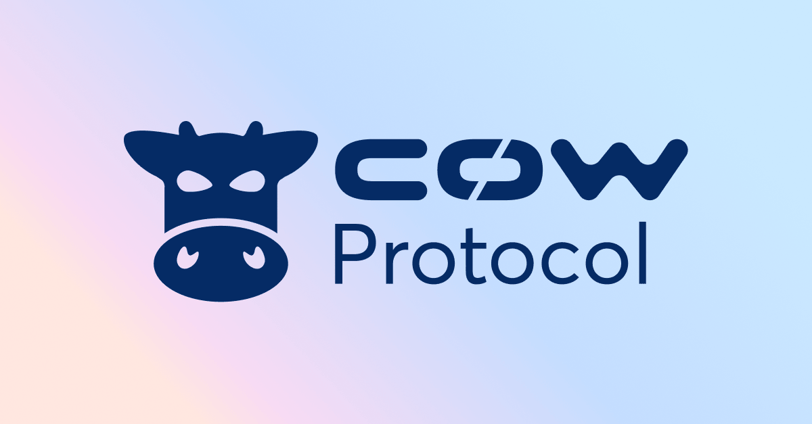
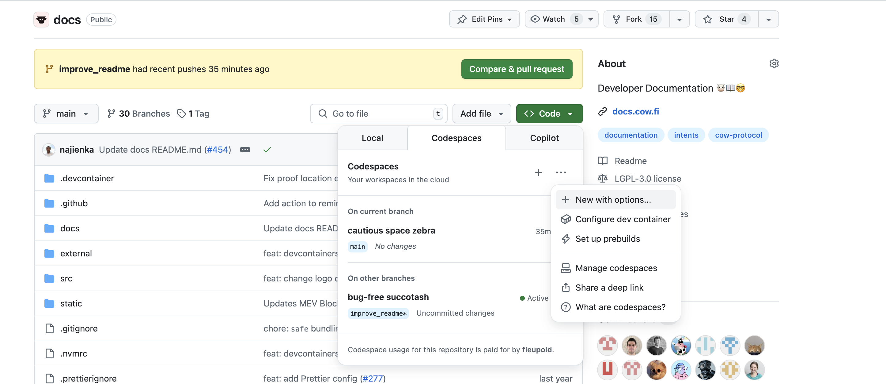

<p align="center">
   
</p>

# CoW Protocol Documentation

The documentation is built using [Docusaurus 2](https://docusaurus.io/), a modern static website generator.

### Devcontainer

The easiest way to run this repo, is to open it in a Github Devcontainer from the main github page.



> [!IMPORTANT]  
> Under options, make sure to select the branch you want to preview (or `main` if you are starting a new PR from scratch).
> If you cannot find the branch, you can also go to the existing PR and launch a codespace directly from there.

Wait for the container to build (this can take some time).
Then either preview the current version, or make a change and then build an updated preview by typing

```bash
yarn serve --build
```

The preview should load in a new tab.

### Installation

```bash
yarn
```

### Build

You will also need to `build` the app, to ensure external dependent projects are cloned and setup properly.

```bash
yarn build
```

This command generates static content into the `build` directory and can be served using any static contents hosting service.

### Local Development

```bash
yarn serve --build
```

This command starts a local development server and opens up a browser window. Most changes are reflected live without having to restart the server.


