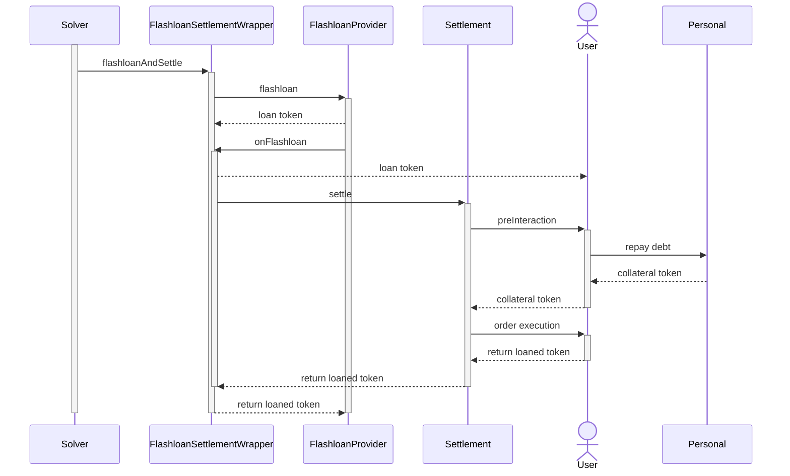

# How does it work?

The flashloan's flow can be summarized to:

1. Advance funds to the user.
2. Invoke a function that allows the user to execute an operation with the borrowed funds.
3. Return the funds to the lender.
4. Verify that the full amount has been repaid.

If any step fails, the entire transaction is reverted, ensuring that no funds are moved. This makes flash loans risk-free, even without collateral.

All steps must occur within the same caller context. The reason it holds on to the caller context is that the user's token must be advanced into the settlement contract (so that a solver has funds to work with) and only send the swapped tokens out at the end of the settlement. By holding on to the caller's context, it is possible to revert if the tokens cannot be transferred at the end of the settlement. However, CoW Protocol cannot hold on to this context directly. To ensure that all steps execute within the same caller context, the GPv2 Settlement contract's `settle()` function is called from within the Flashloan Settlement Wrapper contract callback. Rather than directly calling the GPv2 Settlement contract, the solver first interacts with the Flashloan Settlement Wrapper contract.

The user specifies which operations to execute with the loaned tokens in the pre-hook (e.g., repay a debt with collateral), and then in the user order, the user must return the loaned token.

## Flashloans Use Cases

The flashloans orders can be used (not exclusively) for:

- **[Paying outstanding debt with collateral](../order-types/pay-debt-flashloans.md)**: A key advantage of flashloans is the ability to repay debt with collateral, since flashloans allow users to close or reduce their debt positions without needing upfront liquidity.
- **Preventing liquidation of leveraged positions**: When a trader’s collateral value drops close to the liquidation threshold, a flashloan can be used to temporarily inject liquidity, repay part of the debt, or shift funds to maintain a healthy collateral ratio. This proactive adjustment prevents forced liquidations and minimizes potential losses.
- **Adjusting leverage positions dynamically:** Flashloans make it possible to restructure leverage without manually moving funds. Traders can increase or decrease leverage by borrowing and swapping assets within the same transaction, allowing for more efficient position management without unnecessary capital lockup.
