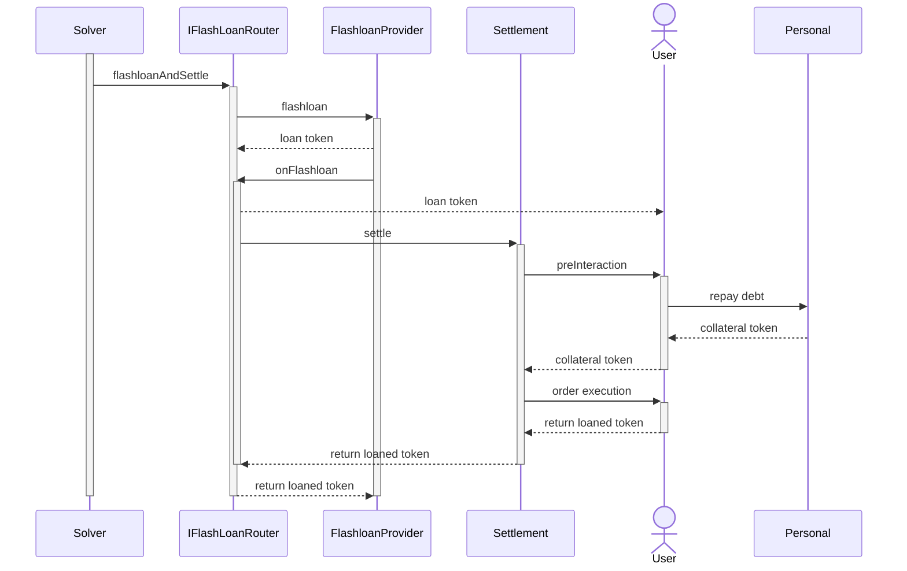

# How does it work?

The flashloan's flow can be summarized to:

1. Advance funds to the user.
2. Invoke a function that allows the user to execute an operation with the borrowed funds.
3. Return the funds to the lender.
4. Verify that the full amount has been repaid.

If any step fails, the entire transaction is reverted, ensuring that no funds are moved. This makes flash loans risk-free, even without collateral. 

The user must ensure that by the end of the order execution, the settlement contract has sufficient funds to repay the lender. For example, the user can define operations in the pre-hook that utilize the loaned tokens (e.g., repaying a debt using collateral). Then, within the user order, they can perform a swap to obtain the required loaned tokens for repayment.

## Flashloans Use Cases

The flashloans orders can be used (not exclusively) for:

- **[Paying outstanding debt with collateral](../order-types/pay-debt-flashloans.md)**: A key use case of flashloans is the ability to repay debt with collateral, since flashloans allow users to close or reduce their debt positions without needing upfront liquidity.
- **Preventing liquidation of leveraged positions**: When a trader’s collateral value drops close to the liquidation threshold, a flashloan can be used to temporarily inject liquidity, repay part of the debt, or shift funds to maintain a healthy collateral ratio. This proactive adjustment prevents forced liquidations and minimizes potential losses.
- **Adjusting leverage positions dynamically:** Flashloans make it possible to restructure leverage without manually moving funds. Traders can increase or decrease leverage by borrowing and swapping assets within the same transaction, allowing for more efficient position management without unnecessary capital lockup.
