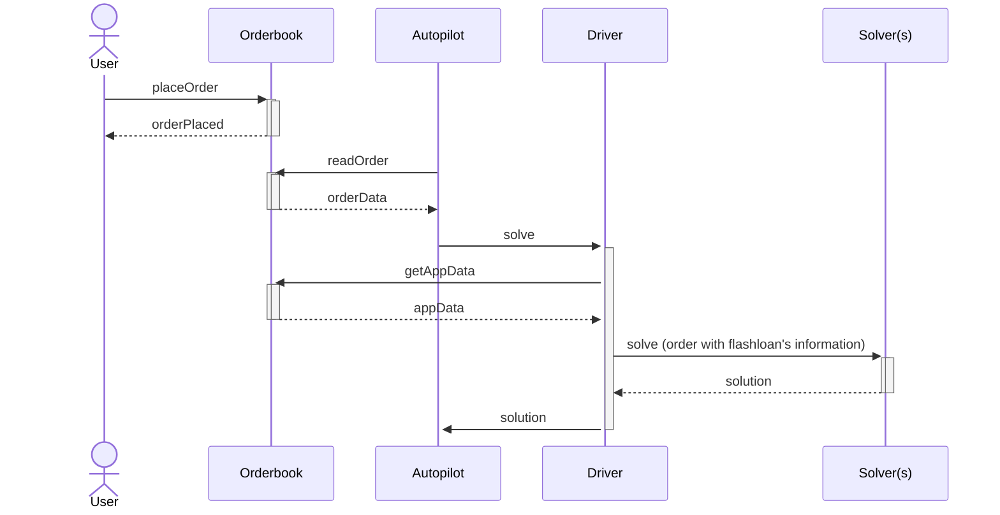

# How to specify an order with flashloan

The flashloan is encoded into the [appData](/cow-protocol/reference/core/intents/app-data)'s metadata as an optional object as it follows:

```json
{
  "flashloan": {
    "lender": "0x1111111111111111111111111111111111111111",
    "borrower": "0x2222222222222222222222222222222222222222",
    "token": "0xdAC17F958D2ee523a2206206994597C13D831ec7",
    "amount": "1000000"
  }
}
````

- **lender (optional):** the contract that could be used to borrow the funds from, if it is not set, the driver's default provider will be used.
- **borrower (optional):** who should get the proceeds of the trader, if it is not set, then the order receiver will get the funds.
- **token:** wthen token that needs to get borrowed.
- **amount:** how many atoms of the token need to get borrowed (e.g., 1 `WETH` would be 10¹⁸).

## appData flow

The user is able to create a flashloan order by attaching to the `appData` the specified metadata. The autopilot reads the order and cuts it into a [batch auction](../introduction/batch-auctions).
Then the driver fetches the `appData` by calling the orderbook with `GET /v1/app_data/<app_data_hash>` for every order and caches them in memory. The driver includes the flashloan information into the batch auction's order before sending it to the solver(s).


