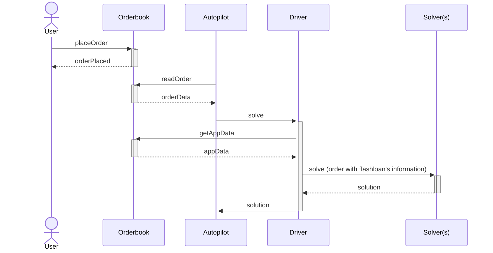

# Solvers

The solver receives for each order an optional object indicating the flashloan's hints. This information serves as a hint for the solver, but the solver ultimately can modify this data in order to make the operation more optimal.

## How to get the flashloan's hints

The user is able to create a flashloan order's hint by attaching to the `appData` the specified metadata. The autopilot reads the order and cuts it into a [batch auction](../introduction/batch-auctions). Then the driver fetches the `appData` by calling the orderbook with `GET /v1/app_data/<app_data_hash>` for every order and caches them in memory. The driver includes the flashloan information into the batch auction's order before sending it to the solver(s).

## Contract call

The solver must interact with the Flashloan Settlement Wrapper contract.

TODO
