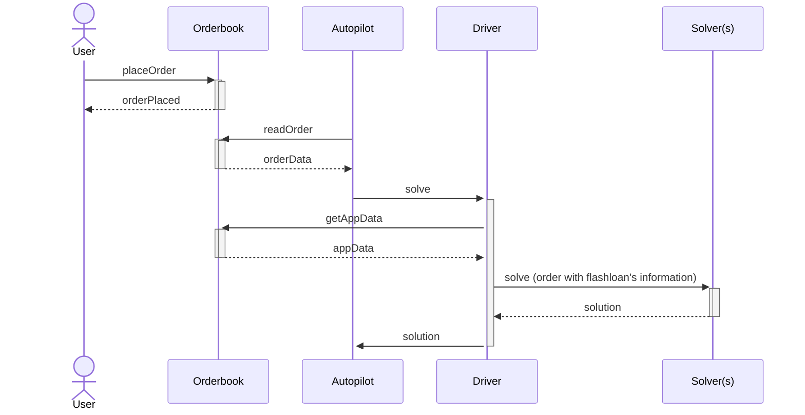

# Solvers

The solver can receive an optional object with each order that provides hints for using flashloans. These hints act as guidance, but the solver is free to return a different list of flashloan objects in their solution. The solver has three options:

- Provide no hint: In this case, the driver will assume the flashloan hint attached to the order gets settled in the solution.
- Use the provided hint: The solver can directly copy the flashloan hint included with the order.
- Define a custom hint: The solver can specify a different flashloan hint, allowing for better optimization of flashloan usage.

## How to get the flashloan's hints

The user is able to create a flashloan order's hint by attaching to the `appData` the specified metadata. The autopilot reads the order and cuts it into a [batch auction](../introduction/batch-auctions). Then the driver fetches the `appData` by calling the orderbook with `GET /v1/app_data/<app_data_hash>` for every order and caches them in memory. The driver includes the flashloan information into the batch auction's order before sending it to the solver(s).

## Contract call

The solver must interact with the Flashloan Settlement Wrapper contract.

TODO
