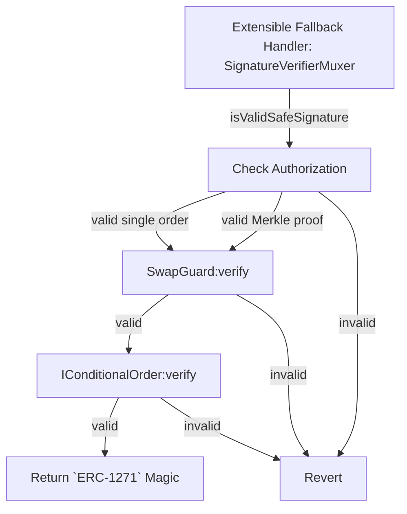
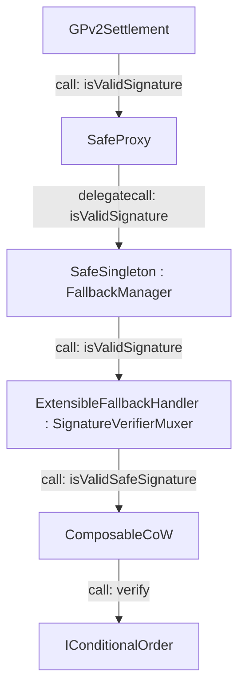

# ComposableCoW

ComposableCoW is a framework for smoothing the developer experience when building conditional orders on CoW Protocol. Conditional orders are a subset of [`ERC-1271`](../../reference/signing-schemes#erc-1271) smart contract orders. It allows one to create conditional orders that:

1. Can be used to generate multiple discrete order (self-expressing)
2. Assess a proposed order against a set of conditions (self-validating)

The framework makes boilerplate code for conditional orders a thing of the past, and allows developers to focus on the business logic of their order. ComposableCoW handles:

1. Authorization (multiple owners, with multiple orders per owner)
2. Order relaying (watch-towers)

## Architecture

The following principles have been employed in the architectural design:

1. `O(1)` gas-efficiency for `n` conditional order creation / replacement / deletion
2. Conditional orders **SHOULD** behave the same as a discrete order for EOAs (self-custody of assets, i.e. "wrapper" contracts not required)
3. Conditional orders **SHOULD** be optimized towards _statelessness_ - pass required data via `calldata`
4. **MAY** enhance the [Safe](https://safe.global) user experience when paired with [`ExtensibleFallbackHandler`](https://hackmd.io/-nLuF3JIRyuS5w864_mbrg) 🐮🔒

By using Merkle Trees, the gas efficiency of `O(1)` is achieved for `n` conditional orders. This is achieved by storing the Merkle Tree root on-chain, and passing the Merkle Tree proof to the `ComposableCoW` contract. This allows for `O(1)` gas efficiency for adding / removing conditional orders.

For simplicity, single orders are also supported, however, this is **NOT** recommended for large `n` as the gas efficiency is `O(n)`.

### Execution context

As there are many nested contracts, it's important for a callee to know some context from the caller. To achieve this, ComposableCoW passes a `bytes32` variable `ctx` to the callee, such that:

```
ctx = merkle root of orders: bytes32(0)
      single order:          H(ConditionalOrderParams)
```

Having this context also allows for conditional orders / merkle roots to use this as a key in a mapping, to store conditional order-specific data.

#### Conditional order verification flow

The following flowchart illustrates the conditional order verification flow (assuming `safe`):



#### Settlement execution path

CoW Protocol order settlement execution path (assuming `safe`):



### Signature verification

ComposableCoW implements `ISafeSignatureVerifier`, which allows for delegated `ERC-1271` signature validation with an enhanced context:

```solidity
function isValidSafeSignature(
    Safe safe,
    address sender,
    bytes32 _hash,
    bytes32 domainSeparator,
    bytes32, // typeHash
    bytes calldata encodeData,
    bytes calldata payload
) external view override returns (bytes4 magic);
```

| **Parameter** | **Description** |
|---|---|
| `safe` | Contract that is delegating signing |
| `sender` | `msg.sender` that called `isValidSignature` on `safe` |
| `_hash` | Order digest |
| `domainSeparator` | See [`EIP-712`](https://eips.ethereum.org/EIPS/eip-712#definition-of-domainseparator) |
| `typeHash` | Not used |
| `encodeData` | ABI-encoded [`GPv2Order.Data`](../core/settlement.md#gpv2orderdata-struct) (per [`EIP-712`](https://eips.ethereum.org/EIPS/eip-712#definition-of-encodedata)) to be settled |
| `encodeData` | ABI-encoded [`GPv2Order.Data`](../core/settlement.md#gpv2orderdata-struct) to be settled |

In order to delegate signature verification to `ComposableCoW`, the delegating contract may either:

1. Be a Safe and use `ExtensibleFallbackHandler` that allows for `EIP-712` domain delegation to a custom contract (i.e. `ComposableCoW`); or
2. Implement `ERC-1271` and within the `isValidSignature` method, call `ComposableCoW.isValidSafeSignature()`.

:::tip

ComposableCoW can also be used with contracts other than Safe. The [`ERC1271Forwarder`](https://github.com/cowprotocol/composable-cow/blob/main/src/ERC1271Forwarder.sol) abstract contract has been provided to allow for new contracts to easily integrate with ComposableCoW.

:::

:::note

If using `ExtensibleFallbackHandler`, and the CoW Protocol settlement domain is delegated to `ComposableCoW`, **ALL** `ERC-1271` signatures will be processed by `ComposableCoW`.

:::

### Discrete order verifiers

A conditional order that verifies a proposed discrete order against a set of conditions shall implement the `IConditionalOrder` interface.

```solidity
function verify(
    address owner,
    address sender,
    bytes32 _hash,
    bytes32 domainSeparator,
    bytes32 ctx,
    bytes calldata staticInput,
    bytes calldata offchainInput
    GPv2Order.Data calldata order,
) external view;
```

| **Parameter** | **Description** |
|---|---|
| `owner` | The owner of the conditional order |
| `sender` | `msg.sender` context calling `isValidSignature` |
| `_hash` | `EIP-712` order digest |
| `domainSeparator` | `EIP-712` domain separator |
| `ctx` | [Execution context](#execution-context) |
| `staticInput` | Conditional order type-specific data known at time of creation for **all** discrete orders |
| `offchainInput` | Conditional order type-specific data **NOT** known at time of creation for a **specific** discrete order (or zero-length bytes if not applicable) |
| `order` | The proposed discrete order's [`GPv2Order.Data`](../core/settlement.md#gpv2orderdata-struct) struct |

:::warning

Order implementations **MUST** validate / verify `offchainInput`!

:::

:::caution

The `verify` method **MUST** `revert` with `OrderNotValid(string)` if the parameters in `staticInput` do not correspond to a valid order.

:::

:::note 

ComposableCoW is responsible for checking that all values **EXCLUDING** `offchainInput` belong to an order that was previously registered on-chain.

:::

### Discrete order generators

A conditional order that generates discrete orders shall implement the `IConditionalOrderGenerator` interface.

```solidity
function getTradeableOrder(
    address owner,
    address sender,
    bytes32 ctx,
    bytes calldata staticInput,
    bytes calldata offchainInput
) external view returns (GPv2Order.Data memory);
```

To simplify the developer experience, a [`BaseConditionalOrder`](https://github.com/cowprotocol/composable-cow/blob/main/src/BaseConditionalOrder.sol) contract has been provided that implements the `IConditionalOrderGenerator` interface, and necessary boilerplate.

### Swap guards

A swap guard is a contract that implements the `ISwapGuard` interface, and if set by an `owner`, will be called by `ComposableCoW` prior to calling `verify` on the conditional order.

This allows for `owner`-wide restrictions on the conditional order, such as:

* [`receiver` lock](https://github.com/cowprotocol/composable-cow/blob/main/src/guards/ReceiverLock.sol) (i.e. `receiver` **MUST** be `owner`)
* Token whitelist

The `ISwapGuard` interface is as follows:

```solidity
function verify(
    GPv2Order.Data calldata order,
    bytes32 ctx,
    IConditionalOrder.ConditionalOrderParams calldata params,
    bytes calldata offchainInput
) external view returns (bool);
```

| **Parameter** | **Description** |
|---|---|
| `order` | Proposed discrete order |
| `ctx` | [Execution context](#execution-context) |
| `params` | [`ConditionalOrderParams`](#conditionalorderparams) |
| `offchainInput` | Conditional order type-specific data **NOT** known at time of creation for a **specific** discrete order (or zero-length bytes if not applicable) |

### Guarantees and Invariants

- CoW Protocol's settlement contract enforces single-use orders, i.e. **NO** `GPv2Order` can be filled more than once
- For merkle trees, `H(ConditionalOrderParams)` **MUST** be a member of the merkle tree `roots[owner]`
- For single orders, `singleOrders[owner][H(ConditionalOrderParams)] == true`

:::caution  

While a discrete order can be filled only once on CoW Protocol, a single conditional order can be used to create many different discrete orders. It is the responsibility of the implementation to limit which and when discrete orders can be executed.  

:::

## Data Types and Storage

### `ConditionalOrderParams`

A conditional order is defined by the following data:

```solidity
struct ConditionalOrderParams {
    IConditionalOrder handler;
    bytes32 salt;
    bytes staticData;
}
```

| **Field** | **Description** |
|---|---|
| `handler` | The contract implementing the conditional order logic |
| `salt` | Allows for multiple conditional orders of the same type and data |
| `staticData` | Data available to **ALL** *discrete* orders created by the conditional order |

:::note

All of the above fields are verified by `ComposableCoW` to be valid, prior to calling the `verify` method on the handler (`IConditionalOrder`).

:::

:::tip

When used with Merkle Trees and a cryptographically-secure random `salt`, the conditional order is effectively private (until a discrete order cut from this conditional order is broadcast to the CoW Protocol API).

:::

:::caution

* `H(ConditionalOrderParams)` **MUST** be unique
* Not setting `salt` to a cryptographically-secure random value **MAY** result in leaking information or hash collisions
* Single orders **MAY** leak order information on creation

:::

### `PayloadStruct`

This is the data passed to `ComposableCoW` via the `payload` parameter of `isValidSafeSignature`:

```solidity
struct PayloadStruct {
    bytes32[] proof;
    IConditionalOrder.ConditionalOrderParams params;
    bytes offchainInput;
}
```

| **Field** | **Description** |
|---|---|
| `proof` | Merkle Tree proof (if applicable, zero length otherwise) |
| `params` | [`ConditionalOrderParams`](#conditionalorderparams) |
| `offchainInput` | Off-chain input (if applicable, zero length otherwise) |

By setting `proof` to zero-length, this indicates to `ComposableCoW` that the order is a single order, and not part of a Merkle Tree.

### `Proof`

Some services pick up new conditional orders automatically from on-chain events.

The proof data can be emitted on-chain, but it can also be retrieved from other supported on-chain services.

The location field signals where this data can be retrieved. 

```solidity
struct Proof {
    uint256 location;
    bytes data;
}
```

:::note

The `Proof.location` is intentionally not made an `enum` to allow for future extensibility as other proof locations may be integrated.

:::

| **Field** | **Description** |
|---|---|
| `location` | An integer representing the location where to find the proofs |
| `data` | `location` implementation specific data for retrieving the proofs |

#### Locations

| **Name** | **`location`** | **`data`** |
|---|---|---|
| `PRIVATE` | `0` | `bytes("")` |
| `LOG` | `1` | `abi.encode(bytes[] order)` where `order = abi.encode(bytes32[] proof, ConditionalOrderParams params)` |
| `SWARM` | `2` | `abi.encode(bytes32 swarmCac)` |
| `WAKU` | `3` | `abi.encode(string protobufUri, string[] enrTreeOrMultiaddr, string contentTopic, bytes payload)` |
| `IPFS` | `5` | `abi.encode(bytes32 ipfsCid)` |

:::caution

Locations above are for the point of defining a standard. The provided watch-tower currently does _not_ support Merkle Tree proofs for orders.

:::

<details closed>
    <summary>JSON schema for proofs</summary>

It is expected that the proofs retrieved, excluding `PRIVATE` and `LOG` conform to a JSON schema:

```json
{
    "type": "object",
    "properties": {
        "proof": {
            "type": "array",
            "items": {
                "type": "string"
            }
        },
        "params": {
            "type": "object",
            "properties": {
                "handler": {
                    "type": "string"
                },
                "salt": {
                    "type": "string"
                },
                "staticData": {
                    "type": "string"
                }
            },
            "required": [
                "handler",
                "salt",
                "staticData"
            ]
        },
        "offchainInput": {
            "type": "string"
        }
        "description": {
            "type": "string"
        }
    },
    "required": [
        "proof",
        "params",
    ]
}
```

</details>

### `roots`

Using an `owner` as a key, the `roots` mapping stores the Merkle Tree root for the conditional orders of that `owner`.

```solidity
mapping(address => bytes32) public roots;
```

### `singleOrders`

Using `owner, ctx` as a key, the `singleOrders` mapping stores the single orders for the conditional orders of that `owner`.

```solidity
mapping(address => mapping(bytes32 => bool)) public singleOrders;
```

### `cabinet`

Using `owner, ctx` as a key, the `cabinet` mapping stores the conditional order-specific data for the conditional orders of that `owner`.

```solidity
mapping(address => mapping(bytes32 => bytes32)) public cabinet;
```

### `swapGuards`

Using `owner` as a key, the `swapGuards` mapping stores the swap guards for the conditional orders of that `owner`.

```solidity
mapping(address => ISwapGuard) public swapGuards;
```

## Functions

### For users

#### `setRoot` / `setRootWithContext`

A `safe` or `owner` calls the respective setter method to set the Merkle Tree root for their conditional orders:

```solidity
function setRoot(bytes32 root, Proof calldata proof) public;
function setRootWithContext(
    bytes32 root,
    Proof calldata proof,
    IValueFactory factory,
    bytes calldata data
) external;
```

| **Parameter** | **Description** |
|---|---|
| `root` | Merkle Tree root of conditional orders |
| `proof` | [`Proof`](#proof) |
| `factory` | An `IValueFactory` that will be used to populate the `ctx` storage slot (if applicable) |
| `data` | Data to be passed to the `factory` to populate the `ctx` storage slot (if applicable) |
  
When a new merkle root is set, emits `MerkleRootSet(address indexed owner, bytes32 root, Proof proof)`.

:::note

`ComposableCoW` will **NOT** verify the proof data passed in via the `proof` parameter for `setRoot`. It is the responsibility of the client and watch-tower to verify / validate this.

:::

#### `create` / `createWithContext`

The `owner` calls the respective setter method to create a conditional order:

```solidity
function create(
    IConditionalOrder.ConditionalOrderParams calldata params,
    bool dispatch
) public;
function createWithContext(
    IConditionalOrder.ConditionalOrderParams calldata params,
    IValueFactory factory,
    bytes calldata data,
    bool dispatch
) external;
```

| **Parameter** | **Description** |
|---|---|
| `params` | [`ConditionalOrderParams`](#conditionalorderparams) |
| `factory` | An `IValueFactory` that will be used to populate the `ctx` storage slot (if applicable) |
| `data` | Data to be passed to the `factory` to populate the `ctx` storage slot (if applicable) |
| `dispatch` | If `true`, broadcast the `ConditionalOrderCreated` event |

#### `remove`

The `owner` calls the `remove(bytes32 singleOrderHash)` method to remove a conditional order:

```solidity
function remove(bytes32 singleOrderHash) external;
```

| **Parameter** | **Description** |
|---|---|
| `singleOrderHash` | `H(ConditionalOrderParams)` |

#### `setSwapGuard`

The `owner` calls the `setSwapGuard(ISwapGuard guard)` method to set a swap guard for a conditional order:

```solidity
function setSwapGuard(ISwapGuard swapGuard) external;
```

| **Parameter** | **Description** |
|---|---|
| `swapGuard` | The swap guard contract |

### For watch-towers

#### `getTradeableOrderWithSignature`

A watch-tower calls the `getTradeableOrderWithSignature` method to get a discrete order that is tradeable on CoW Protocol:

```solidity
function getTradeableOrderWithSignature(
    address owner,
    IConditionalOrder.ConditionalOrderParams calldata params,
    bytes calldata offchainInput,
    bytes32[] calldata proof
) external view returns (GPv2Order.Data memory order, bytes memory signature);
```

This function will:

1. Determine if `owner` is a `safe`, and provide the `SignatureVerifierMuxer` appropriate formatting for the `ERC-1271` signature submission to CoW Protocol.
2. If not a `safe`, format the `ERC-1271` signature according to `abi.encode(domainSeparator, staticData, offchainData)`.

Subsequently, `ComposableCoW` will:

1. Check that the order is authorized.
2. Check that the order type supports discrete order generation (i.e. `IConditionalOrderGenerator`) by using `IERC165` (and `revert` if not, allowing the watch-tower to prune invalid monitored conditional orders).
3. Call `getTradeableOrder` on the handler to get the discrete order ([`GPv2Order.Data`](../core/settlement.md#gpv2orderdata-struct)).
4. Generate the signing data as above. 

## Indexing

* `ConditionalOrderCreated(address indexed owner, ConditionalOrderParams params)`
* `MerkleRootSet(address index owner, bytes32 root, Proof proof)`

### Custom error codes

* `ProofNotAuthed()` - the proof is not authorized (merkle root incorrect)
* `SingleOrderNotAuthed()` - the single order is not authorized
* `SwapGuardRestricted()` - the swap guard did not pass verification
* `InvalidHandler()` - the handler is not a valid conditional order
* `InvalidFallbackHandler()` - the fallback handler is not a valid conditional order
* `InterfaceNotSupported()` - the handler does not support the `IConditionalOrder` interface

:::tip Keep your orders watched

A conditional order developer **SHOULD** use these error codes to ensure that the conditional order is well-formed and not garbage collected / rate limited by a watch-tower.

:::

* `OrderNotValid(string)` - the `staticInput` parameters are not valid for the conditional order
* `PollTryNextBlock(string)` - signal to a watch-tower that polling should be attempted again
* `PollTryAtBlock(uint256 blockNumber, string)` - signal to a watch-tower that polling should be attempted again at a specific block number
* `PollTryAtEpoch(uint256 timestamp, string)` - signal to a watch-tower that polling should be attempted again at a specific epoch (unix timestamp)
* `PollNever(string)` - signal to a watch-tower that the conditional order should not be polled again (delete)

## Off-chain

### Watch-tower

As these orders are not automatically indexed by the CoW Protocol, there needs to be some method of relaying them to the Order Book API for inclusion in a batch. 

This is the responsibility of a [watch-tower](https://github.com/cowprotocol/watch-tower). CoW Protocol runs a watch-tower that will monitor the `ConditionalOrderCreated` event, and relay the discrete orders to the Order Book API.

There is also a [DAppNode package for running a watch-tower](https://github.com/cowprotocol/dappnodepackage-cow-watch-tower).
