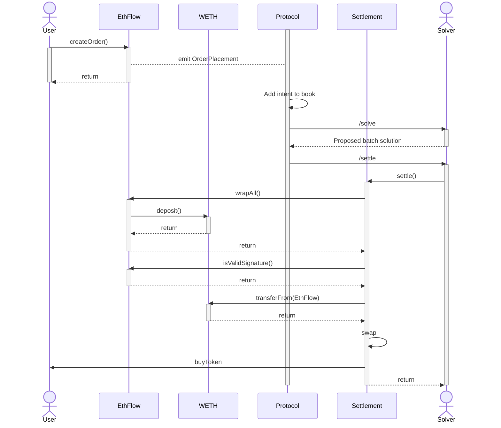

# Eth-flow

As CoW Protocol only [supports `ERC20 tokens`](../../core/tokens), this means that if a user wants to sell `ETH` on CoW Protocol, they need to:

1. Convert their `ETH` into `WETH`
2. Approve the [vault relayer](../core/vault-relayer) for spending their `WETH`
3. Create their order

This process is time-consuming and potentially costly for the user and is why we developed Eth-flow, a contract that smooths the user experience when selling native tokens on CoW Protocol.

## Architecture

An intermediary smart contract is used to wrap `ETH` into `WETH` and create an intent on behalf of the user. This contract then expresses the users' intent to trade on CoW Protocol using an [`ERC-1271`](../../core/signing-schemes#erc-1271)-signed intent.



The user interacts with Eth-flow to deposit `ETH` via `createOrder`. The Eth-flow contract will then create an intent on behalf of the user that will be placed into the Order Book by the Protocol and settled by solvers - the same way as if the user had wrapped their `ETH` to `WETH` and created the intent themselves.

The proceeds will go to the user and not to the exchange because we specify the user as the `receiver` in the Eth-flow contract intent.

### User intent / Contract intent

Every `ETH` sell intent from a user ("_user intent_") is transformed into a `WETH` sell intent in the Eth-flow contract ("_contract intent_").

This intent is implicitly created when the user deposits `ETH`, by emitting an on-chain event that is indexed by the off-chain components of the protocol.

The user's intent is a subset of the contract intent as some parameters are implicit (such as the sell token being `ETH` and the `receiver` being the user). The following table describes the parameters of the user intent.

:::note

The user intent described below is not a valid intent for the settlement contract. It represents the data used by the Eth-flow contract for bookkeeping. The contract intent ([`GPv2Order.Data`](../core/settlement#gpv2orderdata-struct)) is that which is settled by the Protocol.

:::

| **Parameter** | **User** | **Contract** | **Limitation** |
|---|---|---|---|
| `sellToken` | `ETH` | `WETH` |  |
| `buyToken` | any | same as user |  |
| `receiver` | `!= address(0)` | same as user | Must **NOT** be the zero address as this has the meaning of `self` in CoW Protocol |
| `sellAmount` | any | same as user |  |
| `buyAmount` | any | same as user |  |
| `validTo` | any | `type(uint32).max` | Required to be fixed at the maximum point in the future as `filledAmount` in `GPv2Settlement` contract is relied upon which can be cleared by `freeFilledAmountStorage` |
| `appData` | any | same as user |  |
| `feeAmount` | any | same as user |  |
| `kind` | `sell` | `sell` | Limited to `sell` intents only as dust from `buy` intents left in the Eth-flow contract would not be economical for a user to withdraw |
| `partiallyFillable` | any | same as user |  |
| `sellTokenBalance` | `erc20` | `erc20` | Only `erc20` implemented |
| `buyTokenBalance` | `erc20` | `erc20` | Only `erc20` implemented |

### Contract order signing

The contract order uses [`ERC-1271`](../../core/signing-schemes#erc-1271) signatures.

The `signature` is empty, since all information needed to verify the order can be found on-chain.

Signature verification in a settlement works as follows:

1. The intent digest is computed as part of the settlement process and is the message that is assumed to be signed by the Eth-flow contract with `ERC-1271`. The digest is used to retrieve the `owner` and the `validTo` from the [intent mapping](#orders).
2. The intent `validTo` is checked against the current timestamp.
3. The intent must be valid (should be set and not invalidated).

If all verification steps succeed, Eth-flow affirmatively signs the digest with `ERC-1271`.

### Guarantees / Invariants

1. A user can have multiple open intents

## Data Types and Storage

### `EthFlowOrder.OnchainData`

This struct contains the parts of a user intent that need to be stored on chain.

```solidity
struct OnchainData {
    address owner;
    uint32 validTo;
}
```

For asserting the validity of the intent, the Eth-flow contract applies some assumptions to the `owner`:

* `owner = address(0)` ⇒ unset
* `owner = address(0xffffffffffffffffffffffffffffffffffffffff)` ⇒ invalidated

:::note

Modifying the `validTo` field does not change the contract intent digest.

:::

### `EthFlowOrder.Data`

This struct collects all parameters needed to describe a single user trade intent.

```solidity
struct Data {
    IERC20 buyToken;
    address receiver;
    uint256 sellAmount;
    uint256 buyAmount;
    bytes32 appData;
    uint256 feeAmount;
    uint32 validTo;
    bool partiallyFillable;
    int64 quoteId;
}
```

| **Field** | **Description** |
|---|---|
| `...` | Same as [`GPv2Order.Data`](../core/settlement#gpv2orderdata-struct) |
| `quoteId` | `quoteId` returned by OrderBook API when requesting a quote for this order |

:::note

Users _should_ provide a valid `quoteId` when placing an order. This is not enforced by the Eth-flow contract, however quotes may be used as a basis to determine whether the automated refunding service should refund an order that has expired or not. In all cases, the user is able to manually refund the portion of their order that has not been matched.

:::

### `orders`

The Eth-flow contract stores users' intents as a `mapping`:

```solidity
mapping(bytes32 => EthFlowOrder.OnchainData) public orders;
```

The key of the mapping is the intent digest. It is derived by computing the contract intent digest (i.e. [`GPv2Order.Data` struct digest](../core/settlement#gpv2orderdata-struct)) from the user intent parameters.

:::note

There is a possibility of a collision in the digest. There could be two different Eth-flow intents that end up having the same digest. In this case, only one of the two intents can be created and the contract would revert if trying to create the second one.

:::

## Functions

:::note

All interactions with the Eth-flow contract require an Ethereum transaction by the user and incur a gas cost in *addition* to the protocol fee.

:::

### For users

#### `createOrder`
    
For when a user wants to sell `ETH`:

```solidity
function createOrder(EthFlowOrder.Data order) payable;
```

Eth-flow performs some checks when the user creates an intent. Failing any of these checks means that the transaction reverts:

1. The amount of `ETH` sent along with the transaction must be exactly what is needed to cover the sell amount plus the fees.
2. The order must be valid at the time the transaction is mined.

The intent parameters are used to compute the intent digest according to the [intent mapping](#user-intent--contract-intent). On successful execution of the transaction a new order is added to storage:

```raw
intent digest -> (msg.sender, validTo)
```

#### `invalidateOrder`

For when a user wants to invalidate an intent and return the `ETH` to the intent creator:

```solidity
function invalidateOrder(EthFlowOrder.Data order)
```

`order` is the same intent struct used to [create the intent](#createorder).

Intents can be invalidated in two ways:

1. The user who created the intent calls this function. Every valid intent can be invalidated at any time by its creator.
2. After the intent has expired, any address can trigger its invalidation. This is done to allow CoW Protocol to provide a service to automatically refund unmatched orders to the users.

An intent's validity and owner are recovered from the [intent mapping](#orders).

Each intent can be invalidated at most once and returns all funds that have not yet been used for trading. After invalidation, the intent is marked as invalid by setting the intent mapping for the intent digest to `invalidated`.

:::tip

Do you need to **manually recover funds from an Eth-flow intent**? There's a [tool for that](https://manual-ethflow-refunder.cowdev.eth.limo/). Simply enter the TX hash of the Eth-flow intent creation transaction and the tool will generate a transaction that will invalidate the intent and return the funds to the user.

:::

## Indexing

The Eth-flow contract has events that are indexed by the Protocol. These events are:

* `OrderPlacement`

## Off-chain

There are two components in [services](https://github.com/cowprotocol/services) that are used in the off-chain infrastructure for Eth-flow:

* Protocol - adds the intent to the order book
* Refunder - automatically refunds unmatched intents
