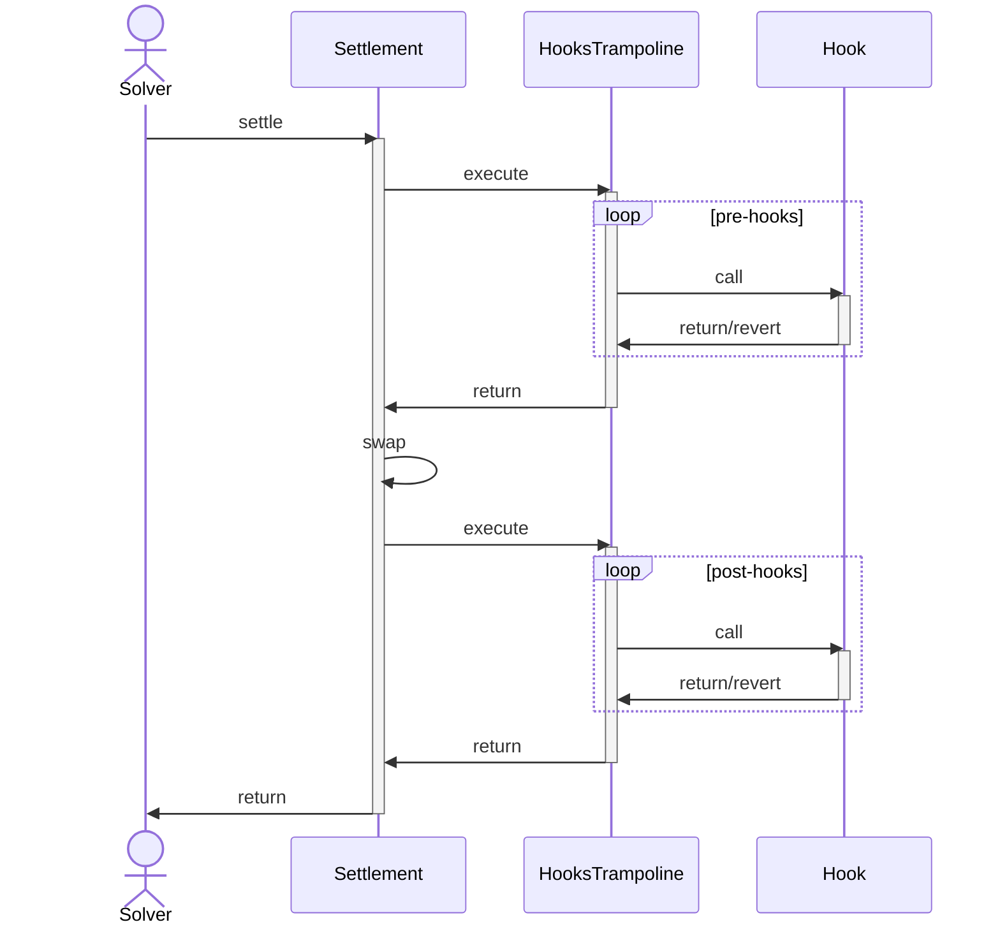

# HooksTrampoline

A contract for executing a users' custom actions before and after settlement.

## Architecture

The main [settlement](../core/settlement.md) contract for CoW Protocol allows for custom [interactions](../core/settlement#interactions) to be executed before and after the settlement logic. This is primarily used by solvers to access on-chain liquidity for settling batch auctions, but it can also be made available to users to perform custom actions, hereafter referred to as *hooks*.

However, executing hooks from the settlement contract is not ideal for two reasons:

1. Hooks may be malicious and drain the protocol fees
2. Hooks may revert, causing the settlement contract to revert, disrupting the settlement process

To mitigate these risks, users' hooks are executed by a trampoline contract, `HooksTrampoline`, which insulates the settlement contract.

Therefore executing users' hooks can be visualized as follows:



### Guarantees and Invariants

1. The trampoline contract is not upgradable
2. Hooks are only executed during the course of a settlement on CoW Protocol

:::warning

* Beware of leaving any funds in the trampoline contract. These are accessible to anyone.
* Do **NOT** grant any permissions to the trampoline contract. These are accessible to anyone.

:::

## Data Types and Storage

### `Hook`

Hooks are passed to the trampoline contract as a `Hook` struct:

```solidity
struct Hook {
    address target;
    bytes callData;
    uint256 gasLimit;
}
```

| **Field** | **Description** |
| --- | --- |
| `target` | Address of the contract to call |
| `callData` | Data to pass to the contract |
| `gasLimit` | Maximum amount of gas to use for the call |

## Functions

### For settlement

#### `execute`

This function is called by the settlement contract during the course of settlement as an *interaction* to execute the user's hooks.

```solidity
function execute(Hook[] calldata hooks) external onlySettlement;
```

| **Parameter** | **Description** |
| --- | --- |
| `hooks` | Array of hooks to execute |

## Indexing

Nil

## Off-chain

Nil