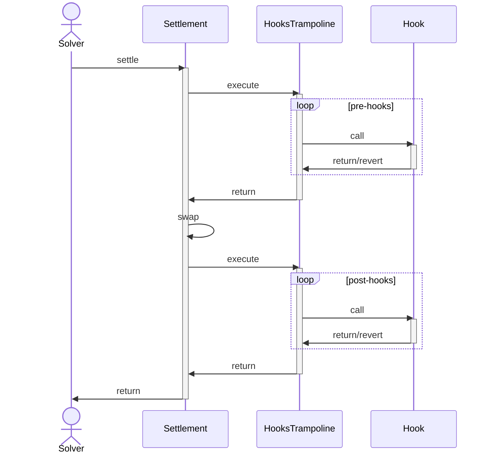

# HooksTrampoline

A helper contract used by solvers, to securely execute user's [hooks](/cow-protocol/reference/core/intents/hooks) with the settlement transaction.

## Architecture

The main [settlement](../core/settlement.md) contract for CoW Protocol allows for custom [interactions](../core/settlement#interactions) to be executed before and after the settlement logic. This is primarily used by solvers to access on-chain liquidity for settling batch auctions, but it can also be made available to users to perform custom actions, hereafter referred to as *[hooks](/cow-protocol/reference/core/intents/hooks)*.

However, executing hooks from the settlement contract is not ideal for two reasons:

1. Hooks may be malicious and drain the protocol fees
2. Hooks may revert, causing the settlement contract to revert, disrupting the settlement process

Since solvers are responsible for any losses resulting from their settlement transactions, they execute hooks through an intermediary contract. The `HooksTrampoline` contract serves as a reference implementation that helps isolate the settlement contract and provide protection.

Therefore executing users' hooks can be visualized as follows:



### Guarantees and Invariants

1. The trampoline contract is not upgradable
2. Hooks are only executed during the course of a settlement on CoW Protocol
3. Enough gas is forwarded to the hooks to execute the logic

:::warning

* Beware of leaving any funds in the trampoline contract. These are accessible to anyone.
* Do **NOT** grant any permissions to the trampoline contract. These are accessible to anyone.

:::

### Relying on the trampoline contract address

Most solvers will use the `HooksTrampoline` contract to execute hooks, as it offers strong security guarantees. However, the protocol does not mandate any specific implementation. In fact, solvers are not required to use an intermediary contract at all if they can ensure the security of their hooks by other means, they may do so and save gas.


:::warning
Do not design hooks that rely on the caller (`msg.sender`) being a specific `HooksTrampoline` contract:

1. **Not secure**: Such a check does not actually protect against third-party calls. Anyone can create an order that invokes your contract, and that call will still originate from a trampoline contract.
2. **Not reliable**: As noted above, the trampoline contract address can change at any time.
:::


## Data Types and Storage

### `Hook`

Hooks are passed to the trampoline contract as a `Hook` struct:

```solidity
struct Hook {
    address target;
    bytes callData;
    uint256 gasLimit;
}
```

| **Field** | **Description** |
| --- | --- |
| `target` | Address of the contract to call |
| `callData` | Data to pass to the contract |
| `gasLimit` | Maximum amount of gas to use for the call |

## Functions

### For settlement

#### `execute`

This function is called by the settlement contract during the course of settlement as an *interaction* to execute the user's hooks.

```solidity
function execute(Hook[] calldata hooks) external onlySettlement;
```

| **Parameter** | **Description** |
| --- | --- |
| `hooks` | Array of hooks to execute |

## Indexing

Nil

## Off-chain

Nil