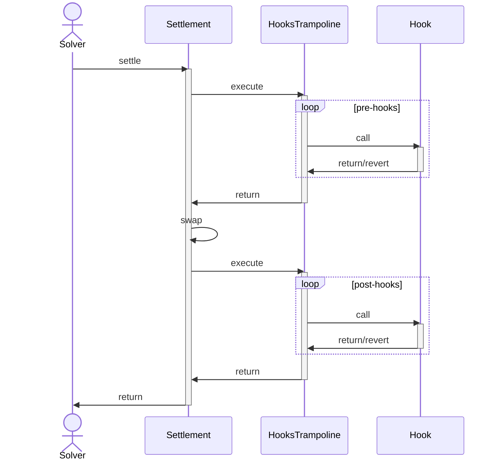

# HooksTrampoline

## Architecture

```mermaid
sequenceDiagram
    actor Solver
    participant Settlement
    participant HooksTrampoline
    participant Hook
    Solver->>Settlement: settle
    activate Settlement
    Settlement->>HooksTrampoline: execute
    activate HooksTrampoline
    loop pre-hooks
        HooksTrampoline->>Hook: call
        activate Hook
        Hook->>HooksTrampoline: return/revert
        deactivate Hook
    end
    HooksTrampoline->>Settlement: return
    deactivate HooksTrampoline
    Settlement->>Settlement: swap
    Settlement->>HooksTrampoline: execute
    activate HooksTrampoline
    loop post-hooks
        HooksTrampoline->>Hook: call
        activate Hook
        Hook->>HooksTrampoline: return/revert
        deactivate Hook
    end
    HooksTrampoline->>Settlement: return
    deactivate HooksTrampoline
    Settlement->>Solver: return
    deactivate Settlement
```

## Guarantees / Invariants

## Storage

## Interactions

## Indexing

## Off-chain