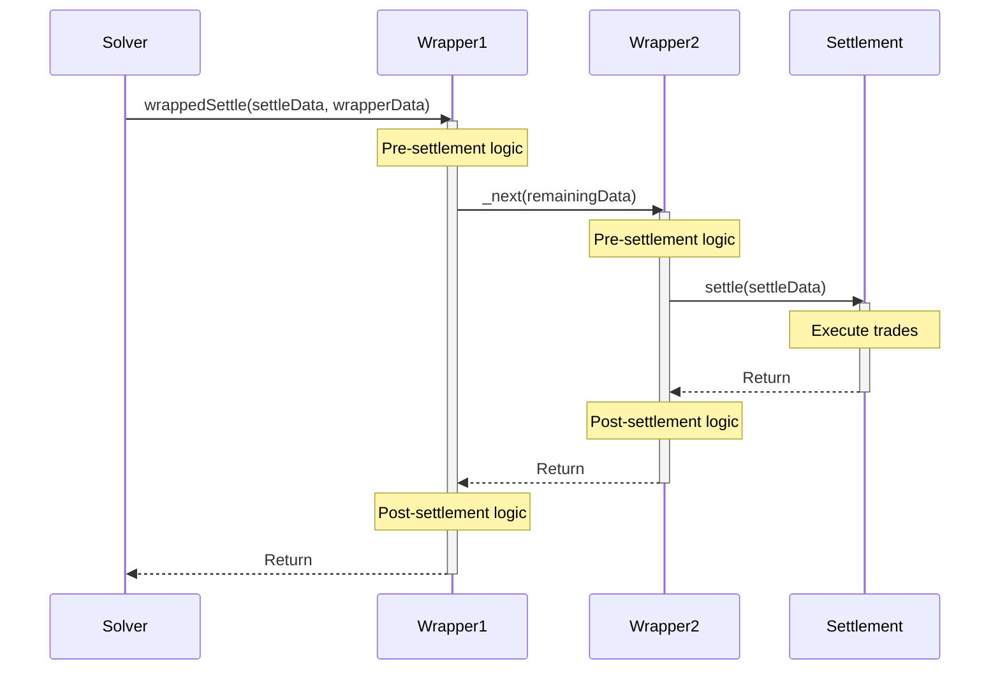

# Generalized Wrappers

Generalized wrappers are smart contracts that enable custom logic to execute before and after CoW Protocol settlement operations. This reference documents the contract interfaces, implementation patterns, and on-chain behavior of the wrapper system.

## Architecture

### Execution Flow



### Key Design Principles

1. **Abstract**: There are very few limitations on what a wrapper can/can't do around a settlement transaction
2. **Efficient Encoding**: Wrapper-specific data appended to minimize gas overhead
3. **Nested Support**: Multiple wrappers chain by encoding addresses sequentially, allowing CoW orders
4. **Authentication**: Only allowlisted wrappers can call settlement contract

## Implementation

Developers looking to integrate using wrappers should copy this all-in-one solidity file in your project.

It provides a few base contracts which can serve as the foundation for your integration:

- **`ICowWrapper`**: Core interface all wrappers must implement
- **`CowWrapper`**: Abstract base contract providing security and utilities that all wrappers should use

<script src="https://gist.github.com/kaze-cow/693f9302c0c06b3ade53e7c612001cf0.js"></script>


### Quick Start Example

Here's a minimal wrapper implementation to use as a starting point:

```solidity
// SPDX-License-Identifier: GPL-3.0
pragma solidity ^0.8.0;

import { CowWrapper } from "./CowWrapper.sol";

contract MyWrapper is CowWrapper {
    constructor(address settlement) CowWrapper(settlement) {}

    function _wrap(bytes calldata wrapperData) internal override {
        // Your custom pre-settlement logic here
        // Example: pull tokens, initiate flash loan, etc.

        // Continue the wrapper chain (calls settlement or next wrapper)
        _next(wrapperData);

        // Your custom post-settlement logic here
        // Example: repay flash loan, stake tokens, etc.
    }

    function parseWrapperData(bytes calldata wrapperData)
        external
        view
        override
        returns (bytes memory)
    {
        // Validate and parse wrapper-specific data
        // This must be deterministic - same input always returns same output
        // Revert if data is invalid
        return wrapperData;
    }
}
```

### Wrapper Public Functions

#### `wrappedSettle`

Entry point for wrapper execution. Validates caller authentication and delegates to `_wrap()`--where integrators place their custom logic.

```solidity
function wrappedSettle(
    bytes calldata settleData,
    bytes calldata chainedWrapperData
) external override {
    // Verify caller is an authenticated solver
    require(
        GPv2Authentication(SETTLEMENT).isSolver(msg.sender),
        "Not authorized"
    );

    _wrap(wrapperData);
}
```

**Parameters:**
- `settleData`: Original `GPv2Settlement.settle(...)` calldata
- `chainedWrapperData`: 

#### Chained Wrapper Data Encoding

Each wrapper in the chain consists of:
- 2 bytes: uint16 length of wrapper-specific data
- `length` bytes: wrapper-specific data for this wrapper
- 20 bytes: address of next wrapper (omitted for the final wrapper)
The final wrapper in the chain omits the next wrapper address and calls SETTLEMENT directly.

```
Example: 
```
[0x0005][0xAABBCCDDEE][0x1234...ABCD][0x0003][0x112233]
↑len    ↑data         ↑next wrapper  ↑len   ↑data
```

Each wrapper in the chain will successively pull off their own data and then call the next wrapper address (or the settlement address if no further wrapper data is supplied).

### Virtual Functions for integrators

#### `_wrap`

Contains custom surrounding settlement logic. **Must** call `_next()` to continue the chain to the settlement contract.

```solidity
function _wrap(bytes calldata wrapperData) internal virtual;
```

**Implementation Requirements:**
- Parse wrapper-specific data from `wrapperData` as required
- Execute pre-settlement logic
- Call `_next(remainingWrapperData)` to continue chain
- Execute post-settlement logic

**Example:**

```solidity
function _wrap(bytes calldata wrapperData) internal override {
    // 1. Parse data (first 2 bytes = length)
    uint16 myDataLength = uint16(bytes2(wrapperData[:2]));
    bytes calldata myData = wrapperData[2:2+myDataLength];

    (address token, uint256 amount) = abi.decode(myData, (address, uint256));

    // 2. Pre-settlement logic. Example, receive tokens from user
    IERC20(token).transferFrom(msg.sender, address(this), amount);

    // 3. Continue chain (REQUIRED)
    _next(wrapperData[2+myDataLength:]);

    // 4. Post-settlement logic. Example: stake tokens to a contract (for swap and stake)
    stakeTokens(token, amount);
}
```

### Internal Functions (Provided)

#### `_next`

Continues the wrapper chain or calls settlement. Handles all parsing and routing automatically.

```solidity
function _next(bytes calldata remainingWrapperData) internal;
```

**Behavior:**
- Reads next wrapper address from `remainingWrapperData`
- Determines if more wrappers exist or if settlement is next
- Makes appropriate call with correct data
- Handles wrapper nesting automatically

**Implementation Details:**
- Extracts next target address (last 20 bytes)
- Separates settle data from remaining wrapper data
- Calls next wrapper via `wrappedSettle()` or settlement via `settle()`

## Calldata Encoding Specification

Wrapper data uses an optimized encoding to minimize gas overhead:

### Structure

```
┌─────────────────────┬──────┬──────────┬──────────┬──────┬──────────┬────────────┐
│   Settle Calldata   │ Len₁ │  Data₁   │  Addr₂   │ Len₂ │  Data₂   │ Settlement │
│   (to settlement)   │(2 B) │ (wrap1)  │ (20 B)   │(2 B) │ (wrap2)  │  (20 B)    │
└─────────────────────┴──────┴──────────┴──────────┴──────┴──────────┴────────────┘
│<─── settleData ───>│<────────────────── wrapperData ──────────────────────────>│
```

**Components:**
- **Settle Calldata**: `GPv2Settlement.settle(...)` calldata (function selector + args)
- **Len₁**: 2-byte (uint16) length of wrapper 1's data
- **Data₁**: Wrapper 1's custom data
- **Addr₂**: 20-byte address of wrapper 2
- **Len₂**: 2-byte (uint16) length of wrapper 2's data
- **Data₂**: Wrapper 2's custom data
- **Settlement**: 20-byte address of settlement contract (final target)

### Data Consumption

Each wrapper in the chain:
1. Reads length prefix (2 bytes)
2. Extracts its data (next N bytes)
3. Passes remaining bytes to `_next()`

The `_next()` function:
1. Reads next address (from appropriate offset)
2. Calls next wrapper or settlement
3. Passes remaining data

## CowWrapperHelper

Utility contract for on-chain validation and encoding.

### Interface

```solidity
contract CowWrapperHelper {
    /// @notice Validate and build wrapper data for multiple wrappers
    /// @param wrapperAddresses Array of wrapper contract addresses
    /// @param wrapperDatas Array of wrapper-specific data (parallel to addresses)
    /// @return wrapperData Encoded wrapper data ready for wrappedSettle call
    function verifyAndBuildWrapperData(
        address[] calldata wrapperAddresses,
        bytes[] calldata wrapperDatas
    ) external view returns (bytes memory wrapperData);
}
```


### `CowWrapperHelpers`

To aid external integrators in encoding and verifying wrapper data, an additional view-only contract is provided.

<script src="https://gist.github.com/kaze-cow/8c8a49f3305519948b1ec868c7efa5b9.js"></script>


#### `parseWrapperData`

Validates wrapper-specific data. Must be deterministic and revert on invalid input.

```solidity
function parseWrapperData(
    bytes calldata wrapperData
) external view override returns (bytes memory);
```

**Requirements:**
- **Deterministic**: Same input must always produce same output
- **No time-based logic**: Cannot use `block.timestamp`, `block.number`, etc.
- **No mutable state**: Cannot read external mutable state
- **View function**: Cannot modify state
- **Revert on invalid**: Revert if data is malformed

## Implementation Guidelines for Integrators

### Security Requirements

:::warning Critical Requirements

#### 1. Use CowWrapper Abstract Contract

It is strongly reccomended to **NOT** implement `ICowWrapper` directly. The `CowWrapper` abstract contract provides:
- Solver authentication checks
- Correct calldata parsing and decoding
- Safe wrapper chain continuation
- Sanity checks for the settlement call

#### 2. Intermediate Contracts for User Calls

If allowing user-defined calls, route through intermediate contracts:

```solidity
// ❌ DANGEROUS
function _wrap(bytes calldata wrapperData) internal override {
    (address target, bytes memory data) = abi.decode(wrapperData, (address, bytes));
    target.call(data);  // User could call anything they want, including the settlement contract, using the wrapper's authenticated context
}

// ✅ SAFE
function _wrap(bytes calldata wrapperData) internal override {
    (address target, bytes memory data) = abi.decode(wrapperData, (address, bytes));
    HooksTrampoline(TRAMPOLINE).execute(target, data);  // Isolated execution
}
```

#### 3. Assume All Parameters Are Untrusted

Settlement data can be modified by nested wrappers, and solvers can supply arbitrary calldata. If it is important for your wrapper to be able to validate the wrapper it is receiving, only trust signature-protected or on-chain validated parameters.

#### 4. Deterministic Parsing Required

`parseWrapperData()` must always return same result for same input:

```solidity
// ❌ NOT DETERMINISTIC
function parseWrapperData(bytes calldata wrapperData)
    external view override returns (bytes memory)
{
    uint256 deadline = abi.decode(wrapperData, (uint256));
    require(block.timestamp < deadline, "Expired");  // Changes over time!
    return wrapperData;
}

// ✅ DETERMINISTIC
function parseWrapperData(bytes calldata wrapperData)
    external view override returns (bytes memory)
{
    uint256 deadline = abi.decode(wrapperData, (uint256));
    require(deadline > 0, "Invalid deadline");  // Always same result
    return wrapperData;
}
```

In the example above, your `_wrap` code can always reject deadline past expired instead.

#### 5. Defensive Design

Though a solver would be slashed for doing so, there is no hard guarantee wrapper executes even if user specifies it. If wrapper is critical:

**Option A: Make Order Fail Without Wrapper**
```solidity
// Pull required funds in wrapper
function _wrap(bytes calldata wrapperData) internal override {
    vault.withdraw(user, token, amount);  // Funds now in wrapper
    _next(wrapperData);
    // Settlement uses these funds - fails if wrapper didn't execute
}
```

**Option B: EIP-1271 Authentication**
```solidity
// Order signature only valid if wrapper executed
function isValidSignature(bytes32 hash, bytes memory signature)
    external view returns (bytes4)
{
    require(wrapperExecuted[hash], "Wrapper required");
    return EIP1271_MAGIC;
}
```

There may be other similar ways to enforce execution, but these patterns serve as a starting point.

:::

### Gas Overhead

Wrapper execution adds gas overhead to settlements.

**Benchmark (EmptyWrapper on Ethereum mainnet):**

| Metric | Value |
|--------|-------|
| With EmptyWrapper | 217,033 gas |
| Without wrapper | 194,761 gas |
| **Overhead** | **22,272 gas (11.4%)** |

**Scaling Factors:**
- Settlement data size (calldata copying)
- Wrapper logic complexity
- Number of nested wrappers

**Methodology:** Single Uniswap V3 WETH→USDC trade. See [services PR #3700](https://github.com/cowprotocol/services/pull/3700).

## Example Implementations

### EmptyWrapper

Minimal wrapper demonstrating the pattern:

```solidity
contract EmptyWrapper is CowWrapper {
    constructor(address settlement) CowWrapper(settlement) {}

    function _wrap(bytes calldata wrapperData) internal override {
        // No pre-settlement logic
        _next(wrapperData);  // Pass through
        // No post-settlement logic
    }

    function parseWrapperData(bytes calldata wrapperData)
        external
        view
        override
        returns (bytes memory)
    {
        // No validation needed
        return wrapperData;
    }
}
```

### Flash Loan Wrapper

Wrapper coordinating with lending protocol:

```solidity
contract FlashLoanWrapper is CowWrapper {
    ILendingPool public immutable lendingPool;

    constructor(address settlement, address _lendingPool)
        CowWrapper(settlement)
    {
        lendingPool = ILendingPool(_lendingPool);
    }

    function _wrap(bytes calldata wrapperData) internal override {
        (address asset, uint256 amount, bytes memory params) =
            abi.decode(wrapperData, (address, uint256, bytes));

        // Initiate flash loan (calls executeOperation)
        lendingPool.flashLoan(address(this), asset, amount, params);
    }

    function executeOperation(
        address asset,
        uint256 amount,
        uint256 premium,
        address,
        bytes calldata params
    ) external returns (bool) {
        require(msg.sender == address(lendingPool), "Unauthorized");

        // Execute settlement with borrowed funds
        _next(params);

        // Approve repayment
        IERC20(asset).approve(address(lendingPool), amount + premium);
        return true;
    }

    function parseWrapperData(bytes calldata wrapperData)
        external
        view
        override
        returns (bytes memory)
    {
        require(wrapperData.length >= 96, "Invalid data length");
        (address asset, uint256 amount,) = abi.decode(
            wrapperData,
            (address, uint256, bytes)
        );
        require(asset != address(0) && amount > 0, "Invalid parameters");
        return wrapperData;
    }
}
```

## Known Limitations

### Authentication Required

Wrappers need protocol approval, and are not fully permissionless.

### Settlement Upgrades

When settlement contract upgrades, all wrappers must be redeployed. It is reccomended to use [Cannon](https://usecannon.com/learn) to make it easy to redeploy your wrappers.

## Events

No wrapper-specific events are emitted. Wrapper usage can be identified by:

1. Transaction target is wrapper address (not settlement)
2. Function signature is `wrappedSettle(bytes,bytes)` (not `settle(...)`)
3. Analyzing transaction trace for wrapper contract calls

## Resources

### Documentation
- **[Wrapper Concepts](../../../concepts/order-types/wrappers.md)** - High-level overview and use cases
- **[Integration Guide](../../../integrate/wrappers.mdx)** - Implementation guide for order creators and developers
- **[GPv2Settlement](../core/settlement.md)** - Core settlement contract documentation

### Code
- **[CowWrapper.sol](https://github.com/cowprotocol/euler-integration-contracts/blob/main/src/CowWrapper.sol)** - Abstract contract and interfaces
- **[EmptyWrapper](https://github.com/cowprotocol/euler-integration-contracts)** - Minimal reference implementation
- **[Euler Integration](https://github.com/cowprotocol/euler-integration-contracts/pull/6)** - Complete production wrapper example
