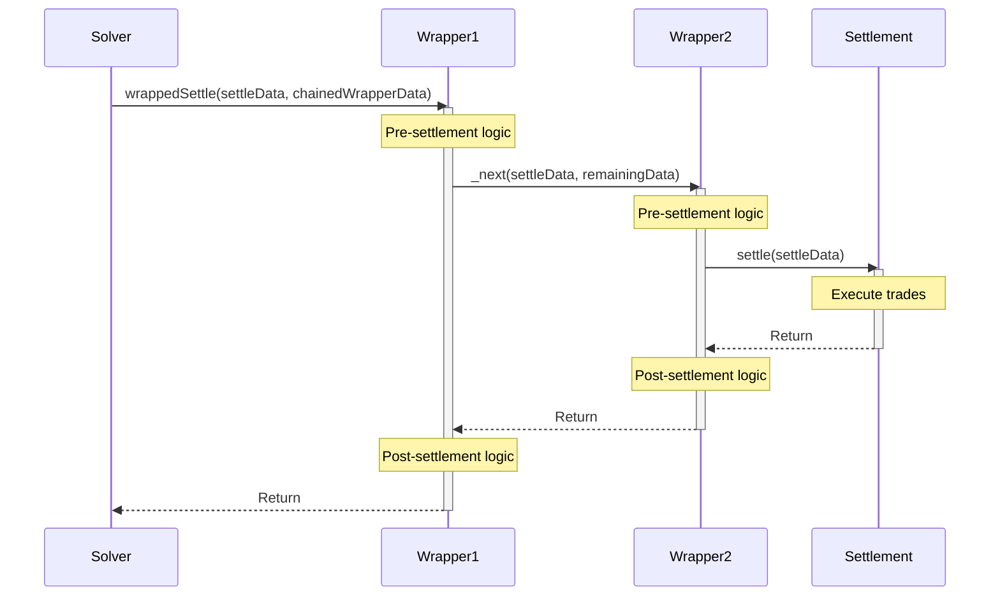

# Atomic Bundles

Atomic Bundles (formerly known as Generalized Wrappers) are smart contracts that enable custom logic to execute before and after CoW Protocol settlement operations. This reference documents the contract interfaces, implementation patterns, and on-chain behavior of the bundle system.

## Architecture

### Execution Flow


```mermaid
sequenceDiagram
    participant Solver
    participant Wrapper1
    participant Wrapper2
    participant Settlement

    Solver->>Wrapper1: wrappedSettle(settleData, chainedWrapperData)
    activate Wrapper1
    Note over Wrapper1: Pre-settlement logic
    Wrapper1->>Wrapper2: _next(settleData, remainingData)
    activate Wrapper2
    Note over Wrapper2: Pre-settlement logic
    Wrapper2->>Settlement: settle(settleData)
    activate Settlement
    Note over Settlement: Execute trades
    Settlement-->>Wrapper2: Return
    deactivate Settlement
    Note over Wrapper2: Post-settlement logic
    Wrapper2-->>Wrapper1: Return
    deactivate Wrapper2
    Note over Wrapper1: Post-settlement logic
    Wrapper1-->>Solver: Return
    deactivate Wrapper1
```

### Key Design Principles

1. **Abstract**: There are very few limitations on what a bundle can/can't do around a settlement transaction
2. **Efficient Encoding**: Bundle-specific data appended to minimize gas overhead
3. **Nested Support**: Multiple bundles chain by encoding addresses sequentially, allowing CoW orders
4. **Authentication**: Only allowlisted bundles can call settlement contract

## Implementation

Developers looking to integrate using Atomic Bundles should copy this all-in-one solidity file into their project as vendored dependency.

It provides a few base contracts which can serve as the foundation for integration:

- **`ICowWrapper`**: Core interface all bundles must implement
- **`CowWrapper`**: Abstract base contract providing security and utilities that all bundles should use

See the code for [`CowWrapper.sol` on GitHub](https://github.com/cowprotocol/euler-integration-contracts/blob/master/src/CowWrapper.sol).

### Quick Start Example

The [`EmptyWrapper`](https://github.com/cowprotocol/euler-integration-contracts/blob/master/test/EmptyWrapper.sol) serves as a good starting point for building a bundle. Following this, the implementation functions should be filled in as described below.

### Virtual Functions for integrators

#### `_wrap`

Contains custom surrounding settlement logic. **Must** call `_next()` to continue the chain to the settlement contract.

```solidity
function _wrap(bytes calldata settleData, bytes calldata wrapperData, bytes calldata remainingWrapperData) internal virtual;
```

**Implementation Requirements:**
- Parse bundle-specific data from `wrapperData` as required
- Execute pre-settlement logic
- Call `_next(remainingWrapperData)` to continue chain
- Execute post-settlement logic

**Example:**

```solidity
function _wrap(bytes calldata settleData, bytes calldata wrapperData, bytes calldata remainingWrapperData) internal override {
    // 1. Parse data
    (address token, uint256 amount) = abi.decode(wrapperData, (address, uint256));

    // 2. Pre-settlement logic. Example, receive tokens from user
    IERC20(token).transferFrom(msg.sender, address(this), amount);

    // 3. Continue chain (REQUIRED)
    _next(settleData, remainingWrapperData);

    // 4. Post-settlement logic. Example: stake tokens to a contract (for swap and stake)
    stakeTokens(token, amount);
}
```

#### `validateWrapperData`

Validates bundle-specific data. Must be deterministic and revert on invalid input.

```solidity
function validateWrapperData(
    bytes calldata wrapperData
) external view override;
```

**Requirements:**
- **Deterministic**: Same input must always produce same output. This means you cannot check the timestamp and revert if the order is valid, for example.
- **View function**: Cannot modify state
- **Revert on invalid**: Revert if data is malformed

### Internal Functions (Provided for integrator use)

#### `_next`

Continues the bundle chain or calls settlement. Handles all parsing and routing automatically.

```solidity
function _next(bytes calldata settleData, bytes calldata remainingWrapperData) internal;
```

**Behavior:**
- Extracts the next target address (first 20 bytes of `remainingWrapperData`)
- Calls the next bundle via `wrappedSettle()`, or the settlement contract via `settle()` if no bundles remain

## Calldata Encoding Specification

The `chainedWrapperData`  parameter of `wrappedSettle(settleData, chainedWrapperData)` is specially encoded to minimize bit shuffling overhead:

```
┌──────┬──────────┬──────────┬──────┬──────────┐
│ Len₁ │  Data₁   │  Addr₂   │ Len₂ │  Data₂   │
│(2 B) │  (Len₁)  │ (20 B)   │(2 B) │  (Len₂)  │
└──────┴──────────┴──────────┴──────┴──────────┘
│<─────────── chainedWrapperData ─────────────>│
```

**Components:**
- **Len₁**: 2-byte (uint16) length of bundle 1's data
- **Data₁**: Bundle 1's custom data
- **Addr₂**: 20-byte address of bundle 2
- **Len₂**: 2-byte (uint16) length of bundle 2's data
- **Data₂**: Bundle 2's custom data
... (repeat Addr₂, Len₂, Data₂ for every subsequent bundle)

### Bundle Public Functions

#### `wrappedSettle`

Entry point for bundle execution. Validates caller authentication and delegates to `_wrap()`--where integrators place their custom logic. See the [full implementation in `CowWrapper.sol`](https://github.com/cowprotocol/euler-integration-contracts/blob/master/src/CowWrapper.sol).

**Parameters:**
- `settleData`: Original `GPv2Settlement.settle(...)` calldata
- `chainedWrapperData`: Encoded bundle chain — see [Calldata Encoding Specification](#calldata-encoding-specification)

## CowWrapperHelpers

A view-only periphery contract for validating and encoding bundle chains. See the [source code](https://github.com/cowprotocol/euler-integration-contracts/blob/master/src/CowWrapperHelpers.sol) for the complete implementation.

### Deployments

The contract is deployed via `CREATE2`:

| Environment | Address |
|-------------|---------|
| Production | `0x8C8f88F3081A7d54fCbC2Bd7C6Cf5E9Fc26e30E9` |
| Staging | `0xfd1a35C8E7AEC58a4bB6AeDca0B2Bf9c9Be9E07F` |

:::note
`CowWrapperHelpers` may not yet be deployed on all networks supported by CoW Protocol.
:::

### Interface

```solidity
contract CowWrapperHelpers {
    /// @notice A definition for a single call to a wrapper
    struct WrapperCall {
        /// @notice The smart contract that will be receiving the call
        address target;

        /// @notice Any additional data which will be required to execute the wrapper call
        bytes data;
    }

    /// @notice Validates a wrapper chain configuration and builds the properly formatted wrapper data
    /// @param wrapperCalls Array of calls in execution order
    /// @return chainedWrapperData The encoded wrapper data ready to be passed to the first wrapper's wrappedSettle
    function verifyAndBuildWrapperData(
        WrapperCall[] memory wrapperCalls
    ) external view returns (bytes memory chainedWrapperData);
}
```

## Implementation Requirements for Integrators

### Security Requirements

#### 1. Audit by a Reputable Firm

The bundle contract must be audited by a reputable security firm before submission for allowlist approval. The audit report should be made available to the CoW DAO as part of the approval process.

#### 2. Use CowWrapper Abstract Contract

It is strongly recommended to **NOT** implement `ICowWrapper` directly. The `CowWrapper` abstract contract provides:
- Solver authentication checks
- Correct calldata parsing and decoding
- Safe bundle chain continuation
- Sanity checks for the settlement call

#### 3. Intermediate Contracts for User Calls

If allowing user-defined calls, route through intermediate contracts:

```solidity
// ❌ DANGEROUS
function _wrap(bytes calldata settleData, bytes calldata wrapperData, bytes calldata remainingWrapperData) internal override {
    (address target, bytes memory data) = abi.decode(wrapperData, (address, bytes));
    target.call(data);  // User could call anything they want, including the settlement contract, using the bundle's authenticated context
}

// ✅ SAFE
function _wrap(bytes calldata settleData, bytes calldata wrapperData, bytes calldata remainingWrapperData) internal override {
    (address target, bytes memory data) = abi.decode(wrapperData, (address, bytes));
    HooksTrampoline(TRAMPOLINE).execute(target, data);  // Isolated execution
}
```

#### 4. Assume All Parameters Are Untrusted

Settlement data can be modified by nested bundles, and solvers can supply arbitrary calldata. If it is important for your bundle to be able to validate the bundle it is receiving, only trust signature-protected or on-chain validated parameters.

As a concrete implication: **hooks cannot be enforced by inspecting settlement interaction data**. Neither checking that a desired hook is present in `settleData`, nor injecting a hook into the forwarded `settleData`, provides any guarantee — an intermediate bundle can freely modify `settleData` before passing it along.

#### 5. Deterministic Parsing Required

`validateWrapperData()` must always produce the same result (revert or not) for same input:

```solidity
// ❌ NOT DETERMINISTIC
function validateWrapperData(bytes calldata wrapperData)
    external view override
{
    uint256 deadline = abi.decode(wrapperData, (uint256));
    require(block.timestamp < deadline, "Expired");  // Changes over time!
}

// ✅ DETERMINISTIC
function validateWrapperData(bytes calldata wrapperData)
    external view override
{
    uint256 deadline = abi.decode(wrapperData, (uint256));
    require(deadline > 0, "Invalid deadline");  // Always same result
}
```

In the example above, your `_wrap` code can always reject deadline past expired instead.

#### 6. Defensive Design

Though a solver would be slashed for doing so, there is no hard guarantee bundle executes even if user specifies it. Additionally, even when a bundle does execute, there is no guarantee that `settle` will eventually be called — an earlier bundle in the chain could skip calling `_next()` entirely. Bundles should not assume that settlement will complete.

### Gas Overhead

Atomic Bundle execution adds gas overhead to settlements.

**Benchmark (EmptyWrapper on Ethereum mainnet):**

| Metric | Value |
|--------|-------|
| With EmptyWrapper | 217,033 gas |
| Without bundle | 194,761 gas |
| **Overhead** | **22,272 gas (11.4%)** |

**Scaling Factors:**
- Settlement data size (calldata copying)
- Bundle logic complexity
- Number of nested bundles

**Methodology:** Single Uniswap V3 WETH→USDC trade. See [services PR #3700](https://github.com/cowprotocol/services/pull/3700).

## Resources

### Documentation
- **[Bundle Concepts](../../../concepts/order-types/wrappers.md)** - High-level overview and use cases
- **[Integration Guide](../../../integrate/wrappers.mdx)** - Implementation guide for order creators and developers
- **[GPv2Settlement](../core/settlement.md)** - Core settlement contract documentation

### Code
- **[CowWrapper.sol](https://github.com/cowprotocol/euler-integration-contracts/blob/master/src/CowWrapper.sol)** - Abstract contract and interfaces
- **[EmptyWrapper](https://github.com/cowprotocol/euler-integration-contracts/blob/master/test/EmptyWrapper.sol)** - Minimal reference implementation
- **[Euler Integration](https://github.com/cowprotocol/euler-integration-contracts)** - Complete production bundle example
