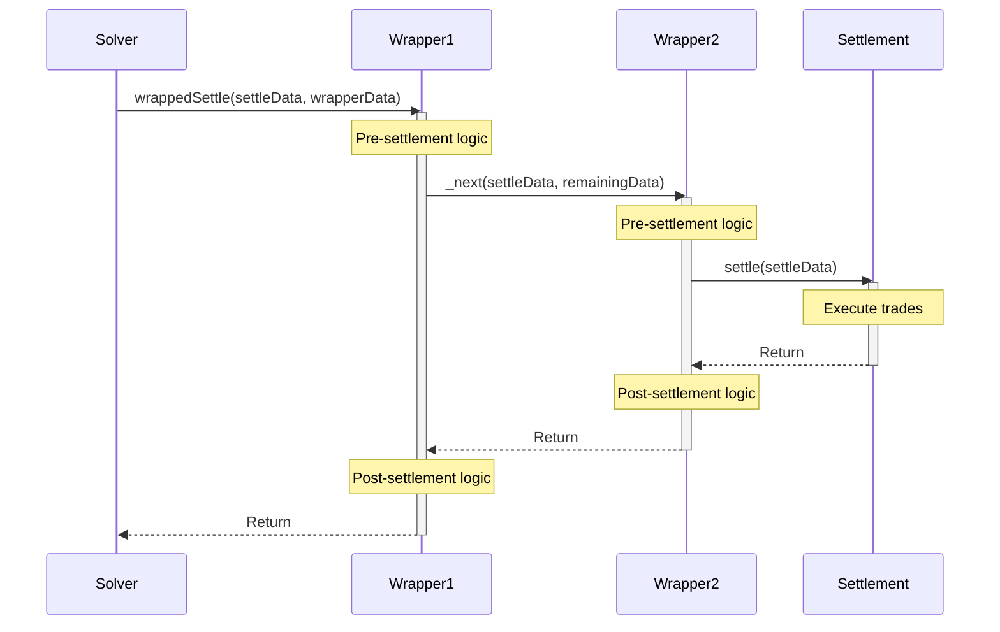

# Generalized Wrappers

Generalized wrappers are smart contracts that enable custom logic to execute before and after CoW Protocol settlement operations. This reference documents the contract interfaces, implementation patterns, and on-chain behavior of the wrapper system.

## Architecture

### Execution Flow


```mermaid
sequenceDiagram
    participant Solver
    participant Wrapper1
    participant Wrapper2
    participant Settlement

    Solver->>Wrapper1: wrappedSettle(settleData, wrapperData)
    activate Wrapper1
    Note over Wrapper1: Pre-settlement logic
    Wrapper1->>Wrapper2: _next(settleData, remainingData)
    activate Wrapper2
    Note over Wrapper2: Pre-settlement logic
    Wrapper2->>Settlement: settle(settleData)
    activate Settlement
    Note over Settlement: Execute trades
    Settlement-->>Wrapper2: Return
    deactivate Settlement
    Note over Wrapper2: Post-settlement logic
    Wrapper2-->>Wrapper1: Return
    deactivate Wrapper2
    Note over Wrapper1: Post-settlement logic
    Wrapper1-->>Solver: Return
    deactivate Wrapper1
```

### Key Design Principles

1. **Abstract**: There are very few limitations on what a wrapper can/can't do around a settlement transaction
2. **Efficient Encoding**: Wrapper-specific data appended to minimize gas overhead
3. **Nested Support**: Multiple wrappers chain by encoding addresses sequentially, allowing CoW orders
4. **Authentication**: Only allowlisted wrappers can call settlement contract

## Implementation

Developers looking to integrate using wrappers should copy this all-in-one solidity file into their project as vendored dependency.

It provides a few base contracts which can serve as the foundation for integration:

- **`ICowWrapper`**: Core interface all wrappers must implement
- **`CowWrapper`**: Abstract base contract providing security and utilities that all wrappers should use

```solidity
// SPDX-License-Identifier: MIT OR Apache-2.0
pragma solidity ^0.8;

/**
 * Title: CoW Wrapper all-in-one integration file
 * Author: CoW DAO
 * This file is completely self-contained (ie no dependencies) and can be portably copied to whatever projects it is needed.
 * It contains:
 * * CowWrapper -- an abstract base contract which should be inherited by all wrappers
 * * ICowWrapper -- the required interface for all wrappers
 * * ICowSettlement -- A minimized interface and base structures for CoW Protocol settlement contract. From https://github.com/cowprotocol/contracts/blob/main/src/contracts/GPv2Settlement.sol
 * * ICowAuthentication -- The authentication interface used by ICowSettlement. From https://github.com/cowprotocol/contracts/blob/main/src/contracts/interfaces/GPv2Authentication.sol
 */

/// @title CoW Protocol Authentication Interface
/// @author CoW DAO developers
interface ICowAuthentication {
    /// @dev determines whether the provided address is an authenticated solver.
    /// @param prospectiveSolver the address of prospective solver.
    /// @return true when prospectiveSolver is an authenticated solver, otherwise false.
    function isSolver(address prospectiveSolver) external view returns (bool);
}

/// @title CoW Protocol Settlement Interface
/// @notice Minimal interface for CoW Protocol's settlement contract
/// @dev Used for type-safe calls to the settlement contract's settle function
interface ICowSettlement {
    /// @notice Trade data structure matching GPv2Settlement
    struct Trade {
        uint256 sellTokenIndex;
        uint256 buyTokenIndex;
        address receiver;
        uint256 sellAmount;
        uint256 buyAmount;
        uint32 validTo;
        bytes32 appData;
        uint256 feeAmount;
        uint256 flags;
        uint256 executedAmount;
        bytes signature;
    }

    /// @notice Interaction data structure for pre/intra/post-settlement actions which are supplied by the solver to complete the user request
    struct Interaction {
        address target;
        uint256 value;
        bytes callData;
    }

    /// @notice Returns the authentication contract used by the settlement contract.
    function authenticator() external view returns (ICowAuthentication);

    /// @notice Returns the address of the vaultRelayer, the target for approvals for funds entering the settlement contract.
    function vaultRelayer() external view returns (address);

    /// @notice Returns the domain separator for EIP-712 signing
    function domainSeparator() external view returns (bytes32);

    /// @notice Allows for approval of orders by submitting an authorized hash on-chain prior to order execution.
    function setPreSignature(bytes calldata orderUid, bool signed) external;

    /// @notice Settles a batch of trades atomically
    /// @param tokens Array of token addresses involved in the settlement
    /// @param clearingPrices Array of clearing prices for each token
    /// @param trades Array of trades to execute
    /// @param interactions Array of three interaction arrays (pre, intra, post-settlement)
    function settle(
        address[] calldata tokens,
        uint256[] calldata clearingPrices,
        Trade[] calldata trades,
        Interaction[][3] calldata interactions
    ) external;
}

/// @title CoW Protocol Wrapper Interface
/// @notice Interface for wrapper contracts that add custom logic around CoW settlements
/// @dev Wrappers can be chained together to compose multiple settlement operations
interface ICowWrapper {
    /// @notice A human readable label for this wrapper. Used for display in explorer/analysis UIs
    function name() external view returns (string memory);

    /// @notice The settlement contract used by this wrapper
    /// @return The CowSettlement contract address
    function SETTLEMENT() external view returns (ICowSettlement);

    /// @notice Initiates a wrapped settlement call
    /// @dev This is the entry point for wrapped settlements. The wrapper will execute custom logic
    ///      before calling the next wrapper or settlement contract in the chain.
    /// @dev SECURITY: `settleData` is NOT guaranteed to remain unchanged through the wrapper chain.
    ///      Intermediate wrappers could modify it before passing it along. Do not rely on
    ///      `settleData` validation for security-critical checks.
    /// @param settleData ABI-encoded call to ICowSettlement.settle() containing trade data. This data is not validated in terms of its relation to the wrapper data,
    /// so it assumed that off-chain processes will enforce the correct construction.
    /// @param chainedWrapperData Encoded wrapper chain with the following format:
    ///        Structure: [uint16 len1][bytes data1][address wrapper2][uint16 len2][bytes data2][address wrapper3]...
    ///
    ///        Each wrapper in the chain consists of:
    ///        - 2 bytes: uint16 length of wrapper-specific data
    ///        - `length` bytes: wrapper-specific data for this wrapper
    ///        - 20 bytes: address of next wrapper (omitted for the final wrapper)
    ///
    ///        The final wrapper in the chain omits the next wrapper address and calls SETTLEMENT directly.
    ///
    ///        Example: [0x0005][0xAABBCCDDEE][0x1234...ABCD][0x0003][0x112233]
    ///                 ↑len   ↑data         ↑next wrapper  ↑len   ↑data (final, no next address)
    ///
    /// @return Magic value to ensure the target was a wrapper and executed code.
    function wrappedSettle(bytes calldata settleData, bytes calldata chainedWrapperData) external returns (bytes4);

    /// @notice Confirms validity of wrapper-specific data
    /// @dev Used by CowWrapperHelpers to validate wrapper data before execution. Reverts if the wrapper data is not valid for some reason.
    /// @param wrapperData The wrapper-specific data to parse
    function validateWrapperData(bytes calldata wrapperData) external view;
}

/// @title CoW Protocol Wrapper Base Contract
/// @notice Abstract base contract for creating wrapper contracts around CoW Protocol settlements
/// @dev A wrapper enables custom pre/post-settlement and context-setting logic and can be chained with other wrappers.
///      Wrappers must:
///      - Be approved by the ICowAuthentication contract
///      - Verify the caller is an authenticated solver
///      - Eventually call settle() on the approved ICowSettlement contract
///      - Implement _wrap() for custom logic
abstract contract CowWrapper is ICowWrapper {
    /// @notice Thrown when the caller is not an authenticated solver
    /// @param unauthorized The address that attempted to call wrappedSettle
    error NotASolver(address unauthorized);

    /// @notice Thrown when settle data doesn't contain the correct function selector
    /// @param invalidSettleData The invalid settle data that was provided
    error InvalidSettleData(bytes invalidSettleData);

    /// @notice Thrown when the next wrapper in the chain does not return the expected selector
    /// @param invalidNextWrapper The address of the next wrapper that returned an invalid response
    error InvalidNextWrapper(address invalidNextWrapper);

    /// @notice The settlement contract
    ICowSettlement public immutable SETTLEMENT;

    /// @notice The authentication contract used to verify solvers
    /// @dev This is derived from `SETTLEMENT.authenticator()`.
    ICowAuthentication public immutable AUTHENTICATOR;

    /// @notice Constructs a new CowWrapper
    /// @param settlement_ The ICowSettlement contract to use at the end of the wrapper chain. Also used for wrapper authentication.
    constructor(ICowSettlement settlement_) {
        SETTLEMENT = settlement_;
        AUTHENTICATOR = settlement_.authenticator();
    }

    /// @inheritdoc ICowWrapper
    function wrappedSettle(bytes calldata settleData, bytes calldata chainedWrapperData) external returns (bytes4) {
        // Revert if not a valid solver
        require(AUTHENTICATOR.isSolver(msg.sender), NotASolver(msg.sender));

        // Find out how long the next wrapper data is supposed to be
        // We use 2 bytes to decode the length of the wrapper data because it allows for up to 64KB of data for each wrapper.
        // This should be plenty of length for all identified use-cases of wrappers in the forseeable future.
        uint256 nextWrapperDataLen = uint256(uint16(bytes2(chainedWrapperData[0:2])));

        // Delegate to the wrapper's custom logic
        uint256 remainingWrapperDataStart = 2 + nextWrapperDataLen;
        _wrap(
            settleData, chainedWrapperData[2:remainingWrapperDataStart], chainedWrapperData[remainingWrapperDataStart:]
        );

        return ICowWrapper.wrappedSettle.selector;
    }

    /// @inheritdoc ICowWrapper
    function validateWrapperData(bytes calldata wrapperData) external view virtual;

    /// @notice Internal function containing the wrapper's custom logic
    /// @dev Must be implemented by concrete wrapper contracts. Should execute custom logic
    ///      then eventually call _next() to continue the wrapped settlement chain.
    /// @param settleData ABI-encoded call to ICowSettlement.settle()
    /// @param wrapperData The wrapper data which should be consumed by this wrapper
    /// @param remainingWrapperData The reminder bytes resulting from consuming the current's wrapper data from the original `chainedWrapperData` in the `wrappedSettle` call. This should be passed unaltered to `_next` that will call the settlement function if this remainder is empty, or delegate the settlement to the next wrapper
    function _wrap(bytes calldata settleData, bytes calldata wrapperData, bytes calldata remainingWrapperData)
        internal
        virtual;

    /// @notice Continues the wrapped settlement chain by calling the next wrapper or settlement contract
    /// @dev Extracts the next target address from wrapperData and either:
    ///      - Calls ICowSettlement.settle() directly if no more wrappers remain, or
    ///      - Calls the next CowWrapper.wrappedSettle() to continue the chain
    /// @param settleData ABI-encoded call to ICowSettlement.settle()
    /// @param remainingWrapperData Remaining wrapper data starting with the next target address (20 bytes)
    function _next(bytes calldata settleData, bytes calldata remainingWrapperData) internal {
        if (remainingWrapperData.length == 0) {
            // No more wrapper data - we're calling the final settlement contract
            // Verify the settle data has the correct function selector
            require(bytes4(settleData[:4]) == ICowSettlement.settle.selector, InvalidSettleData(settleData));

            // Call the settlement contract directly with the settle data
            _callWithBubbleRevert(address(SETTLEMENT), settleData);
        } else {
            // Extract the next wrapper address from the first 20 bytes of wrapperData
            address nextWrapper = address(bytes20(remainingWrapperData[:20]));

            // Skip past the address we just read
            remainingWrapperData = remainingWrapperData[20:];

            // More wrapper data remains - call the next wrapper in the chain
            bytes memory returnData = _callWithBubbleRevert(
                nextWrapper, abi.encodeCall(ICowWrapper.wrappedSettle, (settleData, remainingWrapperData))
            );

            // To prevent accidentally calling a non-contract or a different contract that is not actually a wrapper,
            // we verify that "magic bytes" (matching the selector of the wrappedSettle function) are returned.

            // casting to 'bytes32' is safe because the bytes that are returned by the next wrapper should always be the same specific value
            // (if the return is less than 32 bytes, the `require` fails and returns revert, verified in test)
            require(
                // forge-lint: disable-next-line(unsafe-typecast)
                returnData.length == 32 && bytes32(returnData) == bytes32(ICowWrapper.wrappedSettle.selector),
                InvalidNextWrapper(nextWrapper)
            );
        }
    }

    /// @notice Helper function to bubble the raw revert result of an address().call invocation.
    /// @param target The contract to call
    /// @param data The data to send
    /// @return returnData The return data if it was successful
    function _callWithBubbleRevert(address target, bytes memory data) internal returns (bytes memory returnData) {
        bool success;
        (success, returnData) = target.call(data);
        if (!success) {
            // Bubble up the revert reason from the next wrapper. Assembly is unfortunately required to do this.
            assembly ("memory-safe") {
                revert(add(returnData, 0x20), mload(returnData))
            }
        }
    }
}
```

### Quick Start Example

Here's a minimal wrapper implementation to use as a starting point:

```solidity
// SPDX-License-Identifier: GPL-3.0
pragma solidity ^0.8.0;

import { CowWrapper } from "./CowWrapper.sol";

contract MyWrapper is CowWrapper {
    constructor(address settlement) CowWrapper(settlement) {}

    function _wrap(bytes calldata settleData, bytes calldata wrapperData, bytes calldata remainingWrapperData) internal override {
        // Your custom pre-settlement logic here
        // Example: pull tokens, initiate flash loan, etc.

        // Continue the wrapper chain (calls settlement or next wrapper)
        _next(settleData, remainingWrapperData);

        // Your custom post-settlement logic here
        // Example: repay flash loan, stake tokens, etc.
    }

    function validateWrapperData(bytes calldata wrapperData)
        external
        view
        override
    {
        // Validate wrapper-specific data
        // This must be deterministic - same input always returns same output
        // Revert if data is invalid
    }
}
```

### Wrapper Public Functions

#### `wrappedSettle`

Entry point for wrapper execution. Validates caller authentication and delegates to `_wrap()`--where integrators place their custom logic.

```solidity
function wrappedSettle(
    bytes calldata settleData,
    bytes calldata chainedWrapperData
) external override returns (bytes4) {
    // Verify caller is an authenticated solver
    require(AUTHENTICATOR.isSolver(msg.sender), NotASolver(msg.sender));

    // Find out how long the next wrapper data is supposed to be
    uint256 nextWrapperDataLen = uint256(uint16(bytes2(chainedWrapperData[0:2])));

    // Delegate to the wrapper's custom logic
    uint256 remainingWrapperDataStart = 2 + nextWrapperDataLen;
    _wrap(
        settleData,
        chainedWrapperData[2:remainingWrapperDataStart],
        chainedWrapperData[remainingWrapperDataStart:]
    );

    return ICowWrapper.wrappedSettle.selector;
}
```

**Parameters:**
- `settleData`: Original `GPv2Settlement.settle(...)` calldata
- `chainedWrapperData`: 

#### Chained Wrapper Data Encoding

Each wrapper in the chain consists of:
- 2 bytes: uint16 length of wrapper-specific data
- `length` bytes: wrapper-specific data for this wrapper
- 20 bytes: address of next wrapper (or stop here if no wrappers are left)
The final wrapper in the chain omits the next wrapper address and calls SETTLEMENT directly.
- 20 bytes: address of next wrapper (or stop without an address if no wrappers are left)

When no wrapper is left, the final wrapper in the chain calls SETTLEMENT directly.
Example:
```text
[0x0005][0xAABBCCDDEE][0x1234567890123456789012345678901234567890][0x0003][0x112233]
↑len    ↑data         ↑next wrapper                               ↑len    ↑data
```

Each wrapper in the chain will successively pull off their own data and then call the next wrapper address (or the settlement address if no further wrapper data is supplied).

### Virtual Functions for integrators

#### `_wrap`

Contains custom surrounding settlement logic. **Must** call `_next()` to continue the chain to the settlement contract.

```solidity
function _wrap(bytes calldata settleData, bytes calldata wrapperData, bytes calldata remainingWrapperData) internal virtual;
```

**Implementation Requirements:**
- Parse wrapper-specific data from `wrapperData` as required
- Execute pre-settlement logic
- Call `_next(remainingWrapperData)` to continue chain
- Execute post-settlement logic

**Example:**

```solidity
function _wrap(bytes calldata settleData, bytes calldata wrapperData, bytes calldata remainingWrapperData) internal override {
    // 1. Parse data
    (address token, uint256 amount) = abi.decode(wrapperData, (address, uint256));

    // 2. Pre-settlement logic. Example, receive tokens from user
    IERC20(token).transferFrom(msg.sender, address(this), amount);

    // 3. Continue chain (REQUIRED)
    _next(settleData, remainingWrapperData);

    // 4. Post-settlement logic. Example: stake tokens to a contract (for swap and stake)
    stakeTokens(token, amount);
}
```

### Internal Functions (Provided)

#### `_next`

Continues the wrapper chain or calls settlement. Handles all parsing and routing automatically.

```solidity
function _next(bytes calldata settleData, bytes calldata remainingWrapperData) internal;
```

**Behavior:**
- Reads next wrapper address from `remainingWrapperData`
- Determines if more wrappers exist or if settlement is next
- Makes appropriate call with correct data
- Handles wrapper nesting automatically

**Implementation Details:**
- Extracts next target address (first 20 bytes)
- Separates settle data from remaining wrapper data
- Calls next wrapper via `wrappedSettle()` or settlement via `settle()`

## Calldata Encoding Specification

The `chainedWrapperData`  parameter of `wrappedSettle(settleData, chainedWrapperData)` is specially encoded to minimize bit shuffling overhead:

```
┌──────┬──────────┬──────────┬──────┬──────────┐
│ Len₁ │  Data₁   │  Addr₂   │ Len₂ │  Data₂   │
│(2 B) │ (wrap1)  │ (20 B)   │(2 B) │ (wrap2)  │
└──────┴──────────┴──────────┴──────┴──────────┘
│<─────────── chainedWrapperData ─────────────>│
```

**Components:**
- **Len₁**: 2-byte (uint16) length of wrapper 1's data
- **Data₁**: Wrapper 1's custom data
- **Addr₂**: 20-byte address of wrapper 2
- **Len₂**: 2-byte (uint16) length of wrapper 2's data
- **Data₂**: Wrapper 2's custom data
... (repeat Addr₂, Len₂, Data₂ for every subsequent wrapper)

## CowWrapperHelper

Utility contract for on-chain validation and encoding.

### Interface

```solidity
contract CowWrapperHelpers {
    /// @notice A definition for a single call to a wrapper
    struct WrapperCall {
        /// @notice The smart contract that will be receiving the call
        address target;

        /// @notice Any additional data which will be required to execute the wrapper call
        bytes data;
    }

    /// @notice Validates a wrapper chain configuration and builds the properly formatted wrapper data
    /// @param wrapperCalls Array of calls in execution order
    /// @return chainedWrapperData The encoded wrapper data ready to be passed to the first wrapper's wrappedSettle
    function verifyAndBuildWrapperData(
        WrapperCall[] memory wrapperCalls
    ) external view returns (bytes memory chainedWrapperData);
}
```


### `CowWrapperHelpers`

To aid external integrators in encoding and verifying wrapper data, an additional view-only contract is provided.

See the [CowWrapperHelper contract source code](https://github.com/cowprotocol/euler-integration-contracts/blob/master/src/CowWrapperHelper.sol) for the complete implementation.


#### `validateWrapperData`

Validates wrapper-specific data. Must be deterministic and revert on invalid input.

```solidity
function validateWrapperData(
    bytes calldata wrapperData
) external view override;
```

**Requirements:**
- **Deterministic**: Same input must always produce same output
- **No time-based logic**: Cannot use `block.timestamp`, `block.number`, etc.
- **No mutable state**: Cannot read external mutable state
- **View function**: Cannot modify state
- **Revert on invalid**: Revert if data is malformed

## Implementation Requirements for Integrators

### Security Requirements

:::warning Critical Requirements

#### 1. Audit by a Reputable Firm

The wrapper contract must be audited by a reputable security firm before submission for allowlist approval. The audit report should be made available to the CoW DAO as part of the approval process.

#### 2. Use CowWrapper Abstract Contract

It is strongly recommended to **NOT** implement `ICowWrapper` directly. The `CowWrapper` abstract contract provides:
- Solver authentication checks
- Correct calldata parsing and decoding
- Safe wrapper chain continuation
- Sanity checks for the settlement call

#### 3. Intermediate Contracts for User Calls

If allowing user-defined calls, route through intermediate contracts:

```solidity
// ❌ DANGEROUS
function _wrap(bytes calldata settleData, bytes calldata wrapperData, bytes calldata remainingWrapperData) internal override {
    (address target, bytes memory data) = abi.decode(wrapperData, (address, bytes));
    target.call(data);  // User could call anything they want, including the settlement contract, using the wrapper's authenticated context
}

// ✅ SAFE
function _wrap(bytes calldata settleData, bytes calldata wrapperData, bytes calldata remainingWrapperData) internal override {
    (address target, bytes memory data) = abi.decode(wrapperData, (address, bytes));
    HooksTrampoline(TRAMPOLINE).execute(target, data);  // Isolated execution
}
```

#### 4. Assume All Parameters Are Untrusted

Settlement data can be modified by nested wrappers, and solvers can supply arbitrary calldata. If it is important for your wrapper to be able to validate the wrapper it is receiving, only trust signature-protected or on-chain validated parameters.

As a concrete implication: **hooks cannot be enforced by inspecting settlement interaction data**. Neither checking that a desired hook is present in `settleData`, nor injecting a hook into the forwarded `settleData`, provides any guarantee — an intermediate wrapper can freely modify `settleData` before passing it along.

#### 5. Deterministic Parsing Required

`validateWrapperData()` must always produce the same result (revert or not) for same input:

```solidity
// ❌ NOT DETERMINISTIC
function validateWrapperData(bytes calldata wrapperData)
    external view override
{
    uint256 deadline = abi.decode(wrapperData, (uint256));
    require(block.timestamp < deadline, "Expired");  // Changes over time!
}

// ✅ DETERMINISTIC
function validateWrapperData(bytes calldata wrapperData)
    external view override
{
    uint256 deadline = abi.decode(wrapperData, (uint256));
    require(deadline > 0, "Invalid deadline");  // Always same result
}
```

In the example above, your `_wrap` code can always reject deadline past expired instead.

#### 6. Defensive Design

Though a solver would be slashed for doing so, there is no hard guarantee wrapper executes even if user specifies it. Additionally, even when a wrapper does execute, there is no guarantee that `settle` will eventually be called — an earlier wrapper in the chain could skip calling `_next()` entirely. Wrappers should not assume that settlement will complete.

If the wrapper is critical to the user's flow:

**Option A: Make Order Fail Without Wrapper**
```solidity
// Pull required funds in wrapper
function _wrap(bytes calldata settleData, bytes calldata wrapperData, bytes calldata remainingWrapperData) internal override {
    vault.withdraw(user, token, amount);  // Funds now in wrapper
    _next(settleData, remainingWrapperData);
    // Settlement uses these funds - fails if wrapper didn't execute
}
```

**Option B: EIP-1271 Authentication**
```solidity
// Order signature only valid if wrapper executed
function isValidSignature(bytes32 hash, bytes memory signature)
    external view returns (bytes4)
{
    require(wrapperExecuted[hash], "Wrapper required");
    return EIP1271_MAGIC;
}
```

There may be other similar ways to enforce execution, but these patterns serve as a starting point.

:::

### Gas Overhead

Wrapper execution adds gas overhead to settlements.

**Benchmark (EmptyWrapper on Ethereum mainnet):**

| Metric | Value |
|--------|-------|
| With EmptyWrapper | 217,033 gas |
| Without wrapper | 194,761 gas |
| **Overhead** | **22,272 gas (11.4%)** |

**Scaling Factors:**
- Settlement data size (calldata copying)
- Wrapper logic complexity
- Number of nested wrappers

**Methodology:** Single Uniswap V3 WETH→USDC trade. See [services PR #3700](https://github.com/cowprotocol/services/pull/3700).

## Example Implementations

### EmptyWrapper

Minimal wrapper demonstrating the pattern:

```solidity
contract EmptyWrapper is CowWrapper {
    constructor(address settlement) CowWrapper(settlement) {}

    function _wrap(bytes calldata settleData, bytes calldata wrapperData, bytes calldata remainingWrapperData) internal override {
        // No pre-settlement logic
        _next(settleData, remainingWrapperData);  // Pass through
        // No post-settlement logic
    }

    function validateWrapperData(bytes calldata wrapperData)
        external
        view
        override
    {
        // No validation needed
    }
}
```

### Flash Loan Wrapper

Wrapper coordinating with lending protocol:

```solidity
contract FlashLoanWrapper is CowWrapper {
    ILendingPool public immutable lendingPool;

    constructor(address settlement, address _lendingPool)
        CowWrapper(settlement)
    {
        lendingPool = ILendingPool(_lendingPool);
    }

    function _wrap(bytes calldata settleData, bytes calldata wrapperData, bytes calldata remainingWrapperData) internal override {
        (address asset, uint256 amount) =
            abi.decode(wrapperData, (address, uint256));

        // Store data for use in callback
        // (In a real implementation, you would store settleData and remainingWrapperData)

        // Initiate flash loan (calls executeOperation)
        lendingPool.flashLoan(address(this), asset, amount, "");
    }

    function executeOperation(
        address asset,
        uint256 amount,
        uint256 premium,
        address,
        bytes calldata params
    ) external returns (bool) {
        require(msg.sender == address(lendingPool), "Unauthorized");

        // Execute settlement with borrowed funds
        // (In a real implementation, retrieve stored settleData and remainingWrapperData)
        // _next(settleData, remainingWrapperData);

        // Approve repayment
        IERC20(asset).approve(address(lendingPool), amount + premium);
        return true;
    }

    function validateWrapperData(bytes calldata wrapperData)
        external
        view
        override
    {
        require(wrapperData.length >= 64, "Invalid data length");
        (address asset, uint256 amount) = abi.decode(
            wrapperData,
            (address, uint256)
        );
        require(asset != address(0) && amount > 0, "Invalid parameters");
    }
}
```

## Events

No wrapper-specific events are emitted. Wrapper usage can be identified by:

1. Transaction target is wrapper address (not settlement)
2. Function signature is `wrappedSettle(bytes,bytes)` (not `settle(...)`)
3. Analyzing transaction trace for wrapper contract calls

## Resources

### Documentation
- **[Wrapper Concepts](../../../concepts/order-types/wrappers.md)** - High-level overview and use cases
- **[Integration Guide](../../../integrate/wrappers.mdx)** - Implementation guide for order creators and developers
- **[GPv2Settlement](../core/settlement.md)** - Core settlement contract documentation

### Code
- **[CowWrapper.sol](https://github.com/cowprotocol/euler-integration-contracts/blob/master/src/CowWrapper.sol)** - Abstract contract and interfaces
- **[EmptyWrapper](https://github.com/cowprotocol/euler-integration-contracts)** - Minimal reference implementation
- **[Euler Integration](https://github.com/cowprotocol/euler-integration-contracts/pull/6)** - Complete production wrapper example
