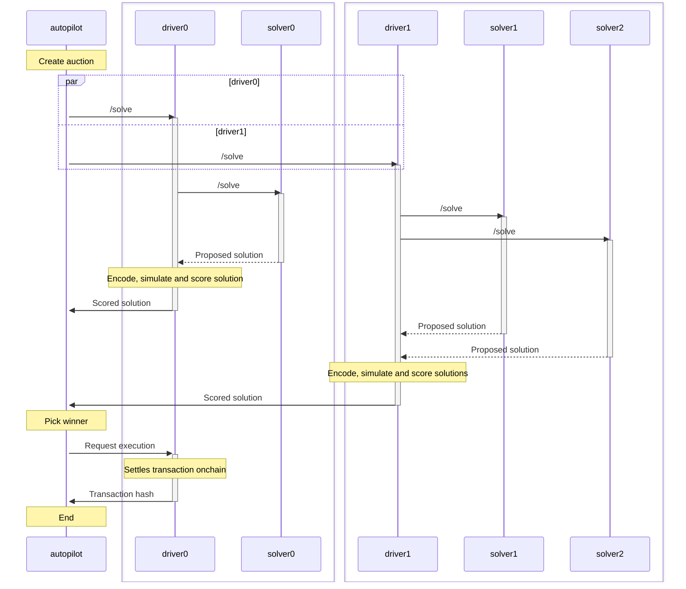

# Arbitrating auctions

This section gives a high level overview of the different components that are involved for CoW protocol batch auctions to take place.

## Architecture

Three main sub-systems are required to facilitate and drive the auction.

### The Orderbook

The orderbook is the main entry point of the protocol for traders.
UIs and other integrations can use the orderbook's API to create trades, get quotes for trades, get currently solved auction, etc. 
For instance, when you visit [CoW Swap](https://swap.cow.fi) and place an order, the site uses the OrderBook API to add the order to a database. 
This database with all order is shared with the **autopilot**.

### The Autopilot

The autopilot is a service that drives the core protocol functionalities.
It is responsible for creating and arbitrating auctions.
It decides which orders are valid for a specific auction, defines the timeline for each auction and orchestrates the revelation and settlement of the winning solver's solution.
Besides that, the autopilot monitors the competition and serves as data consensus layer in the case of dispute or slashing by the DAO.
Auctions are communicated to all registered solvers.

### Solvers 
For the sake of this documentation, we differentiate solvers into two sub-parts:

#### The Driver

This is the executive part of the solving process, responsible for interacting with the blockchain in order to enrich, encode and eventually execute the settlement.
It prepares all the data needed for the engine to match orders in the auction and forwards the augmented auction to the engine.
In turn it receives raw solutions from the solver engine, which it post-processes, simulates, merges, encodes into a blockchain transaction and finally scores.
The driver interfaces with the autopilot and reports the best solution's score to participate in the competition.
If chosen as a winner of the auction, the driver is also responsible for getting the solution included in the blockchain.

#### Solver Engine

Solvers Engines implement the pure matching logic, by employing different types of solving algorithms to optimally match traders with one another taking on-chain as well as private liquidity into account.
They receive the pre-processed auction instance from the driver sub-component and return the solution together with instructions on how to achieve the fulfillment on-chain.

## Interactions

The main flow of arbitrating an auction end-to-end can be seen in the following sequence diagram:

