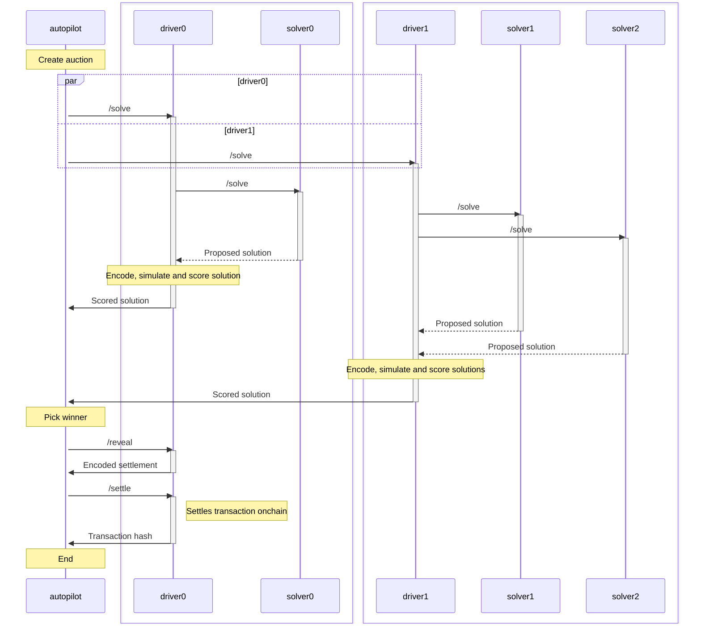

# Architecture

#### The Orderbook

The orderbook is the main entry point of the protocol. Clients can use the Orderbook API to create trades, get quotes for trades, get currently solved auction, etc. When you go to [CoW Swap](https://swap.cow.fi) and create a trade, the web site uses the OrderBook API to add the trade to the database. All the data orderbook use is stored in the database.

#### The Autopilot

The autopilot is a service that drives the core protocol functionalities. It is responsible for creating and arbitrating auctions. It communicates with the driver and decides when the auction is solved and when the solution is revealed and finally settled. Besides that, autopilot is responsible for monitoring the solvers and making sure they behave correctly, and slash them if they don't.

#### The Driver

The driver is a service that works as a bridge between the autopilot and the solvers. It prepares all the data needed for the solvers to solve the auction and sends it to them. It also receives solutions from solvers and does a postprocessing on them before sending them to the autopilot. Postprocessing includes encoding, simulating, merging and ranking solutions. The best solution is then sent to the autopilot. If chosen as a winner of the auction, the driver is also responsible for sending the solution to the blockchain.

#### Solvers

Solvers are services that implement different solving algorithms to optimally solve the auction. They are expected to build solutions and return them to the driver before the deadline.

# Arbitrating auctions

