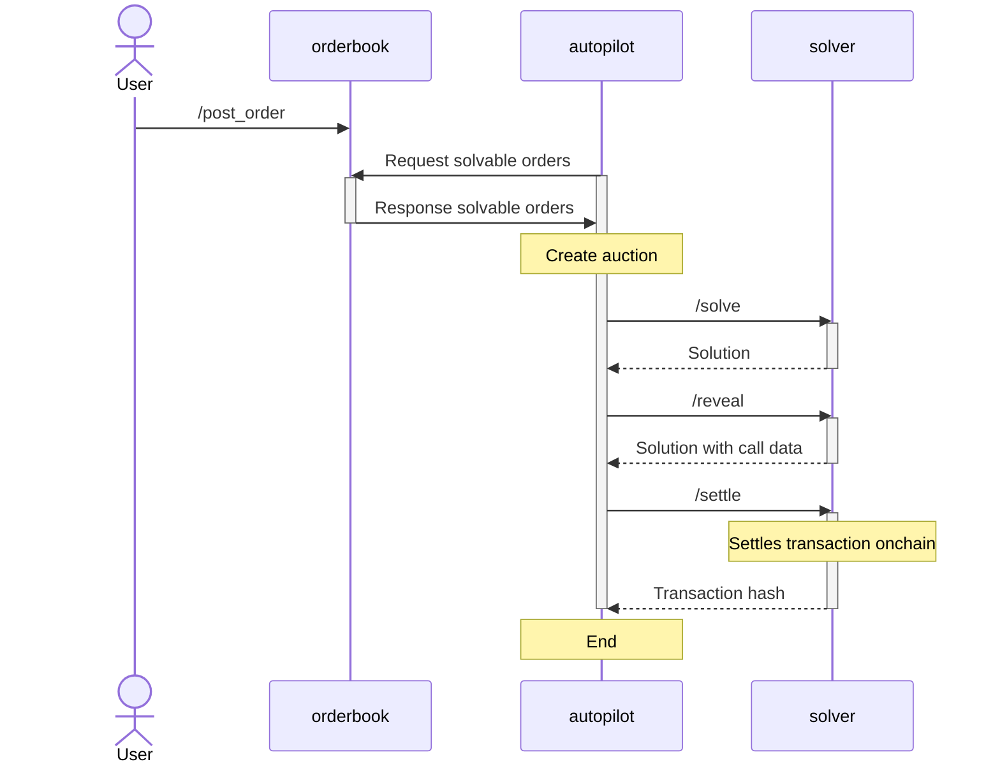
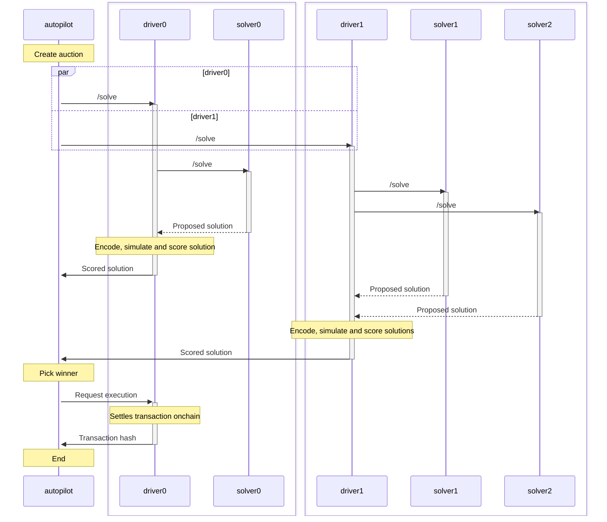

# Arbitrating auctions

This section gives a high level overview of the different components that are involved for CoW protocol batch auctions to take place.

## Architecture

Three main sub-systems are required to facilitate and drive the auction.

### OrderBook

The [orderbook](./arbitrate/orderbook) is the main entry point of the protocol for traders.
Using the orderbook's API, UIs and other integrations allow traders to:

- Get quotes for orders
- Place orders
- Cancel orders
- Get the currently solved auction, etc.

For instance, when you visit [CoW Swap](https://swap.cow.fi) and place an order, the site uses the OrderBook API to add the order to a database. 
This database with all orders is shared with the **autopilot**.

### Autopilot

The [autopilot](./arbitrate/autopilot) is a service that drives the core protocol functionalities with responsibilities including:

- Creating and arbitrating auctions
- Defining the timeline and valid orders for each auction
- Orchestrating the revelation and settlement of the winning solver's solution
- Monitoring the competition
- Serving as data consensus layer in the case of dispute or slashing by the DAO
- Communicating auctions to all registered solvers

### Solvers 
For the sake of this documentation, we differentiate solvers into two sub-parts:

#### Driver

The [Driver](./arbitrate/solver/driver) is the executive part of the solving process, and is responsible for:

- Interacting with the blockchain in order to enrich, encode and eventually execute the settlement
- Preparing all the data needed for the engine to match orders in the auction and forwarding the augmented auction to the engine
- Receiving raw solutions from the solver engine, which it post-processes, simulates, merges, encodes into a blockchain transaction and finally scores

The driver interfaces with the autopilot and reports the best solution's score to participate in the competition.
If chosen as a winner of the auction, the driver is also responsible for getting the solution included in the blockchain.

#### Solver Engine

[Solver Engines](./arbitrate/solver/solver-engine) implement the pure matching logic, by employing different types of solving algorithms to optimally match traders with one another taking on-chain as well as private liquidity into account.
They receive the pre-processed auction instance from the driver sub-component and return the solution together with instructions on how to achieve the fulfillment on-chain.

## Interactions

The main flow of arbitrating an auction end-to-end can be seen in the following sequence diagram:

The following sequence diagram shows the interaction between the autopilot and the solvers in more detail:

