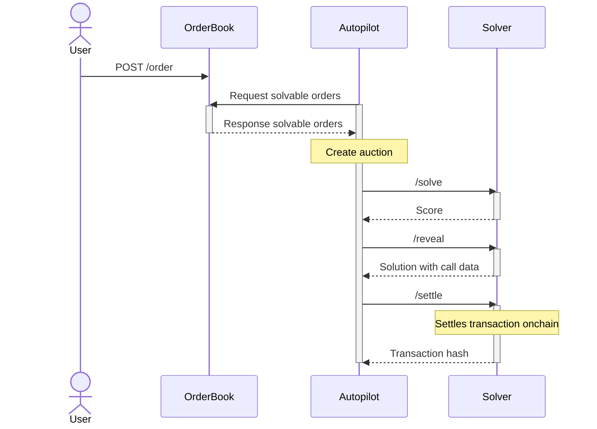

# Arbitrating auctions

This section gives a high level overview of the different components that are involved for CoW protocol batch auctions to take place.

## Architecture

Three main sub-systems are required to facilitate and drive the auction



### OrderBook

The [orderbook](./arbitrate/orderbook) is the main entry point of the protocol for traders.
Using the orderbook's API, UIs and other integrations allow traders to:

- Get quotes for orders
- Place orders
- Cancel orders
- Get the currently solved auction, etc.

For instance, when you visit [CoW Swap](https://swap.cow.fi) and place an order, the site uses the OrderBook API to add the order to a database. 
This database with all orders is shared with the **autopilot**.

### Autopilot

The [autopilot](./arbitrate/autopilot) is a service that drives the core protocol functionalities with responsibilities including:

- Creating and arbitrating auctions
- Defining the timeline and valid orders for each auction
- Orchestrating the revelation and settlement of the winning solver's solution
- Monitoring the competition
- Serving as data consensus layer in the case of dispute or slashing by the DAO
- Communicating auctions to all registered solvers

### Solvers 
For the sake of this documentation, we differentiate solvers into two sub-parts:

#### Driver

The [Driver](./arbitrate/solver/driver) is the executive part of the solving process, and is responsible for:

- Interacting with the blockchain in order to enrich, encode and eventually execute the settlement
- Preparing all the data needed for the engine to match orders in the auction and forwarding the augmented auction to the engine
- Receiving raw solutions from the solver engine, which it post-processes, simulates, merges, encodes into a blockchain transaction and finally scores

The driver interfaces with the autopilot and reports the best solution's score to participate in the competition.
If chosen as a winner of the auction, the driver is also responsible for getting the solution included in the blockchain.

#### Solver Engine

[Solver Engines](./arbitrate/solver/solver-engine) implement the pure matching logic, by employing different types of solving algorithms to optimally match traders with one another taking on-chain as well as private liquidity into account.
They receive the pre-processed auction instance from the driver sub-component and return the solution together with instructions on how to achieve the fulfillment on-chain.

## Arbitrating auctions locally

In this tutorial we will run all the components locally on Ethereum mainnet, including the orderbook, autopilot, driver and solver engine. All these components have their own configuration parameters. For the sake of simplicity, we will use the bare minimum configuration for all of them.

### Solver engine configuration file

baseline.toml
```
chain-id = "1" # Ethereum mainnet
base-tokens = [
    "0xc02aaa39b223fe8d0a0e5c4f27ead9083c756cc2",
    "0x6B175474E89094C44Da98b954EedeAC495271d0F",
    "0xA0b86991c6218b36c1d19D4a2e9Eb0cE3606eB48",
    "0xdAC17F958D2ee523a2206206994597C13D831ec7",
    "0xc00e94Cb662C3520282E6f5717214004A7f26888",
    "0x9f8F72aA9304c8B593d555F12eF6589cC3A579A2",
    "0x2260FAC5E5542a773Aa44fBCfeDf7C193bc2C599",
    "0x6810e776880C02933D47DB1b9fc05908e5386b96",
]
max-hops = 2
max-partial-attempts = 5
risk-parameters = [0,0,0,0]
```

### Driver configuration file

driver.toml
```
[[solver]]
name = "baseline" # Arbitrary name given to this solver, must be unique
endpoint = "http://0.0.0.0:7872"
absolute-slippage = "40000000000000000" # Denominated in wei, optional
relative-slippage = "0.1" # Percentage in the [0, 1] range
account = "0x01246d541E732D7F15d164331711edfF217e4665"

[submission]
gas-price-cap = 1e12
additional-tip-percentage = 0.05

[[submission.mempool]]
mempool = "public"

[liquidity]
base-tokens = [
    "0xc02aaa39b223fe8d0a0e5c4f27ead9083c756cc2",
    "0x6B175474E89094C44Da98b954EedeAC495271d0F",
    "0xA0b86991c6218b36c1d19D4a2e9Eb0cE3606eB48",
    "0xdAC17F958D2ee523a2206206994597C13D831ec7",
    "0xc00e94Cb662C3520282E6f5717214004A7f26888",
    "0x9f8F72aA9304c8B593d555F12eF6589cC3A579A2",
    "0x2260FAC5E5542a773Aa44fBCfeDf7C193bc2C599",
    "0x6810e776880C02933D47DB1b9fc05908e5386b96",
]

[[liquidity.uniswap-v2]] # Uniswap V2 configuration
preset = "uniswap-v2"
```

### Run script

run.sh
```bash
#!/bin/bash
export REPO_DIR='<path to repo>'; # checked out from https://github.com/cowprotocol/services
export ETHRPC='<eth rpc url>'; # e.g. https://mainnet.infura.io/v3/<your infura key>
export TOML_TRACE_ERROR="1";

export NODE_URL=$ETHRPC;
export SIMULATION_NODE_URL=$ETHRPC;
export ETH_RPC=$ETHRPC;
export TRACING_NODE_URL=$ETHRPC;

# Fetch current auction from public orderbook and run auction locally
# If you want to run an orderbook locally comment out this line
# export SHADOW='https://api.cow.fi/mainnet';

export SETTLE_INTERVAL=5
export GAS_ESTIMATORS='Native,Web3';
export PRICE_ESTIMATORS='None';
export BLOCK_STREAM_POLL_INTERVAL_SECONDS='1'
export TOKEN_OWNER_FINDERS='liquidity,blockscout,ethplorer,solvers';
export SOLVER_TOKEN_OWNERS_CACHE_UPDATE_INTERVALS="300"
export ENABLE_LIMIT_ORDERS='true';
export NATIVE_PRICE_CACHE_MAX_UPDATE_SIZE=100
export NATIVE_PRICE_CACHE_MAX_AGE_SECS=13
export SOLVER_TIME_LIMIT=15
export PRICE_ESTIMATION_DRIVERS="baseline|http://localhost:11088/baseline"
export DRIVERS="baseline|http://localhost:11088/baseline"

# Orderbook args
# Don't use built-in estimators; instead rely on the drivers
export PRICE_ESTIMATORS='None'
export NATIVE_PRICE_ESTIMATORS='baseline'
# Run the bad token test to detect whether a token is supported
export SKIP_TRACE_API='false'
export ALLOW_PLACING_PARTIALLY_FILLABLE_LIMIT_ORDERS='true'

SETUP_DIR="$( cd -- "$(dirname "$0")" >/dev/null 2>&1 ; pwd -P )"
cd $REPO_DIR;

# build all binaries
cargo build -p solvers -p driver -p autopilot -p orderbook

# spawn all components
cargo run -p solvers -- baseline --config "${SETUP_DIR}/baseline.toml" &
pid[0]=$!
cargo run -p driver -- --config "${SETUP_DIR}/driver.toml" &
pid[1]=$!
cargo run -p autopilot &
pid[2]=$!
cargo run -p orderbook &
pid[3]=$!

echo "spawned all processes"

# Kill all on ctrl-c
trap "kill ${pid[0]} ${pid[1]} ${pid[2]} ${pid[3]}; exit 1" INT
wait

```

As shown in this example, it is also possible to run the system in shadow mode, where the orderbook is not run locally but instead the orders are fetched from the public orderbook. This way, autopilot and solver functionalities can be tested against real orders, while skipping the settling the solution on-chain.
