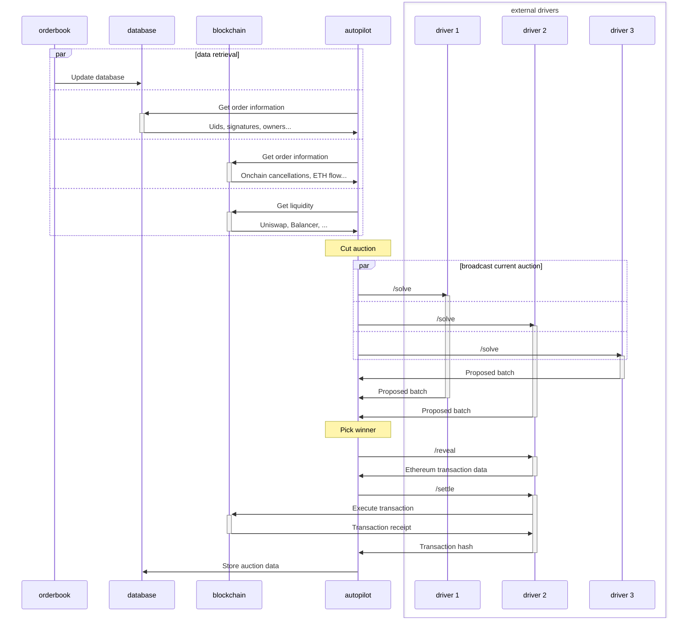

# Autopilot

The autopilot is the engine that drives forward CoW Protocol.

Running at a regular interval, it keeps an up-to-date view on the state of the protocol,
synthesizes this data into an _auction_,
broadcasts this auction to each of the solvers,
and finally chooses which solution will be executed.

Users don't interact with the autopilot directly: its only intended interface is with the solvers (through the driver).
Unlike solvers, there is a single autopilot running for each chain[^barn].

Its role can be broadly summarized into these main purposes.

1. Data collection, which is mainly:
   - Liquidity gathering
   - Order information
2. Cutting auctions
3. Solver competition
4. Auction data storage

[^barn]: There is technically also a second autopilot running on each network for testing purposes (in the _barn_ environment), but this isn't necessary for running the protocol.

## Data collection

The autopilot needs to have a complete overview of the protocol and of many other third-party protocols in order to build an [auction](/cow-protocol/reference/core/auctions/schema) that is as complete as possible.

Much of the order data it needs is collected through the database, which is shared with the orderbook.
The database stores the vast majority of available order information, including user signatures.

Other information can only be retrieved onchain and is updated every time a new block is mined. For example, it needs to know from the protocol:

- Which [pre-signatures](/cow-protocol/reference/core/signing-schemes#presign) have been set
- If new [eth-flow orders](/cow-protocol/tutorials/cow-swap/native#eth-flow) have been created
- Tracking which orders have been [invalidated](/cow-protocol/reference/contracts/core/settlement#invalidateorder) by the user
- Detecting if a batch has been settled and it should prepare a new auction

Retrieved information isn't limited to the CoW Protocol itself.
The aution data also contains information on which liquidity is available to the solvers to settle an auction's orders.
Solvers may use this liquidity information to help them out with finding a solution more quickly.
Some liquidity sources are also used to provide a reference price of each token in an order;
the reference price is used to normalize the value of the [surplus](/cow-protocol/reference/core/auctions/the-problem), since the surplus must be comparable for all orders and an order could use the most disparate ERC-20 tokens.

Examples of liquidity sources that are tracked by the autopilot:
- Uniswap (v2 and v3)
- Balancer (Weighted, Weighted2Token, ComposableStable, ...)
- SushiSwap
- Swapr

## Cutting auctions

The autopilot constantly updates the list of orders that can be settled based on the data retrieved above.

Orders that can't be settled are filtered out: these are expired orders, those with not enough balance, with missing approvals, or that use tokens that aren't supported by the protocol.

The autopilot also checks that [ERC-1271](/cow-protocol/reference/core/signing-schemes#erc-1271) signatures are currently valid.

This steps tries to guarantees that all available orders can be settled on CoW Protocol without further checks from the solvers.

## Solver competition

Once an auction is ready, the autopilot sends a `/solve` request to each solver's driver.
Solvers have a short amount time (seconds) to come up with a [solution](/cow-protocol/core/auctions/the-problem#solution) and return its _score_ to the autopilot.
The autopilot selects the winner based on this score once the allotted time expires or all drivers have returned their batch proposal.

Up to this point, the autopilot only knows the score and not the full solution that achieves that score.
The autopilot then asks the winning solver to reveal its score (throug `/reveal`) and then to execute the corresponding settlement transaction (`/settle`).
The solver is responsible for executing the transaction onchain (through the driver).

## Auction data storage

The data returned by the solver is stored by the autopilot on the database.
Other auction data is recorded as well, for example surplus fee for limit orders and the score returned by each solver.
It also records the result of executing the settlement onchain in order to track the difference in score caused by negative or positive slippage.

This data will be used to compute the [solver payouts](/cow-protocol/reference/core/auctions/rewards).
## Complexities

A typical challenge in the autopilot is handling block reorgs.
The autopilot must be able to revert as many actions as possible in case of a reorg; everything that can't be reverted must be accounted for in the stored data.

## What the autopilot doesn't do

The autopilot doesn't verify that a solver's transaction is valid, nor that it matches the score provided by the solver.
For this purpose, it's only responsible for documenting the proposed solution and the effects of a settlement to the onchain state.
Misbehavior is detected and accounted for when computing the solver payouts based on the data collected by the autopilot.
The solver payouts are handled outside of the autopilot code.

In the same way, the autopilot doesn't verify that the [rules of the game](/cow-protocol/reference/core/auctions/social-consensus) have been upheld.
This is handled in the solver payout stage as well; in exceptional circumstances the DAO can decide to slash the amount the solver staked for vouching.
