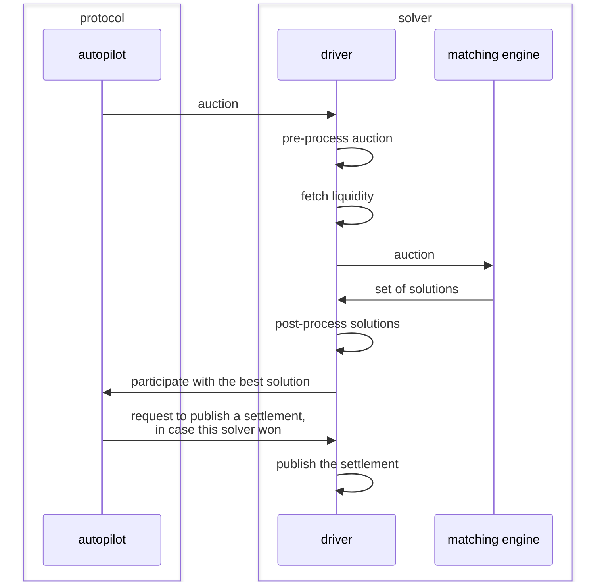

# Driver

People interested in running a solver to participate in CoW Protocol mainly want to focus on implementing the most efficient matching engine.
However, there are also many mundane tasks that are not the real money maker but have to be done regardless.  
The driver is a plug-and-play component that you can run to take care of these things for you until it makes sense to actually focus on optimizing them yourself.  
From the perspective of the protocol a `matching engine` together with its `driver` are considered a `solver`.

## Overview

The open-source Rust implementation can be found in the [driver](https://github.com/cowprotocol/services/tree/main/crates/driver) crate.
It has a few CLI parameters which can be displayed using `--help` but is mainly configured using a single `.toml` file.
A documented example file can be found [here](https://github.com/cowprotocol/services/blob/main/crates/driver/example.toml).

The `driver` sits between the [`autopilot`](autopilot) and a [`matching engine`](solver-engine) and acts as a intermediary between the two.
In case you decide to run the driver for a matching engine the lifecycle of an auction looks like this.

Splitting the driver from the matching engine is just a design decision to keep the barrier of entry for new solvers low.
However, there is nothing preventing you from patching, forking or reimplementing the driver.
You can even merge the responsibilities of the driver and matching engine into one if you want to build the most optimal solver possible.  
The only hard requirement is that the component the autopilot interfaces with implements this [interface](api/driver).

### Responsibilities

#### Preprocessing Auctions

The auctions sent to the driver by the autopilot only contain the bare minimum of information needed.
But usually a matching engine requires more information than that so the driver pre-processes the auction before forwarding it to the matching engine.
That process includes:
* fetching additional meta data (e.g. token decimals)
* discarding orders that can definitely not be settled (e.g. user is missing balances)
* very basic prioritization of remaining orders (e.g. orders below or close to the market price are most likely to settle)

#### Fetching Liquidity

Unless you find a perfect CoW you'll need some sort of liquidity to settle an order with.
To get your solver started with a good set of base liquidity the driver is able to index and encode a broad range of fundamental AMMs.
These include `UniswapV2` and it's derivatives, `UniswapV3` as well as several liquidity sources from the `BalancerV2` family.
All of these can be individually configured or completely disabled if your matching engine manages liquidity on its own.

#### Postprocessing Solutions

The driver expects the matching engine to return a recipe on how to solve a set of orders but the recipe itself could not be submitted on-chain.
In the post-processing step the driver applies multiple sanity checks to the solution, encodes it into a transaction that could be executed on-chain and verifies that it actually simulates successfully before it considers the solution valid.
All this is done because solvers can get slashed for misbehaving so the reference driver checks all it can to reduce the risk of running a solver as much as possible.
If your matching engine returns multiple valid solutions the driver will pick the best one and only report that one to the autopilot to maximize the solver's chance of winning the auction.

#### Submitting Settlements

If the solver provided the best solution the autopilot will tell the driver to actually submit it on-chain.
This is not as straight forward as it sounds when the blockchain is congested and liquidity sources are volatile.
To protect the solver from losing ETH by submitting solutions that revert the driver continuously verifies that the solution still works while it submits it on-chain.
As soon as it would revert the driver cancels the transaction to cut the losses to a minimum.

## Methodology

As you can see the driver has many responsibilities and discussing all of them in detail would be beyond the scope of this documentation but it's worth mentioning one guiding principle that applies to most of them:  

Because having more time for the solver to compute a solution leads to a more competitive solver every process in the driver should introduce as little latency as possible.
Also the blockchain is obviously the single source of truth for a lot of the state in the driver and fetching state from the network can be quite slow.  
To reconcile these aspects many internal components listen for new blocks getting appended to the blockchain.
Whenever that happens the driver fetches all the relevant information and caches it.
When the next auction comes in and the driver actually needs that data it's already up-to-date and ready to be used.

## Dependencies

The driver only responds to incoming requests sent by the autopilot.
You can easily set this up locally yourself but for a driver to participate in the competition in CoW Protocol the accompanying solver has to be bonded and registered in the official CoW Protocol off-chain infrastructure.
