# Order book

The orderbook is the main API that traders, UIs and other integrations use to interact with CoW Protocol.

Its implementation can be found [here](https://github.com/cowprotocol/services/tree/main/crates/orderbook). The API is documented in detail [here](../../apis/orderbook). 

## Overview

By and large the orderbook is a [CRUD](https://en.wikipedia.org/wiki/Create,_read,_update_and_delete) service for the state of the protocol.
It connects to the database which is shared with the [autopilot](./autopilot) to insert or update orders and serves information about existing orders as well as previous trades and auctions.

## Architecture

The standard trader interaction flow can be seen in the following sequence diagram:

```mermaid
sequenceDiagram
    actor User
    participant Order book
    participant Solver1
    User->>Order book: POST /quote
    activate Order book
    Order book->>SolverN: quote?
    activate SolverN
    Order book->>Solver1: quote?
    activate Solver1
    Solver1->>Solver1: compute matching for<br> "single order batch"
    SolverN->>SolverN: compute matching for<br> "single order batch"
    Solver1-->>Order book: result
    deactivate Solver1
    SolverN-->>Order book: result
    deactivate SolverN
    Order book->>Order book: simulate quote
    Order book->>Order book: pick best result
    Order book->>Database: store quote
    Order book-->>User: quote
    deactivate Order book
    User->>User: 🖊 Sign order
    User->>Order book: POST /order
    activate Order book
    Order book->>Order book: verify order
    Order book->>Database: fetch quote
    opt if quote not found
      Order book->>Solver1: quote?
      Solver1-->>Order book: result
      Order book->>SolverN: quote?
      SolverN-->>Order book: result
      Order book->>Order book: smualate & pick
    end
    Order book->>Database: insert order
    Order book-->>User: order UID
    deactivate Order book
    User->>User: ⏳ Wait for happy moo
    User->>Order book: GET /trades
    activate Order book
    Order book->>Database: lookup order
    Database-->>Order book: order & trades
    Order book-->>User: trades
    deactivate Order book
```

After selecting the parameters of their trade, most traders want to see an estimate of how much tokens they will receive in order to pick a reasonable limit price.
For that they send a `/quote` request to the orderbook. 
The orderbook is connected to a subset of solvers that are participating in the competitions (technically their [**drivers**](./solver/driver)) and creates price estimates by sending these solvers a request to solve a batch auction containing just a single order.

The orderbook may simulate quotes if possible to make sure their proposed solution would pass given the current state of the chain and picks the one maximizing the traders' output (the solver winning the quote is rewarded by the protocol). 
The quote is turned into an order that is returned to the trader and is ready to be signed by the user.

Once signed, the trader will post the order for inclusion in the next batch.
At this stage the orderbook will verify the order is valid and either fetch the existing quote or create a new one (the "expected" out amount at order placement time is relevant for order classification and fee policies).
Finally it stores the order in the database, so that the autopilot can index it, and returns the uniquer identifier to the trader.

Now it's the protocol's and solvers' turn to distribute and match the order.
During this time, the trader may request status updates about their order from the orderbook and finally request information about the executed trade and solver competition.

## Methodology

The orderbook exposes a variety of different endpoints.
The majority of them are simple [REST](https://en.wikipedia.org/wiki/REST) interfaces on top of the data model that is stored in the database.
However, there are some more involved operations, which are worth explaining in more detail:

### Getting quotes

The quoting process piggy-backs on the solver competition.
Solver are tasked in finding a matching for an auction instance including only one order (the order to be quoted).
These quote auctions have a _significantly_ shorter deadline to solve "quote" auctions as they are fundamentally simpler to solve.

Quotes can be requested using either the _fast_ or _optimal_ quality type.

- **Optimal quotes**: wait for all connected solvers to either return a response or time out before yielding a result
- **Fast quotes**: return the best estimate as soon as a threshold of solvers (i.e. two) have returned a successful estimate

The API also exposes another price-related route, `/native_price`, which can be used to get an approximate estimate of the dollar (or ETH) value for a given amount of tokens.
These price estimates use fixed amounts and are more heavily cached allowing for faster response times.

### Placing orders

Before an order is accepted in the database it is validated.
Validation steps include
- Asserting the order is well formed and all fields are properly encoded
- The user has sufficient balance/allowance to place this order
- The [signature type](/cow-protocol/reference/signing-schemes) is supported and the signature is valid
- The pre-image for the order's [appData](/cow-protocol/reference/intents/app-data) hash is either provided in the request or publicly available on IPFS (to ensure any additional information about the order can be properly interpreted by the orderbook)

Each order is also associated with a quote for classification as either in or out of market price. This may have an effect on the fee policy used.
For this either the trader provided `quoteId` is looked up or a fresh quote is created.

## Considerations

The orderbook synchronizes state with the autopilot via a shared database.
It communicates with solvers to produce price estimates.
It uses IPFS to update and fetch [appData](/cow-protocol/reference/intents/app-data) documents.
It also depends on on-chain state for:
- checking the trader has sufficient balance/approval to place the order
- simulate smart contract signatures and hooks

