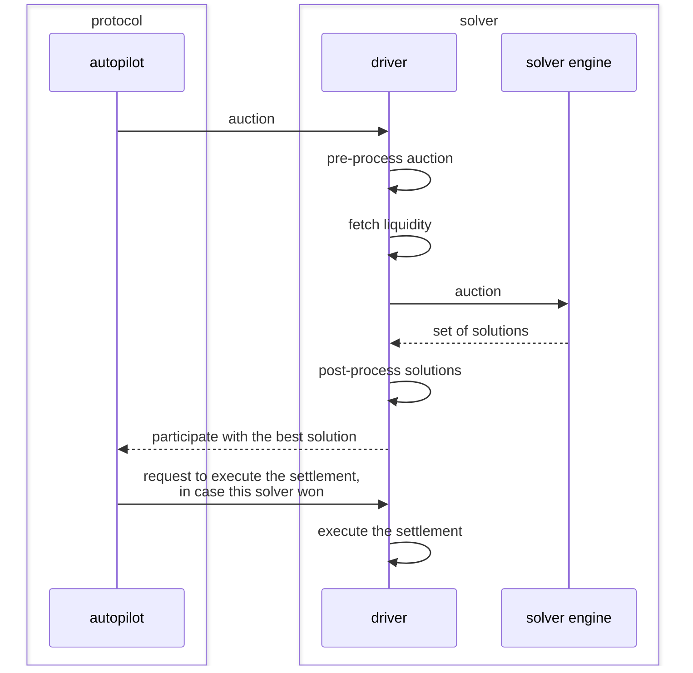
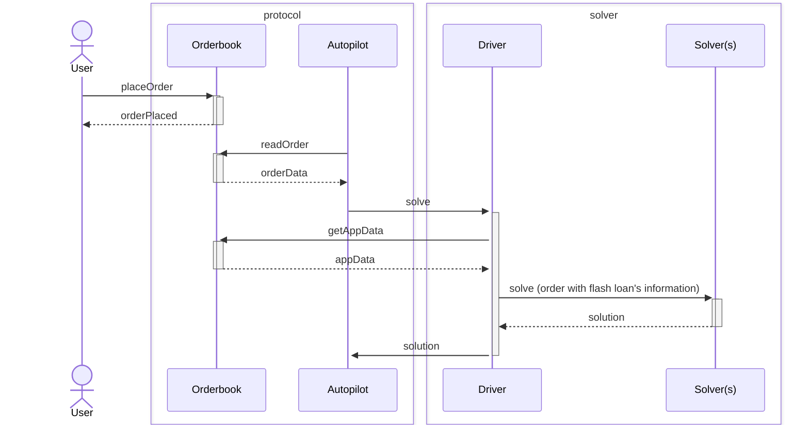

# Driver

People interested in running a solver to participate in CoW Protocol mainly want to focus on implementing the most efficient solver engine.
However, there are also many mundane tasks that may not seem like a competitive advantage but have to be done regardless.

## Overview

The driver is a plug-and-play component that teams can run to take care of mundane tasks until it makes sense for them to actually focus on optimizing them.
From the perspective of the protocol a **solver engine _together_ with its driver** are considered a **solver**.

## Architecture

The open-source Rust implementation can be found in the [driver](https://github.com/cowprotocol/services/tree/main/crates/driver) crate.
It has a few CLI parameters which can be displayed using `--help` but is mainly configured using a single `.toml` file.
A documented example file can be found [here](https://github.com/cowprotocol/services/blob/main/crates/driver/example.toml).

The `driver` sits between the [autopilot](../autopilot) and a [solver engine](solver-engine) and acts as a intermediary between the two.
In case you decide to run the driver for a solver engine the lifecycle of an auction looks like this.

Splitting the driver from the solver engine is just a design decision to keep the barrier of entry for new solvers low.
However, there is nothing preventing you from patching, forking or reimplementing the driver.
You can even merge the responsibilities of the driver and solver engine into one if you want to build the most optimal solver possible; the only hard requirement is that the component the autopilot interfaces with implements this [interface](/cow-protocol/reference/apis/driver).

## Methodology

### Preprocessing auctions

The auctions sent to the driver by the autopilot only contain the bare minimum of information needed.
But usually a solver engine requires more information than that so the driver pre-processes the auction before forwarding it to the solver engine.
We also want to reduce the overall workload of a solver engine, since it's usually expensive to match an order (in terms of time, RPC requests, API calls, etc.).
That process includes:
* fetching additional metadata (e.g. token decimals)
* discarding orders that can definitely not be settled (e.g. user is missing balances)
* very basic prioritization of remaining orders (e.g. orders below or close to the market price are most likely to settle)

### Fetching liquidity

Unless you find a perfect CoW you'll need some sort of liquidity to settle an order with.
To get your solver started with a good set of base liquidity the driver is able to index and encode a broad range of fundamental AMMs.
These include `UniswapV2` and its derivatives, `UniswapV3` as well as several liquidity sources from the `BalancerV2` family.
All of these can be individually configured or completely disabled if your solver engine manages liquidity on its own.

### Postprocessing solutions

The driver expects the solver engine to return a recipe on how to solve a set of orders but the recipe itself could not be submitted on-chain.
In the post-processing step the driver applies multiple sanity checks to the solution, encodes it into a transaction that can be executed on-chain and verifies that it actually simulates successfully before it considers the solution valid.
All this is done because solvers can get slashed for misbehaving so the reference driver checks all it can to reduce the risk of running a solver as much as possible.

Since the solver engine is allowed to propose multiple solutions the driver also contains some logic to pick the best one.
First it will try to merge disjoint solutions to create bigger and more gas efficient batches.
Afterwards it will simulate the solutions to get an accurate gas usage for them which is used to compute a score for each one.
Finally the driver will propose only the highest scoring solution to the autopilot to maximize the solver's chance of winning the auction.

### Submitting settlements

If a solver provided the best solution the autopilot will tell the driver to actually submit it on-chain.
This is not as straight forward as it sounds when the blockchain is congested and liquidity sources are volatile.
To protect the solver from losing ETH by submitting solutions that revert the driver continuously verifies that the solution still works while it submits it on-chain.
As soon as it would revert the driver cancels the transaction to cut the losses to a minimum.

The driver can be configured to use different submission strategies which it dynamically choses based on the potential of MEV for a settlement.
If the settlement does not expose any MEV (e.g. it executes all trades without AMMs) it's safe and most efficient to directly submit to the public mempool.
However, if a settlement exposes MEV the driver would submit to an MEV-protected RPC like [MEVBlocker](https://mevblocker.io).

### Flash Loans

The user is able to create a flash loan order's hint by attaching to the `appData` the specified metadata. The autopilot reads the order and cuts it into a [batch auction](../../../concepts/introduction/batch-auctions). Then the driver fetches the `appData` by calling the orderbook with `GET /v1/app_data/<app_data_hash>` for every order and caches them in memory. The driver should include the flash loan information into the batch auction's order before sending it to the solver(s).

#### Flash Loans Encoding

If a solver decides to encode the transaction without the help of the reference driver, the solver must call the `IFlashLoanRouter` contract's [flashLoanAndSettle](../../../reference/contracts/periphery/flash-loans.md#flashloanandsettle) function instead of the settlement contract's [settle](../../../reference/contracts/core/settlement.md#settle) function. The solver must provide all necessary flash loan inputs for the settlement, as well as the settle calldata, which will be executed within the same context by the `IFlashLoanRouter` contract. The `IFlashLoanRouter` contract will then request the specified flash loans and, once received, execute the settlement as instructed.

The entry point to the router contract ([IFlashLoanRouter](../../../reference/contracts/periphery/flash-loans.md#iflashloanrouter-contract)) is the function `flashLoanAndSettle`.
It takes a list of loans with the following entries for each loan:

- The loaned amount and ERC-20 token.
- The flash-loan lender (e.g., Balancer, Aave, Maker, ...).
- The _borrower_, which is an adapter contract that makes the specific lender implementation compatible with the router.

It also takes the exact call data for a call to `settle`.
The flash-loan router is a solver for CoW Protocol and calls `settle` directly once the flash loans have been obtained.
Only CoW-Protocol solvers can call this function.

Tokens and lenders are external contracts, while the router and borrowers have a dedicated contract implemented by CoW Protocol.

The borrowers are the contracts that are called back by the lender once the flash loan is initiated; they are the contracts that receive the flash-loan proceeds and that are eventually responsible to repay the loan.

The only way to move funds out of a borrower is through an ERC-20 approval transaction from the spender.
Approvals can be set by calling the [approve](../../../reference/contracts/periphery/flash-loans.md#approve) function on the borrower contract ([IBorrower](../../../reference/contracts/periphery/flash-loans.md#iborrower-contract)) from the context of a settlement.
For safe operations, like an approval for the settlement contract to spend the funds of the borrower, it's enough to set the approval once for an unlimited amount and reuse the same approval in future settlements.

At the start of the settlement, it's expected that the loaned funds are transferred from the borrowers to where they are needed. For example, this can be the settlement contract itself, or the address of a user who wants to use the loan to retrieve the collateral needed to avoid liquidations.

In general, solvers have full flexibility in deciding how loaned funds are allocated.

The settlement is also responsible for repaying the flash loans.
The specific repayment mechanism depends on the lender, but a common process is having the settlement contract send back the borrowed funds to the borrower and set an approval to the lender for spending the funds of the borrower: then the lender is going to pull back the funds with an ERC-20 `transferFrom` after the settlement is terminated.
Inability to pay for a flash loan will most likely be met by a reverting transaction.
The flash loans must be executed before any pre-interaction, so the funds are available before the pre-interactions are executed.

For each flash loan, the following encoding has to be added:

- Allow settlement contract to pull borrowed tokens from flash loan wrapper.
- Transfer tokens from flash loan wrapper to user (i.e. borrower).
- Since the order receiver is expected to be the settlement contract, it is needed to transfer the tokens from the settlement contract to the flash loan wrapper.
- Allow flash loan lender to take tokens from wrapper contract.

## Considerations

As you can see the driver has many responsibilities and discussing all of them in detail would be beyond the scope of this documentation but it's worth mentioning one guiding principle that applies to most of them: 
make the driver do as _little_ work as possible in the hot path when processing an auction.

Because having more time for the solver to compute a solution leads to a more competitive solver every process in the driver should introduce as little latency as possible.
Also the blockchain is obviously the single source of truth for a lot of the state in the driver and fetching state from the network can be quite slow.

To reconcile these aspects many internal components listen for new blocks getting appended to the blockchain.
Whenever that happens the driver fetches all the relevant information and caches it.
When the next auction comes in and the driver actually needs that data it's already up-to-date and ready to be used.

### Dependencies

The driver only responds to incoming requests sent by the autopilot.
You can easily set this up locally yourself but for a driver to participate in the competition in CoW Protocol the accompanying solver has to be bonded and registered in the CoW Protocol off-chain infrastructure.
For this, please reach out via the [CoW Discord](https://discord.gg/cowprotocol).
