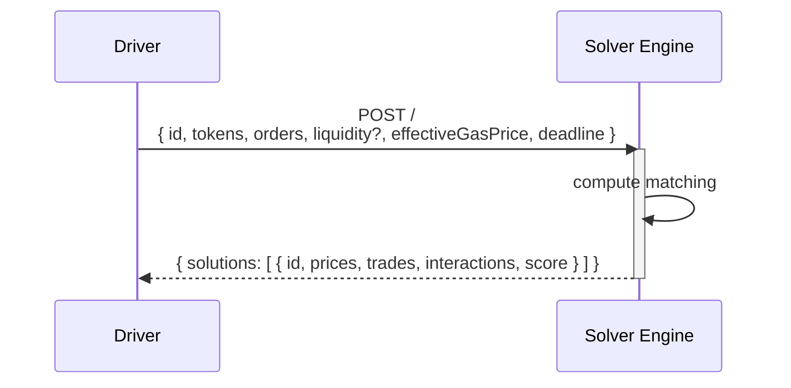

# Solver Engine

The Solver Engine implements the [matching system](https://en.wikipedia.org/wiki/Order_matching_system) of the CoW Protocol batch auction.
As part of the auction lifecycle, it receives a request from the [driver](driver) containing a potentially pre-processed auction instance and returns information about which order to execute together with instructions on how to achieve the desired execution using on-chain liquidity "interactions". 

:::note

Solver teams aiming to use the open-source driver implementation need to implement their own solver engine.

:::

## Overview

An open source [Rust](https://rust-lang.org) implementation of a solver engine can be found in the [solvers crate](https://github.com/cowprotocol/services/tree/main/crates/solvers).
This engine can be run in a few different "modes" to demonstrate and test the whole system end to end (cf. `solvers::infra::cli::Command`):

- **Baseline**: Solve individual orders exclusively via on-chain liquidity provided in the driver-augmented auction.
- **Naive**: Optimistically batch similar orders and settle net amounts via selected AMM liquidity from the driver-augmented auction
- **Legacy**: Forward auction to another solver engine implementing the deprecated, legacy HTTP interface
- **Balancer**: Solve individual orders using Balancer [Smart Order Router](https://docs.balancer.fi/sdk/technical-reference/smart-order-router.html)
- **ZeroEx**: Solve individual orders using [0x API](https://0x.org/docs/0x-swap-api/introduction)
- **OneInch**: Solve individual orders using [1Inch API](https://portal.1inch.dev/documentation/swap/introduction)
- **Paraswap**: Solve individual orders using [Paraswap API](https://developers.paraswap.network/api/master)

Each mode comes with its own set of configuration parameters (cf. [examples](https://github.com/cowprotocol/services/tree/main/crates/solvers/config))

## Architecture

Solver Engines implement the [API](../../reference/apis/solver) expected by the driver component.

The information received by the driver should be sufficient to produce valid responses, meaning that the solver engine could be implemented as a pure function.
However, in practice, solver engines often benefit from additional state management, such as indexing liquidity sources and simulating execution routes for more accurate cost estimates, to remain competitive.

## Methodology

The inner workings are engine specific and highly depend on the underlying matching algorithm.
While third-party aggregator algorithms are proprietary (the engine simply calls their API for as many orders as possible), the baseline and naive solver engine can give us an idea of how to generate basic solutions for simple problem instances. 

### Baseline

For each order in the problem set, this solver implements a greedy single-path output maximization algorithm in a weighted graph where vertices correspond to tokens and edges correspond to AMMs providing liquidity between tokens with their output equal to the exchange rate as defined by AMM function given the input amount.
Outputs are adjusted to consider the execution cost of updating the AMM when used, using fixed gas amount estimates but taking into account the gas price provided in the auction input.
The graph originates over a set of "base tokens" plus the buy and sell token of the order.
It aims to find the single path from buy to sell token that maximizes the output for sell orders and minimizes the input for buy orders.
It handles partially fillable attempting to first fill the entire order.
It doesn't produce Coincidences of Wants.
If the resulting output doesn't satisfy the limit price, it re-attempts filling the order to 50% and keeps halving its amount until a match is found.

### Naive

Unlike baseline, the naive solver was built to demonstrate the power of CoWs and supports peer-to-peer matching of orders.
It groups orders that trade the same assets together and pairs them with the most liquid constant product AMM that the input auction contains for this token pair.
It then attempts to settle the net difference in demand and supply between the orders in the group against the AMM using the resulting AMM price as the clearing price.
Let's take a slightly simplified example:
- Alice wants to sell 100 DAI for at least 90 USDC
- Bob also wants to sell 100 DAI for at least 90 USDC
- Charlie wants to sell 150 USDC for 140 DAI
- A Uniswap style AMM exists allowing to trade DAI/USDC 1:1

After matching Alice, Bob and Charlie peer to peer there is an excess amount of DAI.
Since DAI can be exchanged 1:1 against the AMM we can create the following matching:
- Alice sells 100 DAI, receives 100 USDC (10 USDC surplus)
- Bob sells 100 DAI, receives 100 USDC (10 USDC surplus)
- Charlie sells 150 USDC for 150 DAI (10 DAI surplus)
- 50 DAI is exchanged for 50 USDC using the AMM.

In practice, the exchange rate the AMM provides depends on the excess amount.
In the case that the resulting AMM price doesn't satisfy all user orders in the current group, the order with the strictest limit price from the excess demand side is removed.
Let's say in the example above Alice was only willing to sell her 100 DAI for at least 101 USDC.
This wouldn't satisfy the clearing price computed in the original result.
Since we have an excess amount of DAI, we would remove Alice's order, as it has the strictest limit price on the "sell DAI" side.
This now results in an excess supply of USDC for which we can find the following matching:
- Bob sells 100 DAI, receives 100 USDC (10 USDC surplus)
- Charlie sells 150 USDC for 150 DAI (10 DAI surplus)
- 50 USDC is exchanged for 50 DAI using the AMM.

In the case of a perfect CoW, when excess demand and supply are zero, the current AMM's spot price is used to determine the clearing price.

The naive solver is currently not capable of matching partially fillable orders.

## Dependencies

Solver engines need to be "registered" inside the driver configuration file to receive requests.
Check `driver::infra::config::file::SolverConfig` for the available configuration parameters.
