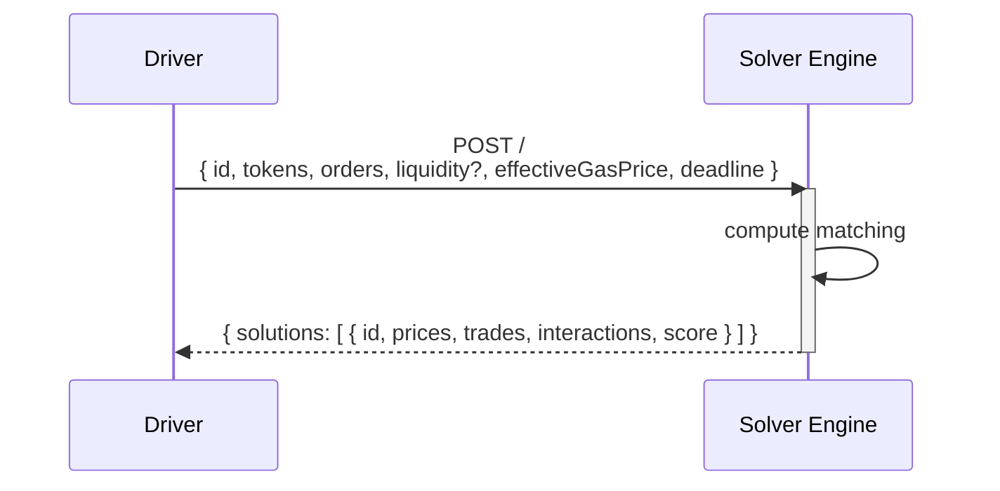
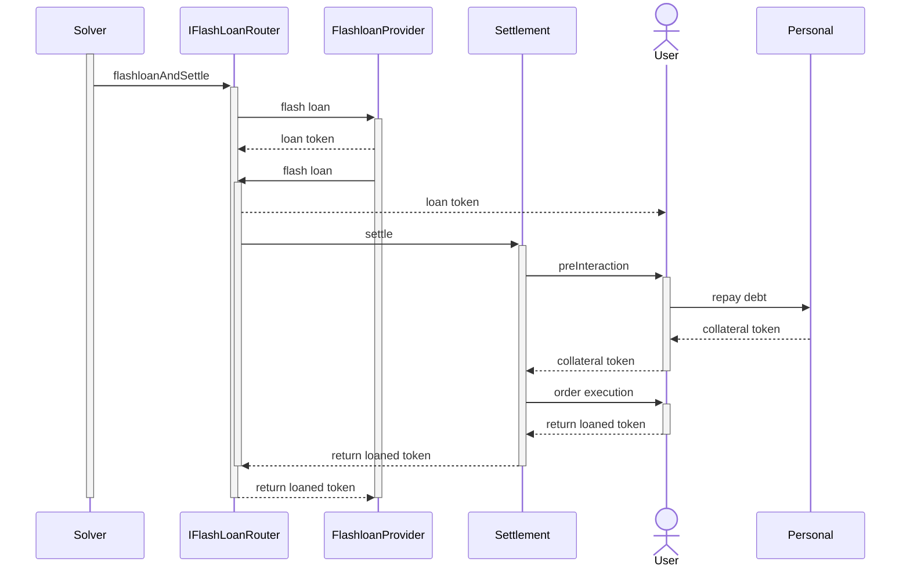

# Solver Engine

The Solver Engine implements the [matching system](https://en.wikipedia.org/wiki/Order_matching_system) of the CoW Protocol batch auction.
As part of the auction lifecycle, it receives a request from the [driver](driver) containing a potentially pre-processed auction instance and returns information about which order to execute together with instructions on how to achieve the desired execution using on-chain liquidity "interactions". 

:::note

Solver teams aiming to use the open-source driver implementation need to implement their own solver engine.

:::

## Overview

An open source [Rust](https://www.rust-lang.org/) implementation of a solver engine can be found in the [solvers crate](https://github.com/cowprotocol/services/tree/main/crates/solvers).
This engine can be run in a few different "modes" to demonstrate and test the whole system end to end (cf. `solvers::infra::cli::Command`):

- **Baseline**: Solve individual orders exclusively via on-chain liquidity provided in the driver-augmented auction.
- **Naive**: Optimistically batch similar orders and settle net amounts via selected AMM liquidity from the driver-augmented auction
- **Legacy**: Forward auction to another solver engine implementing the deprecated, legacy HTTP interface
- **Balancer**: Solve individual orders using Balancer [Smart Order Router](https://docs.balancer.fi/sdk/technical-reference/smart-order-router.html)
- **ZeroEx**: Solve individual orders using [0x API](https://0x.org/docs/0x-swap-api/introduction)
- **OneInch**: Solve individual orders using [1Inch API](https://portal.1inch.dev/documentation/swap/introduction)
- **Paraswap**: Solve individual orders using [Paraswap API](https://developers.paraswap.network/api/master)

Each mode comes with its own set of configuration parameters (cf. [examples](https://github.com/cowprotocol/services/tree/main/crates/solvers/config))

## Architecture

Solver Engines implement the [API](../../../reference/apis/solver) expected by the driver component.

The information received by the driver should be sufficient to produce valid responses, meaning that the solver engine could be implemented as a pure function.
However, in practice, solver engines often benefit from additional state management, such as indexing liquidity sources and simulating execution routes for more accurate cost estimates, to remain competitive.

## Methodology

The inner workings are engine specific and highly depend on the underlying matching algorithm.
While third-party aggregator algorithms are proprietary (the engine simply calls their API for as many orders as possible), the baseline and naive solver engine can give us an idea of how to generate basic solutions for simple problem instances. 

### Baseline

For each order in the problem set, this solver implements a greedy single-path output maximization algorithm in a weighted graph where vertices correspond to tokens and edges correspond to AMMs providing liquidity between tokens with their output equal to the exchange rate as defined by AMM function given the input amount.
Outputs are adjusted to consider the execution cost of updating the AMM when used, using fixed gas amount estimates but taking into account the gas price provided in the auction input.
The graph originates over a set of "base tokens" plus the buy and sell token of the order.
It aims to find the single path from buy to sell token that maximizes the output for sell orders and minimizes the input for buy orders.
It handles partially fillable attempting to first fill the entire order.
It doesn't produce Coincidences of Wants.
If the resulting output doesn't satisfy the limit price, it re-attempts filling the order to 50% and keeps halving its amount until a match is found.

### Naive

Unlike baseline, the naive solver was built to demonstrate the power of CoWs and supports peer-to-peer matching of orders.
It groups orders that trade the same assets together and pairs them with the most liquid constant product AMM that the input auction contains for this token pair.
It then attempts to settle the net difference in demand and supply between the orders in the group against the AMM using the resulting AMM price as the clearing price.
Let's take a slightly simplified example:
- Alice wants to sell 100 DAI for at least 90 USDC
- Bob also wants to sell 100 DAI for at least 90 USDC
- Charlie wants to sell 150 USDC for 140 DAI
- A Uniswap style AMM exists allowing to trade DAI/USDC 1:1

After matching Alice, Bob and Charlie peer to peer there is an excess amount of DAI.
Since DAI can be exchanged 1:1 against the AMM we can create the following matching:
- Alice sells 100 DAI, receives 100 USDC (10 USDC surplus)
- Bob sells 100 DAI, receives 100 USDC (10 USDC surplus)
- Charlie sells 150 USDC for 150 DAI (10 DAI surplus)
- 50 DAI is exchanged for 50 USDC using the AMM.

In practice, the exchange rate the AMM provides depends on the excess amount.
In the case that the resulting AMM price doesn't satisfy all user orders in the current group, the order with the strictest limit price from the excess demand side is removed.
Let's say in the example above Alice was only willing to sell her 100 DAI for at least 101 USDC.
This wouldn't satisfy the clearing price computed in the original result.
Since we have an excess amount of DAI, we would remove Alice's order, as it has the strictest limit price on the "sell DAI" side.
This now results in an excess supply of USDC for which we can find the following matching:
- Bob sells 100 DAI, receives 100 USDC (10 USDC surplus)
- Charlie sells 150 USDC for 150 DAI (10 DAI surplus)
- 50 USDC is exchanged for 50 DAI using the AMM.

In the case of a perfect CoW, when excess demand and supply are zero, the current AMM's spot price is used to determine the clearing price.

The naive solver is currently not capable of matching partially fillable orders.

## Flash Loans

The solver can receive an optional object with each order that provides hints for using flash loans. These hints act as guidance, but the solver is free to return a different list of flash loan objects in their solution. The solver has three options:

- Provide no hint: In this case, the driver will assume the flash loan hint attached to the order gets settled in the solution.
- Use the provided hint: The solver can directly copy the flash loan hint included with the order.
- Define a custom hint: The solver can specify a different flash loan hint, allowing for better optimization of flash loan usage.

A key requirement for flash loans is that all steps must take place within the same caller context. By maintaining this context, flash loans remain risk-free, as the transaction can be reverted if the tokens cannot be returned at the end. However, CoW Protocol cannot hold on to this context directly. To ensure that all steps execute within the same caller context, the GPv2 Settlement contract's [settle](../../../reference/contracts/core/settlement.md#settle) function is called from within the [IFlashLoanRouter](../../../reference/contracts/periphery/flash-loans.md#iflashloanrouter-contract) contract callback. Rather than directly calling the GPv2 Settlement contract, the solver first interacts with the `IFlashLoanRouter` contract.

The solver must consider the gas cost implications of using a flash loan, as the associated overhead is non-negligible.

The settlement contract will receive the swap order funds, but it is the solver’s responsibility to ensure the flash loan is fully repaid within the same transaction. Additionally, the solver needs to account for when the funds will become available, factoring in any user-defined pre-hooks.

The reference driver facilitates this process by pulling funds from the `IFlashLoanRouter` contract and transferring them to the user, so they can be used for the order swap. Since the settlement contract is the recipient of the swap, the driver must then move the funds back to the `IFlashLoanRouter` contract, ensuring that the flash loan lender can retrieve the required repayment from it. If a solver chooses to implement a custom driver, they are responsible for managing this behavior as they deem appropriate.

If a solver decides to encode the transaction without the help of the reference driver, the solver must call the `IFlashLoanRouter` contract's [flashLoanAndSettle](../../../reference/contracts/periphery/flash-loans.md#flashloanandsettle) function instead of the settlement contract's [settle](../../../reference/contracts/core/settlement.md#settle) function. The solver must provide all necessary flash loan inputs for the settlement, as well as the settle calldata, which will be executed within the same context by the `IFlashLoanRouter` contract. The `IFlashLoanRouter` contract will then request the specified flash loans and, once received, execute the settlement as instructed.

The entry point to the router contract ([IFlashLoanRouter](../../../reference/contracts/periphery/flash-loans.md#iflashloanrouter-contract)) is the function `flashLoanAndSettle`.
It takes a list of loans with the following entries for each loan:

- The loaned amount and ERC-20 token.
- The flash-loan lender (e.g., Balancer, Aave, Maker, ...).
- The _borrower_, which is an adapter contract that makes the specific lender implementation compatible with the router.

It also takes the exact call data for a call to `settle`.
The flash-loan router is a solver for CoW Protocol and calls `settle` directly once the flash loans have been obtained.
Only CoW-Protocol solvers can call this function.

Tokens and lenders are external contracts, while the router and each specific borrowers are dedicated contract implemented by CoW Protocol.

The borrowers are the contracts that are called back by the lender once the flash loan is initiated; they are the contracts that receive the flash-loan proceeds and that are eventually responsible to repay the loan.

The only way to move funds out of a borrower is through an ERC-20 approval for some spender.
Approvals can be set by calling the [approve](../../../reference/contracts/periphery/flash-loans.md#approve) function on the borrower contract ([IBorrower](../../../reference/contracts/periphery/flash-loans.md#iborrower-contract)) from the context of a settlement.
For safe operations, like an approval for the settlement contract to spend the funds of the borrower, it's enough to set the approval once for an unlimited amount and reuse the same approval in future settlements.

At the start of the settlement, it's expected that the loaned funds are transferred from the borrowers to where they are needed. For example, this can be the settlement contract itself, or the address of a user who wants to use the loan to retrieve the collateral needed to avoid liquidations.
In general, solvers have full flexibility in deciding how loaned funds are allocated.

The settlement is also responsible for repaying the flash loans.
The specific repayment mechanism depends on the lender, but a common process is having the settlement contract send back the borrowed funds to the borrower and set an approval to the lender for spending the funds of the borrower: then the lender is going to pull back the funds with an ERC-20 `transferFrom` after the settlement is terminated.
Inability to pay for a flash loan will most likely be met by a reverting transaction.

We support the following flash-loan lenders:

- Any lender that is compatible with [ERC-3156](https://eips.ethereum.org/EIPS/eip-3156) interface (for example [Maker](https://docs.makerdao.com/smart-contract-modules/flash-mint-module)).
- [Aave](https://aave.com/docs/developers/flash-loans#overview).

## Dependencies

Solver engines need to be "registered" inside the driver configuration file to receive requests.
Check `driver::infra::config::file::SolverConfig` for the available configuration parameters.
