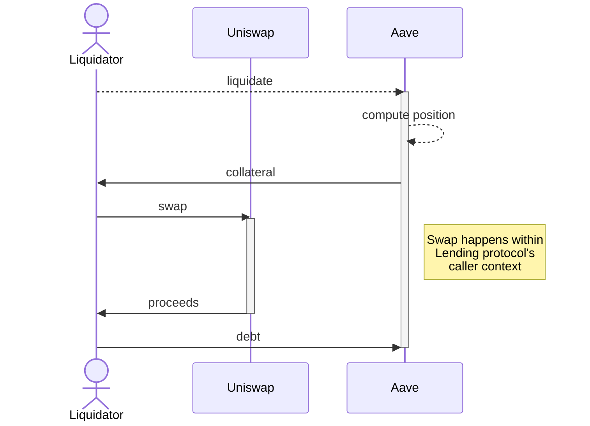
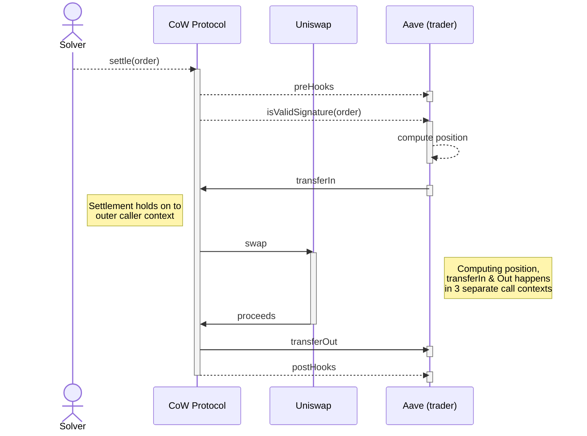
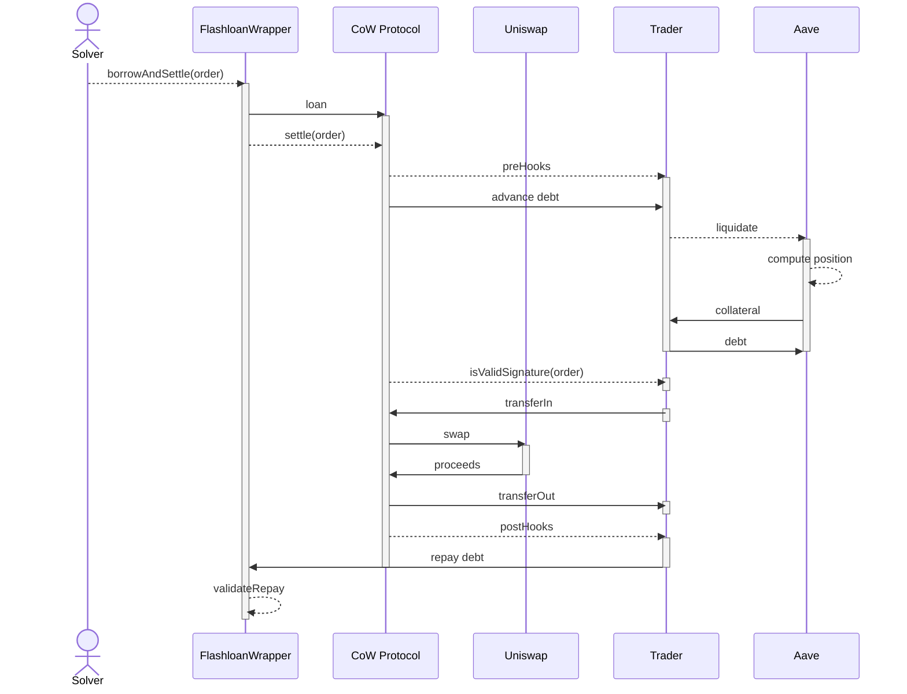

import UnauditedCaution from '../../../../partials/_unaudited.mdx'

# Liquidations

One area of DeFi where CoW Protocol can have a significant impact is liquidations. Here we will discuss how liquidations work today, why they can't be trivially converted to leverage CoW Protocol's MEV protection power, and what a native integration may look like.

A short argument for why CoW based liquidations are superior over existing MEV based auctions can be found in [this tweet thread](https://x.com/fleupold_/status/1701489691055325469?s=20).

## Liquidations today

Usually, liquidations can be triggered permissionlessly as soon as the loan-to-collateral ratio drops below a healthy threshold and the position is "under water". 
The party "kicking" the auction usually has an economic benefit (e.g. being able to recover the collateral at discount). In the presence of competition, this economic benefit is mostly forwarded in the form of MEV to block proposers.

In it's simplest form a lending protocol's liquidation code may look something like:

<UnauditedCaution />

```solidity
function liquidate(
    uint256 position_id, 
    address liquidator, 
    bytes memory data
) external nonReentrant {
    ERC20 collateral;
    ERC20 debt;
    uint256 collateral_amount;
    uint256 debt_amount;
    (collateral, collateral_amount, debt, debt_amount) = find_unhealthy(position_id);
    
    // Advance the collateral
    collateral.safeTransfer(liquidator, collateral_amount);
    
    // Execute whatever the liquidator wants to perform liquidation
    liquidator.call(data);
    
    // Ensure debt is recovered from the liquidator
    debt.safeTransferFrom(liquidator, address(this), debt_amount)
}
```

## The fight over the "caller context"

Note, how `liquidate` calls the liquidator and then **synchronously** (ie without returning from the function) ensures that sufficient debt is recovered?
This means `liquidate` holds on to the caller context and the liquidation has to happen atomically within that context.

A sequence diagram could look like this:



Most importantly, the lending protocol doesn't allow the transfer of collateral and the recovery of the debt to happen in two different calls.
This makes sense as otherwise the atomicity of the two operations couldn't be guaranteed (and someone could potentially take the collateral without repaying the debt).

## Enter CoW Protocol Settlements

CoW Protocol on the other hand, splits the collection of trade amounts, the execution of on-chain interactions to convert "ins" for "outs", and finally transferring the out amounts back to the trader (from the trader's perspective) into three different contexts. 

A sequence diagram of a simple single order CoW settlement (ERC-1271) could look like this:



Note, how this model isn't compatible with the traditional liquidation logic? 
The lending protocol expects to receive the debt (`transferOut`) before or in the same call as it sends out the collateral (`transferIn`), yet CoW Protocol requires the trade to yield its context in between before the payouts can happen (to allow for arbitrary interactions and potentially other traders to transfer in their tokens to form a [CoW](https://docs.cow.fi/overview/coincidence-of-wants)).

The only solution we found so far to work around this in the existing architecture, is to wrap the entire settlement into a flashloan so that the settlement contract can "advance" the debt repayment:



This effectively yields the caller context to an even higher order entity (an external flashloan provider) which nests the entire settlement and the liquidation (as a pre-hook) inside it.

The main disadvantage that this architecture brings is its **complexity**. Solvers need to:

1. Be aware that certain orders with upfront "capital requirements" exist.
2. Understand how to borrow this capital.
3. Accommodate multiple orders (such as two orders creating a CoW) that may potentially create nested flashloans (also with different providers) within one another.
4. Carefully ensure that loans are repaid by the traders at the end of the batch.
Moreover, this flow requires significantly more transfers and storage based book-keeping and is thus gas in-efficient.

While this approach is still theoretically possible, there is a much simpler and more elegant way to *natively* integrate liquidations into CoW Protocol...

## CoW native liquidation logic

The reason that lending protocols want to stay in control of the caller context is to ensure that the debt is repaid atomically in the same transaction.

While performing all steps atomically is the only secure way to achieve this if arbitrary addresses are allowed to kick the liquidation, it is actually not required if the liquidation is triggered via a CoW Protocol smart order (using ERC-1271).
CoW Protocol's [settlement contract](/cow-protocol/reference/contracts/core#gpv2settlement) passes a commitment to the **order parameters (ie. buy and sell amounts)** to the verifying smart contract as part of the signature verification step and, once authorized, **guarantees that the trader will receive at least** as much of the buy token as specified in the order. Otherwise the whole settlement will revert!

This means that as long as the liquidation protocol verifies that the maximum sell amount (collateral) covers the minimum guaranteed buy amount (debt) it can "accept" the trade and rest assured that it will receive the required proceeds to make the position whole. The solver competition will ensure that, if market price permit, the protocol will even receive **more than the limit price** (surplus).

A CoW Protocol adjusted ERC-1271 liquidation logic in its simplest form could look like:

<UnauditedCaution />

```solidity
function isValidSignature(
  bytes32 hash,
  bytes calldata signature
) external view returns (bytes4) {
    Order memory data;
    uint256 position_id;
    (data, position_id) = abi.decode(signature, (Order, uint256));
    
    // Check that the order parameters are correct
    require(hash == data.hash(CowDomainSeparator));
    
    // Perform original liquidation checks
    ERC20 collateral;
    ERC20 debt;
    uint256 collateral_amount;
    uint256 debt_amount;
    (collateral, collateral_amount, debt, debt_amount) = find_unhealthy(position_id);
    
    require(order.buy_token == debt);
    require(order.sell_token == collateral);
    require(order.sell_amount <= collateral_amount);
    require(order.buy_amount >= debt_amount);
    
    // If we get to this stage we know we will at least 
    // receive debt_amount if we send out collateral_amount, 
    // so we can accept the trade.
    return ERC1271_MAGIC_VALUE;
}
```

It is of course possible to combine the traditional liquidation model with the proposed approach either based on time (e.g. allow CoW Swap liquidations only for the first n blocks the loan is under water) or based on the price of the collateral (fallback to traditional model if price drops x% below liquidation threshold).

<details open>
  <summary>Book keeping using CoW Hooks</summary>
  Any book-keeping to account or split the extra proceeds can happen in pre- and post-interactions (aka <a href="/cow-protocol/concepts/product-features/cow-hooks">hooks</a>). 
Note that unlike the transfer of proceeds, the settlement contract itself does not guarantee pre- and post-hooks get executed atomically with the trade. However, solvers can get slashed up to $500k in case they violate this assumption. Moreover, in particular pre-hooks can still be enforced on-chain (by checking their execution happened inside `isValidSignature`) and post-hooks can either be made permissionlessly executable by other actors and/or enforced in subsequent pre-hooks.
</details>

## Conclusion

Liquidations create a lot of MEV, which can be mitigated by using CoW Protocol's batch auctions and treating them as regular stop-loss triggered limit orders subject to uniform price clearing and surplus maximisation.

Current lending protocols however rely on liquidation mechanisms that assume disbursement of collateral and repayment of debt happening atomically in the same "call". This model is incompatible with CoW Protocol's settlement flow which assumes `transferIn` and `transferOut` of trade amounts happens sequentially in separate calls. 

While a complicated architecture to combine the two models via a superordinate flashloan context is possible, it would be much simpler and equally safe for lending protocols to allow repayment of debt to happen asynchronously via ERC-1271 based "smart orders". Trading amounts can be verified during signature validation and are guaranteed by CoW Protocol's immutable settlement contract code to be sent out to the recipient as part of the settlement. Any additional book-keeping can happen in pre/post trade hooks.
