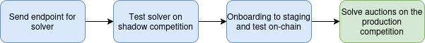

# Joining The CoW Protocol Solver Competition
> **_NOTE:_** Most of this document assumes that you will be joining the solver competition under the CoW DAO bonding pool. If you were to set up your own bonding pool then most of the information in this document is either optional or irrelevant. To join the solver competition under your own bonding pool refer to [this document](https://docs.cow.fi/cow-protocol/reference/core/auctions/bonding-pools) and reach out to help set up the bonding pool and whitelist your solver's address.

## Index
1. Essential information
2. Locally developing your solver
3. Joining the shadow competition
4. KYC checks and onboarding call
5. Joining the staging competition
6. Moving to production
7. Weekly rewards
8. Slippage accounting
9. Moving to other networks
10. Joining the mainnet competition
11. Joining the quoting competition
12. F.A.Q.

## 1. Essential information for joining the solver competition

### Requirements for joining the CoW DAO bonding pool
The general KYC requirements are to send us documentation proving that you are the beneficial owners of the company behind the solver and 1-2 passports of some of the main developers of the solver. Do not send this before the meeting, we will explain the process during the meeting so that you can send the documents afterwards.

Given the risk that will be carried by the CoW DAO bonding pool we also ask that solvers who join the solver competition through the CoW DAO Bonding pool start solving on Arbitrum first. After being in production on Arbitrum solvers can move to other L2's relatively easily. But joining the mainnet competition will require further evaluation after some time of solving on L2's.

### Service fees
As specified in [CIP-48](https://snapshot.box/#/s:cow.eth/proposal/0x563ab9a66265ad72c47a8e55f620f927685dd07d4d49f6d1812905c683f05805) solvers that are part of the CoW DAO bonding pool will be charged a service fee that is withheld from their weekly rewards. This fee will begin six months after the solver has joined the CoW Bonding pool and will encompass 15% of the weekly COW rewards that the solver would have received.

## 2. Locally developing your solver
The first step to joining the solver competition is to set up a solver. We have a [local set up guide](https://docs.cow.fi/cow-protocol/tutorials/solvers/local_test) that can help you set up a solver locally. There are also open source example solvers available in the [solvers crate](https://github.com/cowprotocol/services/tree/main/crates/solvers) that you can use as a starting point for developing your solver.

API specification: https://github.com/cowprotocol/services/blob/main/crates/solvers/openapi.yml

## 3. Joining the shadow (test) competition
Once you have a solver running locally you can join the shadow competition to start testing your solver using CoW Protocol's order flow. 

If you would like to secure your solver, you can set up a firewall and only accept requests from IP addresses that you whitelist beforehand. Contact us for the IP addresses that we use to send requests to your solver that you can whitelist.

### Exposed Endpoint
The exposed endpoint provided must be of the following format: {base_url}/\${envName}/\${network} - for example: https://api.mysolver.io/staging/mainnet
envName values: shadow, staging, prod

### Driver configuration for your solver
There are various configurations for your solver in the driver to help you optimize your solver: 

#### - Wrapping / unwrapping native tokens
The default behaviour for the driver is to set the native token address to `0xeee` and to insert interactions into your solution to unwrap the native token. It's also possible to configure this to either send the wrapped token address (WETH) and unwrap the native token, or send the wrapped token address and not unwrap the native token.

#### - Liquidity fetching
It is possible to enable or disable liquidity fetching for your solver. If this is enabled, the driver will search for on-chain liquidity sources for your solver to use and send them to your solver. [Docs](https://docs.cow.fi/cow-protocol/tutorials/arbitrate/solver/driver#fetching-liquidity)

#### - Fairness checks for EBBO
To ensure a fair execution for the users there are several EBBO rules that are maintained in the auction. Usually, an EBBO violation means that a reference pool from the base protocol would have given the user a better price than what they ended up receiving. 

In the event of an EBBO violation the team will reach out and ask you to reimburse the user. [Docs](https://docs.cow.fi/cow-protocol/reference/core/auctions/ebbo-rules)

#### - Merging disjoint solutions
It is possible for your solver to submit multiple solutions for a single auction and let the driver select the solution with the highest score to submit to the auction. It is possible to enable the driver to merge disjoint solutions in to a single solution for the auction. [Docs](https://docs.cow.fi/cow-protocol/tutorials/arbitrate/solver/driver#postprocessing-solutions)

## 4. KYC checks and onboarding call
Once your solver is tested and ready to join the solver competition, it is time to start the onboarding process. At this point, it would be best to reach out to the team on Telegram to schedule an onboarding call. During this call the team will go over the onboarding process and discuss the next steps.

The main goal of the onboarding call is to both make sure that your team understands everything they need to know related to the solver competition, and for everyone to get to know each other. The main structure of these calls is:

- Introduction

- Solver overview (what is your solver's background and strategy)

- The bonding pool (such as how to join the bonding pool, locking 25% of the weekly rewards, and service fees)

- KYC process and requirements

- Surplus shifting and the EBBO rules

- The slippage accounting process and weekly rewards

## 5. Joining the staging (barn) competition
After the onboarding call, the CoW team will begin preparing the required infrastructure for your solver to join the solver competition. If you are joining the solver competition under the CoW DAO bonding pool, then this will involve setting up and managing the driver on your behalf and setting up and managing the submission keys on your behalf. 

To do this, the team will generate keys for your solver to use for settling auctions on-chain and whitelisting those for the solver competition. In order to do this you will need to send a `rewards address` that you would like to use to receive weekly rewards on the chain that you are solving on. The rewards address needs to be controlled by the relevant solver team on both chain X and mainnet, as we send native token transfers to chain X while we send COW rewards to the mainnet address always

After this process is done, the team will send you the submission addresses that your solver will use to settle auctions on chain. While this is managed by the CoW team, it will be your responsibility to monitor this and make sure that is holds enough funds to cover gas fees. The driver has a minimum threshold for gas that it applies to make sure that the address holds (more than) enough funds to pay the required gas fees. Therefore we recommend these balances:

| Network | Environment | Recommended initial balance |
|---|---|---|
| Mainnet | Staging | 0.2 ETH |
| Mainnet | Production | 1 ETH |
| Arbitrum | Staging | 0.05 ETH |
| Arbitrum | Production | 0.2 ETH |
| Base | Staging | 0.05 ETH |
| Base | Production | 0.2 ETH |
| Gnosis | Staging | 15 xDAI |
| Gnosis | Production | 100 xDAI |

> **_NOTE:_** Please send the funds in the native currency of the chain that these addresses will be solving on. So for a submission address generated for your solver on Arbitrum, send the funds in ETH on the Arbitrum network.

After your solver is live and begins settling transactions, it will be your responsibility to monitor these addresses and to make sure that they hold enough funds to settle transactions for winning auctions.

In order to create some volume to test your solver, you can create orders on staging by using our barn swap interface ([https://barn.cow.fi](https://barn.cow.fi)).

## 6. Moving to production
Once your solver has moved to staging we can deploy your solver on production. Usually the team will schedule your solver to go live with the next release (on Tuesday) after you are deployed on staging. This gives your team a few days to test your solver by settling some transactions on chain before going live on production.

## 7. Weekly rewards
Every week on Tuesday your solver will receive rewards for settling auctions. These are distributed in COW tokens to the rewards address you provided. Rewards in COW will be sent to that address on mainnet, and reimbursements for slippage will be distributed on the same network as where the solving took place.

We advise using a single rewards address that is available on all networks.

[You can find more information about how we calculate and distribute rewards here.](https://docs.cow.fi/cow-protocol/reference/core/auctions/rewards)

## 8. Slippage accounting
Solvers are able to use the settlement contract's buffers when settling auctions. This can often result in one of two situations when prices move during an auction:

1. The settlement contract receives more tokens than what was promised to the user.

In this situation, some extra tokens will be left in the settlement contract after the auction is finished.

2. The settlement contract receives less tokens than what was promised to the user.

In this situation, if the settlement contract has enough of the tokens in its buffers, then the user will still receive the amount of tokens that they were promised. But, some of the funds will have been borrowed from the settlement contract's buffers.

These will be converted to native currencies (ETH or xDAI) and transferred to your solver at the end of the week. If the settlement contract received more tokens in total over the week than what was borrowed, then you will receive this amount to your rewards address. But if more was borrowed from the settlement contract than what was returned, then your solver will be asked to reimburse the difference.

## 9. Moving to other networks
After joining the solver competition on Arbitrum we can enable your solver on other chains relatively soon. For this we will go through the same process of generating addresses, vouching for them, and whitelisting them. For each new chain that we deploy your solver on we will need:

- A rewards address for receiving the weekly COW rewards associated with that network
- An endpoint that you would like to use for staging ad production

## 10. Joining the mainnet competition
We usually wait a bit before migrating solvers to mainnet. After your solver has been active on other networks for some time the team can enable your solver on mainnet. 

## 11. Joining the quoting competition
Besides the solving competition, there is also a quoting competition. This involves responding to a single order batch with a proposed execution for the order and a price that could be delivered to the user. 

[More information about the quoting competition can be found here.](https://docs.cow.fi/cow-protocol/reference/core/auctions/rewards#price-estimation-competition-rewards-cips-27-57)

## 12. F.A.Q.
### Can we get access to the orderbook API?
Yes, we can whitelist solvers so that they can have access to the orderbook API. Although we generally wait with this until your solver is live and settling orders on chain.

### How do we integrate CoW AMM's?
[We have a section in the documentation about integrating CoW AMM's.](https://docs.cow.fi/cow-amm/tutorials/cow-amm-for-solvers)

### Is there a way to find out the COW reward in real time immediately after the trade?
[This table](https://dune.com/queries/5270914) contains reward data per solver and per auction (denominated in the native token of the chain). Note that data is updated every 2 hours.

### What are the environments?
There are three environments: shadow, staging, and production.
In the shadow competition (only arbitrum and mainnet now) the solver is tested using production order flow but without settling any orders. This is for testing the integration of the solver. It is possible to simulate the solver's solutions and see how it does.

In the staging (barn) competition settling happens on-chain but the volume is much lower. That way the solver is tested by actually settling orders on chain.

Finally, production is where the solver is participating in the main solver competition.

### Are there any prerequisites in the shadow environment that we must meet before being allowed to join staging?
No, there are no prerequisites (other than KYC if joining the Cow DAO bonding pool) but it is recommended that the solver manages to submit and win solutions on shadow before staging.
