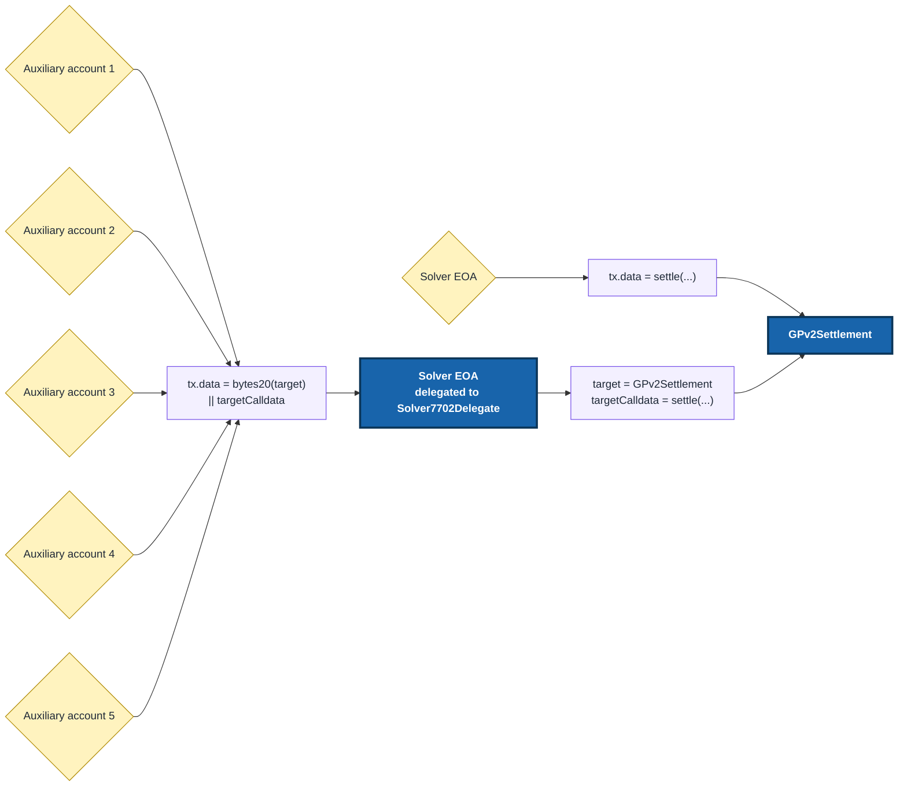

# Parallel Settlement Submission

[`Solver7702Delegate`](https://github.com/cowprotocol/solver-7702-delegate/blob/main/src/Solver7702Delegate.sol) lets a solver keep its existing allowlisted EOA and use auxiliary accounts as additional nonce lanes for settlement submission. For more context on the basic flow, see the [`Solver7702Delegate` README](https://github.com/cowprotocol/solver-7702-delegate#readme).

If a solver may submit more than one settlement at a time, it can set this up early. Ethereum executes transactions from the same EOA in nonce order, so one pending transaction can block subsequent settlement transactions. Auxiliary accounts can submit in parallel, while `GPv2Settlement` still sees the solver EOA as `msg.sender`.

:::warning

Treat auxiliary accounts as operationally sensitive accounts. Any approved auxiliary account can submit settlements through the solver EOA while the delegation is active. Keep their keys in the same security setup as the solver EOA, monitor their native-token balances, and make sure the team responsible for the solver EOA is also responsible for these accounts.

If an auxiliary account key is compromised, rotate the delegation by configuring a new approved caller set and re-delegating from the solver EOA.

:::

## Reference driver setup

If you use the reference driver, add `submission-accounts` to the solver entry in your driver config. This is all most solvers need to configure.

```toml
[[solver]]
name = "my-solver"
endpoint = "https://solver.example"
account = "<solver-private-key-or-signer-config>"
max-solutions-to-propose = 6 # solver EOA + 5 auxiliary accounts
submission-accounts = [
  "<auxiliary-account-private-key-or-signer-config-1>",
  "<auxiliary-account-private-key-or-signer-config-2>",
  "<auxiliary-account-private-key-or-signer-config-3>",
  "<auxiliary-account-private-key-or-signer-config-4>",
  "<auxiliary-account-private-key-or-signer-config-5>"
]
```

The solver `account` must be able to sign the ERC-7702 authorization. Each `submission-accounts` entry must also include signing credentials, not only an address.

Fund each auxiliary account with the chain's native token so it can pay gas.

At startup, the reference driver deploys `Solver7702Delegate` at the expected CREATE2 address, or reuses the existing deployment at that address. When the solver EOA is busy, it uses the auxiliary accounts to submit settlements through separate nonce lanes.

The delegate is immutable. Approved auxiliary accounts are hardcoded into the deployed bytecode, so the caller set cannot be changed after deployment. To change it, deploy a new delegate and re-delegate the solver EOA.

## Custom driver setup

If you run a custom driver, use the [`Solver7702Delegate` README](https://github.com/cowprotocol/solver-7702-delegate#usage) for the deployment and authorization flow. You can also use the reference driver implementation as a guide for how to:

- deploy or reuse the delegate;
- authorize the solver EOA to delegate to it;
- route delegated settlement transactions through configured auxiliary accounts;
- simulate the same transaction shape that will be submitted.

## What changes when submitting

When the solver EOA is free, it submits directly to `GPv2Settlement`. If it already has a pending transaction, an auxiliary account can submit to the solver EOA instead. The solver EOA runs `Solver7702Delegate`, which forwards the call to `GPv2Settlement`.



The calldata format is packed on purpose. Use `abi.encodePacked(bytes20(target), targetCalldata)`. Do not use `abi.encode(target, targetCalldata)`.

## Verification

First, check that the solver EOA points to the expected delegate:

```shell
cast code <solver_eoa> --rpc-url <rpc_url>
```

Make sure, the returned code follows [ERC-7702](https://eips.ethereum.org/EIPS/eip-7702) standard. The code should be:

```text
0xef0100 || delegate_address
```

On a block explorer, the solver EOA may not have a normal contract code view. Confirm that its **Delegated to** banner points to the expected address, then open that address and verify its source as `Solver7702Delegate`.

See the README's [verification steps](https://github.com/cowprotocol/solver-7702-delegate#verify-delegation) for details.

## More details

For manual deployment, authorization, revocation, verification, and operational details, use the [`Solver7702Delegate` README](https://github.com/cowprotocol/solver-7702-delegate#usage).
