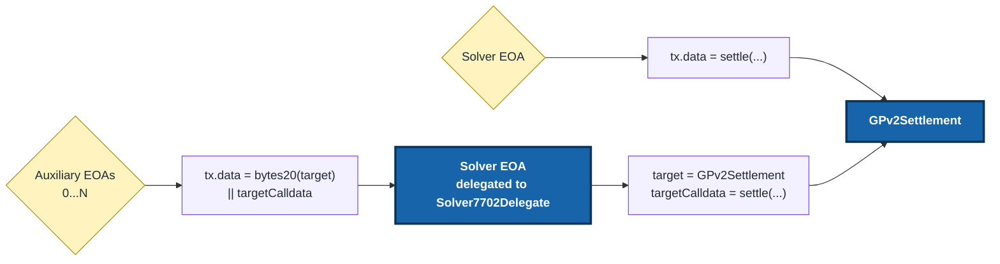

# Parallel Settlement Submission

`Solver7702Delegate` lets a solver keep its existing allowlisted EOA and use auxiliary EOAs as additional nonce lanes for settlement submission.

Solvers expecting production volume should set this up early. With one EOA, a pending transaction can block every settlement behind it. Auxiliary EOAs can submit in parallel, while `GPv2Settlement` still sees the solver EOA as `msg.sender`.

## Reference driver setup

If you use the reference driver, add `submission-accounts` to the solver entry in your driver config. This is all most solvers need to configure.

```toml
[[solver]]
name = "my-solver"
endpoint = "https://solver.example"
account = "<solver-private-key-or-signer-config>"
max-solutions-to-propose = 6 # solver EOA + 5 auxiliary EOAs
submission-accounts = [
  "<auxiliary-private-key-or-signer-config-1>",
  "<auxiliary-private-key-or-signer-config-2>",
  "<auxiliary-private-key-or-signer-config-3>",
  "<auxiliary-private-key-or-signer-config-4>",
  "<auxiliary-private-key-or-signer-config-5>"
]
```

The solver `account` must be able to sign the ERC-7702 authorization. Each `submission-accounts` entry must also include signing credentials, not only an address.

Fund each auxiliary EOA with the chain's native token so it can pay gas.

:::warning

Treat auxiliary EOAs as operationally sensitive accounts. Any approved auxiliary EOA can submit settlements through the solver EOA while the delegation is active. Keep their keys in the same security setup as the solver EOA, monitor their native-token balances, and make sure the team responsible for the solver EOA is also responsible for these accounts.

If an auxiliary key is compromised, rotate the delegation by configuring a new approved caller set and re-delegating from the solver EOA.

:::

At startup, the reference driver deploys `Solver7702Delegate` at the expected CREATE2 address, or reuses the existing deployment at that address. When the solver EOA is busy, it uses the auxiliary accounts to submit settlements through separate nonce lanes.

## What changes when submitting

When the solver EOA is free, it submits directly to `GPv2Settlement`. If it already has a pending transaction, an auxiliary EOA can submit to the solver EOA instead. The solver EOA runs `Solver7702Delegate`, which forwards the call to `GPv2Settlement`.



The calldata format is packed on purpose. Use `abi.encodePacked(bytes20(target), targetCalldata)`. Do not use `abi.encode(target, targetCalldata)`.

## Verification

First, check that the solver EOA points to the expected delegate:

```shell
cast code <solver_eoa> --rpc-url <rpc_url>
```

For ERC-7702, the code has this form:

```text
0xef0100 || delegate_address
```

On a block explorer, the solver EOA may not have a normal contract code view. Confirm that its **Delegated to** banner points to the expected address, then open that address and verify its source as `Solver7702Delegate`.

See the README's [verification steps](https://github.com/cowprotocol/solver-7702-delegate#verify-delegation) for details.

## More details

For manual deployment, authorization, revocation, verification, and operational details, use the [`Solver7702Delegate` README](https://github.com/cowprotocol/solver-7702-delegate#usage).
