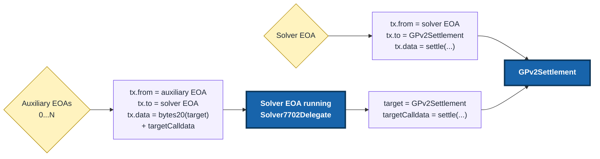

# Using Solver7702Delegate for parallel settlement submission

`Solver7702Delegate` lets a solver keep its existing allowlisted solver EOA while using auxiliary EOAs as extra submission nonce lanes.

This is strongly recommended for solvers that expect real volume. With one EOA, a pending settlement can block every later settlement behind the same nonce lane. With `Solver7702Delegate`, auxiliary EOAs can submit in parallel, while `GPv2Settlement` still sees the solver EOA as `msg.sender`.

## Reference driver setup

If you use the reference driver, add `submission-accounts` to the solver entry in your driver config. This is the main setup path for most solvers.

```toml
[[solver]]
name = "my-solver"
endpoint = "https://solver.example"
account = "<solver-private-key-or-signer-config>"
max-solutions-to-propose = 6 # solver EOA + N auxiliary EOAs
submission-accounts = [
  "<auxiliary-private-key-or-signer-config-1>",
  "<auxiliary-private-key-or-signer-config-2>",
  "<auxiliary-private-key-or-signer-config-3>",
  "<auxiliary-private-key-or-signer-config-4>",
  "<auxiliary-private-key-or-signer-config-5>"
]
```

The solver `account` must be able to sign the ERC-7702 authorization. Each `submission-accounts` entry must also be signer with a private key, not just an address.

Fund each auxiliary EOA with native token for gas, as they will be used to submit transactions separately from the solver EOA.

When `submission-accounts` is configured, the reference driver:

- sets up `Solver7702Delegate` during startup when the required signers are available;
- uses the auxiliary accounts as extra settlement nonce lanes, when solver EOA is busy;
- reuses the expected delegate deployment when the same code is already present;
- refuses to start with `max-solutions-to-propose > 1` unless submission accounts are configured.

## What changes when submitting

Direct submission should still be used when the solver EOA is free. Delegated submission is useful when the solver EOA already has a pending transaction and another settlement should be submitted without waiting for that nonce.



Inside the delegate, `msg.sender` is the auxiliary EOA and `address(this)` is the solver EOA. Inside `GPv2Settlement`, `msg.sender` is still the solver EOA.

The calldata format is packed on purpose. Use `abi.encodePacked(bytes20(target), targetCalldata)`. Do not use `abi.encode(target, targetCalldata)`.

## Verification

Before using delegated submission, verify both pieces:

1. The solver EOA delegates to the expected delegate.
2. The delegate bytecode matches the expected approved caller set.

Check the solver EOA code:

```shell
cast code <solver_eoa> --rpc-url <rpc_url>
```

For ERC-7702, delegated account code has this shape:

```text
0xef0100 || delegateAddress
```

The delegate bytecode check matters because approved callers are immutable constructor values. Do not only check that the delegate address has code.

## Manual cast commands

Most solvers should use the reference driver setup above. Use these commands only if you are setting up delegation manually and/or building a custom driver.

**To authorize a delegate when the solver EOA sends its own authorization transaction, sign with `--self-broadcast`**:

```shell
cast wallet sign-auth <delegate_address> \
  --private-key <solver_private_key> \
  --rpc-url <rpc_url> \
  --chain <chain_id> \
  --self-broadcast

cast send 0x0000000000000000000000000000000000000000 \
  --auth <signed_authorization> \
  --private-key <solver_private_key> \
  --rpc-url <rpc_url> \
  --chain <chain_id>
```

**If a different funded account sends either transaction, do not use `--self-broadcast` when signing.** The solver EOA signs the authorization, but the funded account pays gas and submits the transaction:

```shell
cast wallet sign-auth <delegate_or_zero_address> \
  --private-key <solver_private_key> \
  --rpc-url <rpc_url> \
  --chain <chain_id>

cast send 0x0000000000000000000000000000000000000000 \
  --auth <signed_authorization> \
  --private-key <transaction_sender_private_key> \
  --rpc-url <rpc_url> \
  --chain <chain_id>
```

To revoke delegation, sign an authorization to the zero address:

```shell
cast wallet sign-auth 0x0000000000000000000000000000000000000000 \
  --private-key <solver_private_key> \
  --rpc-url <rpc_url> \
  --chain <chain_id> \
  --self-broadcast

cast send 0x0000000000000000000000000000000000000000 \
  --auth <signed_authorization> \
  --private-key <solver_private_key> \
  --rpc-url <rpc_url> \
  --chain <chain_id>
```

## Custom driver requirements

If you do not use the reference driver, your driver must:

- deploy `Solver7702Delegate` for the approved auxiliary caller set;
- have the solver EOA delegate to the deployed `Solver7702Delegate`;
- route delegated settlement transactions with `from = auxiliary EOA` and `to = solver EOA` (if solver EOA is busy);
- encode delegated calldata as `bytes20(target) || targetCalldata`.

## Capabilities and limits

- Version 1 supports up to five immutable approved caller slots.
- Approved auxiliary EOAs are trusted hot keys. They can trigger arbitrary calls as the solver EOA.
- Changing authorized auxiliary accounts requires redeploying the delegate and re-delegating the solver EOA.
- The delegate can call arbitrary targets. The driver should normally use `GPv2Settlement` for settlement submissions.
- Use this only on chains and infrastructure that support ERC-7702 transaction authorization handling.

Keep solver EOA funds and approvals minimal, do not share auxiliary EOAs across solvers, and rotate callers immediately if an auxiliary key is compromised.

## More details

For exact manual deployment, authorization, revocation, bytecode verification, and operational procedures, use the [`Solver7702Delegate` README](https://github.com/cowprotocol/solver-7702-delegate).
