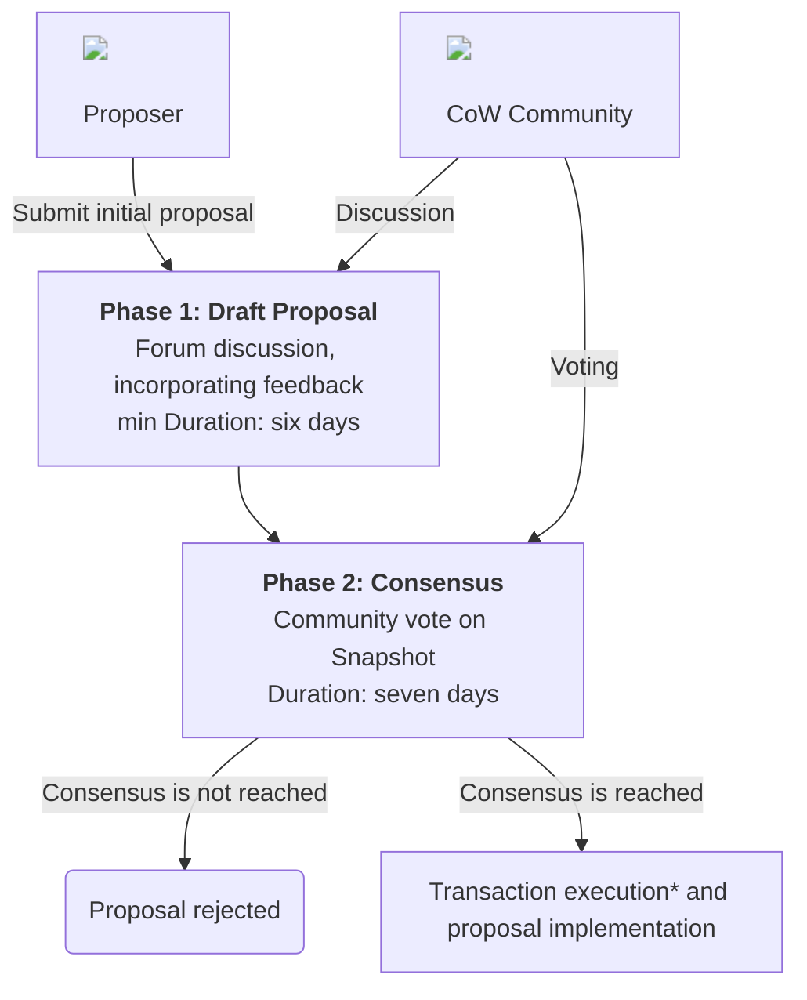

import Living from '../_living.md'

# Governance Process

<Living />

This document outlines a process for developing and advancing CoW DAO. The purpose of this process is to garner discussion and help the community to get the needed information and sufficient time in order to review and vote on proposals.

## CoW DAO Improvement Proposals (CIPs)

At the core of CoW DAO governance is the CoW DAO Improvement Proposal (CIP) process. CIPs are the primary mechanism for proposing new features, collecting community input on an issue, and for documenting the design decisions that have gone into CoW DAO.

It is a best practice to create a CIP for any significant change to CoW DAO. This helps to ensure that the community is aware of the change and has an opportunity to provide feedback before the change is implemented.

:::tip CIP Template

Want to get started writing a CIP? Check out the [CIP template](./process/template) to get started.

:::

## Methodology

The CoW DAO governance process includes two steps for proposals to get approved:

(*) note: if the  execution is via oSnap module for automatic execution on-chain, it adds a three day delay to the actual transaction execution. 

### Phase 1: Community Discussion

**Minimum time: 6 days**

In the first phase, a *draft* proposal is created and posted to the forum. The purpose of the Draft Proposal phase is to establish formal discussion around a potential proposal.

To create a Draft Proposal please follow these steps:

- Create a new topic in the [Governance category](https://forum.cow.fi/c/cow-improvement-proposals-cip/6/none), using the [proposal template pinned](https://forum.cow.fi/t/cip-0-template/28) to the top of the _Governance Resources_ category.
- Engage in discussion to build support for the proposal.
- If your proposal includes any on chain interactions by CoW DAO, you will need to write the code for your proposal while it is in draft stage. It is **required** to provide Tenderly transaction simulations. You may wish to wait until the proposal gathers some support before doing this.

Once you are confident the proposal is in a stable state, and at least the minimum time has passed since the proposal was first published, you can move the proposal yourself to the [next phase](#phase-2-voting).

**Note: there is an exception to the 6-days rule with fast-tracked proposals that only require 72hours (3 days) on the forum: at the moment of writing, these include slashing proposals due to EBBO-violation (refer to CIP-52)**

### Phase 2: Voting

**Vote duration: 7 days**

- Anyone that holds >10,000 COW can advance a CIP and post it to [snapshot](https://snapshot.org/#/cow.eth) assuming all criteria defined in [Phase 1](#phase-1-community-discussion) above are met.
- Assign the CIP a number in the form `CIP-###`.
- Change the topic from _Draft Proposal_ to **Active Proposal**.
- Create a snapshot vote with a duration of 7 days, and cross link the snapshot and forum post.
- If your proposal should include an executable transactions, you will now need to create the transaction on the oSnap Snapshot module as part of the process for posting the proposal on Snapshot.
- After creating the proposal on Snapshot and before proceeding, please double and triple check that the included transaction is correct. Asking another community member for a review is advised.

**Note that the oSnap implementation on CoW DAO adds a three day delay in execution after the voting is successfully closed.**

## Process Improvement

The aforementioned process is open to improvement. If you have any suggestions, please post them in the [Governance category](https://forum.cow.fi/c/cow-improvement-proposals-cip/6/none) of the forum. Proposals that increase governance efficiency and/or decentralization are encouraged, as CoW Protocol continues to move to a more community-owned and decentralized governance model.
