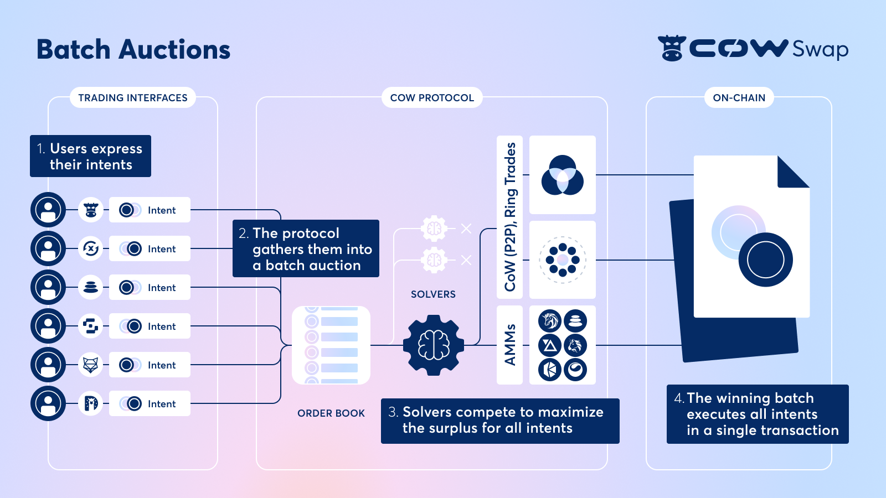

# Introduction

## Introduction to CoW Protocol 

CoW Protocol is a fully permissionless trading protocol that leverages Batch Auctions as its price finding mechanism. CoW Protocol enables batch auctions to maximize liquidity via Coincidence of Wants (CoWs) in addition to tapping all available on-chain liquidity whenever needed. Batch Auctions are continuously run by the protocol because the solvers, the parties in charge of finding the most optimal settlement for the batch, are in competition to settle it. The winning solver will be the one that can maximize traders surplus by either having the most optimal CoW, finding the best liquidity sources, or combining both in a single settlement.

<figure><figcaption></figcaption></figure>

Coincidence of Wants (CoWs) are one of the most, if not the most, innovative aspects of the protocol, but what exactly are they? CoWs are settlements which share liquidity across all orders who have matching limit prices. Rather than an AMM or an CLOB, CoW Protocol uses batch auctions as a core mechanism to facilitate CoWs. Using batch auctions leads to better prices for the individual traders as well as offering big savings, in terms of gas fees optimization and liquidity provider fees. Additionally, because of Batch Auction uniform clearing prices and CoWs not needing access to on-chain liquidity, CoW Protocol is able to offer the user a level of MEV protection that can not be achieved by any other protocol.

CoW Swap is the first trading interface built on top of CoW Protocol. It acts as Meta DEX aggregator, giving the users the best price across the aggregators or AMMs depending on which one is the most liquid venue for the trades within a batch.

Instead of using a central operator or a constant function market maker to determine trade settlements, CoW Protocol uses a “party” called solver, who is the party in charge of providing the settlement solution to the batch auctions. Solvers compete against each other to submit the most optimal batch settlement solution and each time a solver submits a successful batch settlement solution, the protocol rewards them with tokens, meaning that the protocol rewards solvers for solving the batch auction optimization problem. Anyone can become a solver, although, in order to become one, there are certain requirements:

* To become a solver, an Ethereum address needs to deposit a bond in the form of tokens. Asset type and amounts are pending to be defined by the CoW DAO.
* Once the tokens have been staked (locked up), CoW DAO has to vote to approve or reject the Ethereum address that will identify the solver. If the vote is successful, the solvers Ethereum address will be included in the allowlist (verification) solvers contract.
* Additionally, a solver must have the technical knowledge to create the appropriate batch settlement solutions or take the risk of being slashed by the CoW DAO for wrongdoing.

### Benefits

CoW Protocol has a wide range of benefits, both technical and functional, but to sum it up, here are the main benefits it brings to the ecosystem:

* Fully permissionless Meta DEX Aggregator on which anyone can trade any tokens and build integrations;
* First implementation (2nd iteration) of batch auctions promoting fair uniform clearing prices;
* Trades are protected from different sorts of MEV such as front/back running or sandwhich attacks;
* Maximized liquidity and access to all on chain liquidity
  * Best prices when COWs are found, or at least as good as the best DEX aggregator price if they aren't
  * All token pairs available for trading, Offchain order submission enables gasless trading
* Fair, decentralized settlement in which an open competition for order matching replaces a central operator or a constant function market maker.
* Tokenomics ensure that solvers are competing against each other to deliver the best order settlement solution for traders in exchange for the reward of each batch auction.

### Trading Cycle

While we call CoW Swap a META DEX Aggregator, as it may have similarities with current DEX aggregators or DEX trading protocol, CoW Protocol introduces a completely new way of trading. In comparison with other DEXs or DEX aggregator, CoW Protocol, and therefore the interfaces built on top of it ([swap.cow.fi](https://swap.cow.fi/#/1/swap/WETH?utm\_source=docs.cow.fi\&utm\_medium=web\&utm\_content=overview-page) for example), don't require the user to send a transaction to submit a trade, but rather require the user to send a signed message. The reason for this is that the protocol works with off-chain messages, where the trader signs an order with the valid parameters they are willing to accept. This signed order is later on picked up by the solvers and executed in the batch auction that satisfies the users signed requirements.

Let's get an owl's eye view on how the protocol's trading cycles works:

* Users need to approve the contract allowance manager to enable trading for a desired token. This interaction incurs a transaction fee, but only needs to be done once per token, meaning that once you have approved a token, there aren't any more transaction fees on it.
* Users can place limit sell/buy orders off-chain at any time by simply signing a message that contains their trade details. Users don't pay a gas fee for posting and canceling orders. On the other hand, the user does pay a protocol fee to cover the solvers settling the transaction for them.
* Off-chain orders are picked up by the solvers who will settle them in a batch auction.
  * At the start of a batch, all currently open orders on the protocol are considered;
  * For each batch an open competition to submit order settlement solutions by solvers takes place;
* The protocol select the solvers order settlement solution that maximizes trader welfare the most and provides the best clearing prices for the orders in that batch;
  * All matched orders within a batch can either be settled off-chain via the liquidity found in the coincidence of wants (CoWs) across orders, or on-chain against AMM/aggregator liquidity.

From a users' perspective, a full trading cycle on CoW Protocol consists of three user actions:

1. Approve the Allowance Manager Contract
2. Sign the order you want to place
3. Enjoy the tokens you just traded.

### Conclusion

We believe CoW Protocol is critical infrastructure for open finance, which will see the creation of more and more tokenized assets, and will ultimately need a reliable trading mechanism that has the users best interest in mind.

Ultimately, CoW Protocol is built in the spirit of permissionless innovation. Its fully decentralized architecture means you don't need CoW Swap to build on our protocol.
